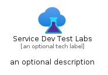
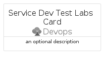

# ServiceDevTestLabs


```text
azure-17/Item/Devops/ServiceDevTestLabs
```

```text
include('azure-17/Item/Devops/ServiceDevTestLabs')
```


| Illustration | ServiceDevTestLabs | ServiceDevTestLabsCard | ServiceDevTestLabsGroup |
| :---: | :---: | :---: | :---: |
|  |  |  |  |


## Sprites
The item provides the following sriptes:

- `<$ServiceDevTestLabsXs>`
- `<$ServiceDevTestLabsSm>`
- `<$ServiceDevTestLabsMd>`
- `<$ServiceDevTestLabsLg>`


## ServiceDevTestLabs

### Load remotely
```plantuml
@startuml
' configures the library
!global $LIB_BASE_LOCATION="https://raw.githubusercontent.com/tmorin/plantuml-libs/master/distribution"

' loads the library's bootstrap
!include $LIB_BASE_LOCATION/bootstrap.puml

' loads the package bootstrap
include('azure-17/bootstrap')

' loads the Item which embeds the element ServiceDevTestLabs
include('azure-17/Item/Devops/ServiceDevTestLabs')

' renders the element
ServiceDevTestLabs('ServiceDevTestLabs', 'Service Dev Test Labs', 'an optional tech label', 'an optional description')
@enduml
```

### Load locally
```plantuml
@startuml
' configures the library
!global $INCLUSION_MODE="local"
!global $LIB_BASE_LOCATION="../../.."

' loads the library's bootstrap
!include $LIB_BASE_LOCATION/bootstrap.puml

' loads the package bootstrap
include('azure-17/bootstrap')

' loads the Item which embeds the element ServiceDevTestLabs
include('azure-17/Item/Devops/ServiceDevTestLabs')

' renders the element
ServiceDevTestLabs('ServiceDevTestLabs', 'Service Dev Test Labs', 'an optional tech label', 'an optional description')
@enduml
```

## ServiceDevTestLabsCard

### Load remotely
```plantuml
@startuml
' configures the library
!global $LIB_BASE_LOCATION="https://raw.githubusercontent.com/tmorin/plantuml-libs/master/distribution"

' loads the library's bootstrap
!include $LIB_BASE_LOCATION/bootstrap.puml

' loads the package bootstrap
include('azure-17/bootstrap')

' loads the Item which embeds the element ServiceDevTestLabsCard
include('azure-17/Item/Devops/ServiceDevTestLabs')

' renders the element
ServiceDevTestLabsCard('ServiceDevTestLabsCard', 'Service Dev Test Labs Card', 'an optional description')
@enduml
```

### Load locally
```plantuml
@startuml
' configures the library
!global $INCLUSION_MODE="local"
!global $LIB_BASE_LOCATION="../../.."

' loads the library's bootstrap
!include $LIB_BASE_LOCATION/bootstrap.puml

' loads the package bootstrap
include('azure-17/bootstrap')

' loads the Item which embeds the element ServiceDevTestLabsCard
include('azure-17/Item/Devops/ServiceDevTestLabs')

' renders the element
ServiceDevTestLabsCard('ServiceDevTestLabsCard', 'Service Dev Test Labs Card', 'an optional description')
@enduml
```

## ServiceDevTestLabsGroup

### Load remotely
```plantuml
@startuml
' configures the library
!global $LIB_BASE_LOCATION="https://raw.githubusercontent.com/tmorin/plantuml-libs/master/distribution"

' loads the library's bootstrap
!include $LIB_BASE_LOCATION/bootstrap.puml

' loads the package bootstrap
include('azure-17/bootstrap')

' loads the Item which embeds the element ServiceDevTestLabsGroup
include('azure-17/Item/Devops/ServiceDevTestLabs')

' renders the element
ServiceDevTestLabsGroup('ServiceDevTestLabsGroup', 'Service Dev Test Labs Group', 'an optional tech label') {
    note as note
        the content of the group
    end note
}
@enduml
```

### Load locally
```plantuml
@startuml
' configures the library
!global $INCLUSION_MODE="local"
!global $LIB_BASE_LOCATION="../../.."

' loads the library's bootstrap
!include $LIB_BASE_LOCATION/bootstrap.puml

' loads the package bootstrap
include('azure-17/bootstrap')

' loads the Item which embeds the element ServiceDevTestLabsGroup
include('azure-17/Item/Devops/ServiceDevTestLabs')

' renders the element
ServiceDevTestLabsGroup('ServiceDevTestLabsGroup', 'Service Dev Test Labs Group', 'an optional tech label') {
    note as note
        the content of the group
    end note
}
@enduml
```

