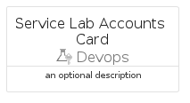
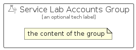

# ServiceLabAccounts


```text
azure-17/Item/Devops/ServiceLabAccounts
```

```text
include('azure-17/Item/Devops/ServiceLabAccounts')
```


| Illustration | ServiceLabAccounts | ServiceLabAccountsCard | ServiceLabAccountsGroup |
| :---: | :---: | :---: | :---: |
|  |  |  |  |


## Sprites
The item provides the following sriptes:

- `<$ServiceLabAccountsXs>`
- `<$ServiceLabAccountsSm>`
- `<$ServiceLabAccountsMd>`
- `<$ServiceLabAccountsLg>`


## ServiceLabAccounts

### Load remotely
```plantuml
@startuml
' configures the library
!global $LIB_BASE_LOCATION="https://raw.githubusercontent.com/tmorin/plantuml-libs/master/distribution"

' loads the library's bootstrap
!include $LIB_BASE_LOCATION/bootstrap.puml

' loads the package bootstrap
include('azure-17/bootstrap')

' loads the Item which embeds the element ServiceLabAccounts
include('azure-17/Item/Devops/ServiceLabAccounts')

' renders the element
ServiceLabAccounts('ServiceLabAccounts', 'Service Lab Accounts', 'an optional tech label', 'an optional description')
@enduml
```

### Load locally
```plantuml
@startuml
' configures the library
!global $INCLUSION_MODE="local"
!global $LIB_BASE_LOCATION="../../.."

' loads the library's bootstrap
!include $LIB_BASE_LOCATION/bootstrap.puml

' loads the package bootstrap
include('azure-17/bootstrap')

' loads the Item which embeds the element ServiceLabAccounts
include('azure-17/Item/Devops/ServiceLabAccounts')

' renders the element
ServiceLabAccounts('ServiceLabAccounts', 'Service Lab Accounts', 'an optional tech label', 'an optional description')
@enduml
```

## ServiceLabAccountsCard

### Load remotely
```plantuml
@startuml
' configures the library
!global $LIB_BASE_LOCATION="https://raw.githubusercontent.com/tmorin/plantuml-libs/master/distribution"

' loads the library's bootstrap
!include $LIB_BASE_LOCATION/bootstrap.puml

' loads the package bootstrap
include('azure-17/bootstrap')

' loads the Item which embeds the element ServiceLabAccountsCard
include('azure-17/Item/Devops/ServiceLabAccounts')

' renders the element
ServiceLabAccountsCard('ServiceLabAccountsCard', 'Service Lab Accounts Card', 'an optional description')
@enduml
```

### Load locally
```plantuml
@startuml
' configures the library
!global $INCLUSION_MODE="local"
!global $LIB_BASE_LOCATION="../../.."

' loads the library's bootstrap
!include $LIB_BASE_LOCATION/bootstrap.puml

' loads the package bootstrap
include('azure-17/bootstrap')

' loads the Item which embeds the element ServiceLabAccountsCard
include('azure-17/Item/Devops/ServiceLabAccounts')

' renders the element
ServiceLabAccountsCard('ServiceLabAccountsCard', 'Service Lab Accounts Card', 'an optional description')
@enduml
```

## ServiceLabAccountsGroup

### Load remotely
```plantuml
@startuml
' configures the library
!global $LIB_BASE_LOCATION="https://raw.githubusercontent.com/tmorin/plantuml-libs/master/distribution"

' loads the library's bootstrap
!include $LIB_BASE_LOCATION/bootstrap.puml

' loads the package bootstrap
include('azure-17/bootstrap')

' loads the Item which embeds the element ServiceLabAccountsGroup
include('azure-17/Item/Devops/ServiceLabAccounts')

' renders the element
ServiceLabAccountsGroup('ServiceLabAccountsGroup', 'Service Lab Accounts Group', 'an optional tech label') {
    note as note
        the content of the group
    end note
}
@enduml
```

### Load locally
```plantuml
@startuml
' configures the library
!global $INCLUSION_MODE="local"
!global $LIB_BASE_LOCATION="../../.."

' loads the library's bootstrap
!include $LIB_BASE_LOCATION/bootstrap.puml

' loads the package bootstrap
include('azure-17/bootstrap')

' loads the Item which embeds the element ServiceLabAccountsGroup
include('azure-17/Item/Devops/ServiceLabAccounts')

' renders the element
ServiceLabAccountsGroup('ServiceLabAccountsGroup', 'Service Lab Accounts Group', 'an optional tech label') {
    note as note
        the content of the group
    end note
}
@enduml
```

