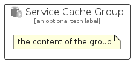

# ServiceCache


```text
azure-17/Item/General/ServiceCache
```

```text
include('azure-17/Item/General/ServiceCache')
```


| Illustration | ServiceCache | ServiceCacheCard | ServiceCacheGroup |
| :---: | :---: | :---: | :---: |
|  |  |  |  |


## Sprites
The item provides the following sriptes:

- `<$ServiceCacheXs>`
- `<$ServiceCacheSm>`
- `<$ServiceCacheMd>`
- `<$ServiceCacheLg>`


## ServiceCache

### Load remotely
```plantuml
@startuml
' configures the library
!global $LIB_BASE_LOCATION="https://raw.githubusercontent.com/tmorin/plantuml-libs/master/distribution"

' loads the library's bootstrap
!include $LIB_BASE_LOCATION/bootstrap.puml

' loads the package bootstrap
include('azure-17/bootstrap')

' loads the Item which embeds the element ServiceCache
include('azure-17/Item/General/ServiceCache')

' renders the element
ServiceCache('ServiceCache', 'Service Cache', 'an optional tech label', 'an optional description')
@enduml
```

### Load locally
```plantuml
@startuml
' configures the library
!global $INCLUSION_MODE="local"
!global $LIB_BASE_LOCATION="../../.."

' loads the library's bootstrap
!include $LIB_BASE_LOCATION/bootstrap.puml

' loads the package bootstrap
include('azure-17/bootstrap')

' loads the Item which embeds the element ServiceCache
include('azure-17/Item/General/ServiceCache')

' renders the element
ServiceCache('ServiceCache', 'Service Cache', 'an optional tech label', 'an optional description')
@enduml
```

## ServiceCacheCard

### Load remotely
```plantuml
@startuml
' configures the library
!global $LIB_BASE_LOCATION="https://raw.githubusercontent.com/tmorin/plantuml-libs/master/distribution"

' loads the library's bootstrap
!include $LIB_BASE_LOCATION/bootstrap.puml

' loads the package bootstrap
include('azure-17/bootstrap')

' loads the Item which embeds the element ServiceCacheCard
include('azure-17/Item/General/ServiceCache')

' renders the element
ServiceCacheCard('ServiceCacheCard', 'Service Cache Card', 'an optional description')
@enduml
```

### Load locally
```plantuml
@startuml
' configures the library
!global $INCLUSION_MODE="local"
!global $LIB_BASE_LOCATION="../../.."

' loads the library's bootstrap
!include $LIB_BASE_LOCATION/bootstrap.puml

' loads the package bootstrap
include('azure-17/bootstrap')

' loads the Item which embeds the element ServiceCacheCard
include('azure-17/Item/General/ServiceCache')

' renders the element
ServiceCacheCard('ServiceCacheCard', 'Service Cache Card', 'an optional description')
@enduml
```

## ServiceCacheGroup

### Load remotely
```plantuml
@startuml
' configures the library
!global $LIB_BASE_LOCATION="https://raw.githubusercontent.com/tmorin/plantuml-libs/master/distribution"

' loads the library's bootstrap
!include $LIB_BASE_LOCATION/bootstrap.puml

' loads the package bootstrap
include('azure-17/bootstrap')

' loads the Item which embeds the element ServiceCacheGroup
include('azure-17/Item/General/ServiceCache')

' renders the element
ServiceCacheGroup('ServiceCacheGroup', 'Service Cache Group', 'an optional tech label') {
    note as note
        the content of the group
    end note
}
@enduml
```

### Load locally
```plantuml
@startuml
' configures the library
!global $INCLUSION_MODE="local"
!global $LIB_BASE_LOCATION="../../.."

' loads the library's bootstrap
!include $LIB_BASE_LOCATION/bootstrap.puml

' loads the package bootstrap
include('azure-17/bootstrap')

' loads the Item which embeds the element ServiceCacheGroup
include('azure-17/Item/General/ServiceCache')

' renders the element
ServiceCacheGroup('ServiceCacheGroup', 'Service Cache Group', 'an optional tech label') {
    note as note
        the content of the group
    end note
}
@enduml
```

