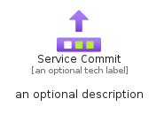

# ServiceCommit


```text
azure-17/Item/General/ServiceCommit
```

```text
include('azure-17/Item/General/ServiceCommit')
```


| Illustration | ServiceCommit | ServiceCommitCard | ServiceCommitGroup |
| :---: | :---: | :---: | :---: |
|  |  |  |  |


## Sprites
The item provides the following sriptes:

- `<$ServiceCommitXs>`
- `<$ServiceCommitSm>`
- `<$ServiceCommitMd>`
- `<$ServiceCommitLg>`


## ServiceCommit

### Load remotely
```plantuml
@startuml
' configures the library
!global $LIB_BASE_LOCATION="https://raw.githubusercontent.com/tmorin/plantuml-libs/master/distribution"

' loads the library's bootstrap
!include $LIB_BASE_LOCATION/bootstrap.puml

' loads the package bootstrap
include('azure-17/bootstrap')

' loads the Item which embeds the element ServiceCommit
include('azure-17/Item/General/ServiceCommit')

' renders the element
ServiceCommit('ServiceCommit', 'Service Commit', 'an optional tech label', 'an optional description')
@enduml
```

### Load locally
```plantuml
@startuml
' configures the library
!global $INCLUSION_MODE="local"
!global $LIB_BASE_LOCATION="../../.."

' loads the library's bootstrap
!include $LIB_BASE_LOCATION/bootstrap.puml

' loads the package bootstrap
include('azure-17/bootstrap')

' loads the Item which embeds the element ServiceCommit
include('azure-17/Item/General/ServiceCommit')

' renders the element
ServiceCommit('ServiceCommit', 'Service Commit', 'an optional tech label', 'an optional description')
@enduml
```

## ServiceCommitCard

### Load remotely
```plantuml
@startuml
' configures the library
!global $LIB_BASE_LOCATION="https://raw.githubusercontent.com/tmorin/plantuml-libs/master/distribution"

' loads the library's bootstrap
!include $LIB_BASE_LOCATION/bootstrap.puml

' loads the package bootstrap
include('azure-17/bootstrap')

' loads the Item which embeds the element ServiceCommitCard
include('azure-17/Item/General/ServiceCommit')

' renders the element
ServiceCommitCard('ServiceCommitCard', 'Service Commit Card', 'an optional description')
@enduml
```

### Load locally
```plantuml
@startuml
' configures the library
!global $INCLUSION_MODE="local"
!global $LIB_BASE_LOCATION="../../.."

' loads the library's bootstrap
!include $LIB_BASE_LOCATION/bootstrap.puml

' loads the package bootstrap
include('azure-17/bootstrap')

' loads the Item which embeds the element ServiceCommitCard
include('azure-17/Item/General/ServiceCommit')

' renders the element
ServiceCommitCard('ServiceCommitCard', 'Service Commit Card', 'an optional description')
@enduml
```

## ServiceCommitGroup

### Load remotely
```plantuml
@startuml
' configures the library
!global $LIB_BASE_LOCATION="https://raw.githubusercontent.com/tmorin/plantuml-libs/master/distribution"

' loads the library's bootstrap
!include $LIB_BASE_LOCATION/bootstrap.puml

' loads the package bootstrap
include('azure-17/bootstrap')

' loads the Item which embeds the element ServiceCommitGroup
include('azure-17/Item/General/ServiceCommit')

' renders the element
ServiceCommitGroup('ServiceCommitGroup', 'Service Commit Group', 'an optional tech label') {
    note as note
        the content of the group
    end note
}
@enduml
```

### Load locally
```plantuml
@startuml
' configures the library
!global $INCLUSION_MODE="local"
!global $LIB_BASE_LOCATION="../../.."

' loads the library's bootstrap
!include $LIB_BASE_LOCATION/bootstrap.puml

' loads the package bootstrap
include('azure-17/bootstrap')

' loads the Item which embeds the element ServiceCommitGroup
include('azure-17/Item/General/ServiceCommit')

' renders the element
ServiceCommitGroup('ServiceCommitGroup', 'Service Commit Group', 'an optional tech label') {
    note as note
        the content of the group
    end note
}
@enduml
```

