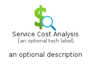
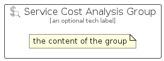

# ServiceCostAnalysis


```text
azure-17/Item/General/ServiceCostAnalysis
```

```text
include('azure-17/Item/General/ServiceCostAnalysis')
```


| Illustration | ServiceCostAnalysis | ServiceCostAnalysisCard | ServiceCostAnalysisGroup |
| :---: | :---: | :---: | :---: |
|  |  |  |  |


## Sprites
The item provides the following sriptes:

- `<$ServiceCostAnalysisXs>`
- `<$ServiceCostAnalysisSm>`
- `<$ServiceCostAnalysisMd>`
- `<$ServiceCostAnalysisLg>`


## ServiceCostAnalysis

### Load remotely
```plantuml
@startuml
' configures the library
!global $LIB_BASE_LOCATION="https://raw.githubusercontent.com/tmorin/plantuml-libs/master/distribution"

' loads the library's bootstrap
!include $LIB_BASE_LOCATION/bootstrap.puml

' loads the package bootstrap
include('azure-17/bootstrap')

' loads the Item which embeds the element ServiceCostAnalysis
include('azure-17/Item/General/ServiceCostAnalysis')

' renders the element
ServiceCostAnalysis('ServiceCostAnalysis', 'Service Cost Analysis', 'an optional tech label', 'an optional description')
@enduml
```

### Load locally
```plantuml
@startuml
' configures the library
!global $INCLUSION_MODE="local"
!global $LIB_BASE_LOCATION="../../.."

' loads the library's bootstrap
!include $LIB_BASE_LOCATION/bootstrap.puml

' loads the package bootstrap
include('azure-17/bootstrap')

' loads the Item which embeds the element ServiceCostAnalysis
include('azure-17/Item/General/ServiceCostAnalysis')

' renders the element
ServiceCostAnalysis('ServiceCostAnalysis', 'Service Cost Analysis', 'an optional tech label', 'an optional description')
@enduml
```

## ServiceCostAnalysisCard

### Load remotely
```plantuml
@startuml
' configures the library
!global $LIB_BASE_LOCATION="https://raw.githubusercontent.com/tmorin/plantuml-libs/master/distribution"

' loads the library's bootstrap
!include $LIB_BASE_LOCATION/bootstrap.puml

' loads the package bootstrap
include('azure-17/bootstrap')

' loads the Item which embeds the element ServiceCostAnalysisCard
include('azure-17/Item/General/ServiceCostAnalysis')

' renders the element
ServiceCostAnalysisCard('ServiceCostAnalysisCard', 'Service Cost Analysis Card', 'an optional description')
@enduml
```

### Load locally
```plantuml
@startuml
' configures the library
!global $INCLUSION_MODE="local"
!global $LIB_BASE_LOCATION="../../.."

' loads the library's bootstrap
!include $LIB_BASE_LOCATION/bootstrap.puml

' loads the package bootstrap
include('azure-17/bootstrap')

' loads the Item which embeds the element ServiceCostAnalysisCard
include('azure-17/Item/General/ServiceCostAnalysis')

' renders the element
ServiceCostAnalysisCard('ServiceCostAnalysisCard', 'Service Cost Analysis Card', 'an optional description')
@enduml
```

## ServiceCostAnalysisGroup

### Load remotely
```plantuml
@startuml
' configures the library
!global $LIB_BASE_LOCATION="https://raw.githubusercontent.com/tmorin/plantuml-libs/master/distribution"

' loads the library's bootstrap
!include $LIB_BASE_LOCATION/bootstrap.puml

' loads the package bootstrap
include('azure-17/bootstrap')

' loads the Item which embeds the element ServiceCostAnalysisGroup
include('azure-17/Item/General/ServiceCostAnalysis')

' renders the element
ServiceCostAnalysisGroup('ServiceCostAnalysisGroup', 'Service Cost Analysis Group', 'an optional tech label') {
    note as note
        the content of the group
    end note
}
@enduml
```

### Load locally
```plantuml
@startuml
' configures the library
!global $INCLUSION_MODE="local"
!global $LIB_BASE_LOCATION="../../.."

' loads the library's bootstrap
!include $LIB_BASE_LOCATION/bootstrap.puml

' loads the package bootstrap
include('azure-17/bootstrap')

' loads the Item which embeds the element ServiceCostAnalysisGroup
include('azure-17/Item/General/ServiceCostAnalysis')

' renders the element
ServiceCostAnalysisGroup('ServiceCostAnalysisGroup', 'Service Cost Analysis Group', 'an optional tech label') {
    note as note
        the content of the group
    end note
}
@enduml
```

