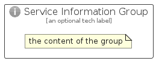

# ServiceInformation


```text
azure-17/Item/General/ServiceInformation
```

```text
include('azure-17/Item/General/ServiceInformation')
```


| Illustration | ServiceInformation | ServiceInformationCard | ServiceInformationGroup |
| :---: | :---: | :---: | :---: |
|  |  |  |  |


## Sprites
The item provides the following sriptes:

- `<$ServiceInformationXs>`
- `<$ServiceInformationSm>`
- `<$ServiceInformationMd>`
- `<$ServiceInformationLg>`


## ServiceInformation

### Load remotely
```plantuml
@startuml
' configures the library
!global $LIB_BASE_LOCATION="https://raw.githubusercontent.com/tmorin/plantuml-libs/master/distribution"

' loads the library's bootstrap
!include $LIB_BASE_LOCATION/bootstrap.puml

' loads the package bootstrap
include('azure-17/bootstrap')

' loads the Item which embeds the element ServiceInformation
include('azure-17/Item/General/ServiceInformation')

' renders the element
ServiceInformation('ServiceInformation', 'Service Information', 'an optional tech label', 'an optional description')
@enduml
```

### Load locally
```plantuml
@startuml
' configures the library
!global $INCLUSION_MODE="local"
!global $LIB_BASE_LOCATION="../../.."

' loads the library's bootstrap
!include $LIB_BASE_LOCATION/bootstrap.puml

' loads the package bootstrap
include('azure-17/bootstrap')

' loads the Item which embeds the element ServiceInformation
include('azure-17/Item/General/ServiceInformation')

' renders the element
ServiceInformation('ServiceInformation', 'Service Information', 'an optional tech label', 'an optional description')
@enduml
```

## ServiceInformationCard

### Load remotely
```plantuml
@startuml
' configures the library
!global $LIB_BASE_LOCATION="https://raw.githubusercontent.com/tmorin/plantuml-libs/master/distribution"

' loads the library's bootstrap
!include $LIB_BASE_LOCATION/bootstrap.puml

' loads the package bootstrap
include('azure-17/bootstrap')

' loads the Item which embeds the element ServiceInformationCard
include('azure-17/Item/General/ServiceInformation')

' renders the element
ServiceInformationCard('ServiceInformationCard', 'Service Information Card', 'an optional description')
@enduml
```

### Load locally
```plantuml
@startuml
' configures the library
!global $INCLUSION_MODE="local"
!global $LIB_BASE_LOCATION="../../.."

' loads the library's bootstrap
!include $LIB_BASE_LOCATION/bootstrap.puml

' loads the package bootstrap
include('azure-17/bootstrap')

' loads the Item which embeds the element ServiceInformationCard
include('azure-17/Item/General/ServiceInformation')

' renders the element
ServiceInformationCard('ServiceInformationCard', 'Service Information Card', 'an optional description')
@enduml
```

## ServiceInformationGroup

### Load remotely
```plantuml
@startuml
' configures the library
!global $LIB_BASE_LOCATION="https://raw.githubusercontent.com/tmorin/plantuml-libs/master/distribution"

' loads the library's bootstrap
!include $LIB_BASE_LOCATION/bootstrap.puml

' loads the package bootstrap
include('azure-17/bootstrap')

' loads the Item which embeds the element ServiceInformationGroup
include('azure-17/Item/General/ServiceInformation')

' renders the element
ServiceInformationGroup('ServiceInformationGroup', 'Service Information Group', 'an optional tech label') {
    note as note
        the content of the group
    end note
}
@enduml
```

### Load locally
```plantuml
@startuml
' configures the library
!global $INCLUSION_MODE="local"
!global $LIB_BASE_LOCATION="../../.."

' loads the library's bootstrap
!include $LIB_BASE_LOCATION/bootstrap.puml

' loads the package bootstrap
include('azure-17/bootstrap')

' loads the Item which embeds the element ServiceInformationGroup
include('azure-17/Item/General/ServiceInformation')

' renders the element
ServiceInformationGroup('ServiceInformationGroup', 'Service Information Group', 'an optional tech label') {
    note as note
        the content of the group
    end note
}
@enduml
```

