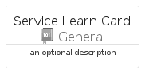
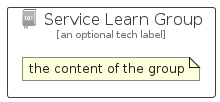

# ServiceLearn


```text
azure-17/Item/General/ServiceLearn
```

```text
include('azure-17/Item/General/ServiceLearn')
```


| Illustration | ServiceLearn | ServiceLearnCard | ServiceLearnGroup |
| :---: | :---: | :---: | :---: |
|  |  |  |  |


## Sprites
The item provides the following sriptes:

- `<$ServiceLearnXs>`
- `<$ServiceLearnSm>`
- `<$ServiceLearnMd>`
- `<$ServiceLearnLg>`


## ServiceLearn

### Load remotely
```plantuml
@startuml
' configures the library
!global $LIB_BASE_LOCATION="https://raw.githubusercontent.com/tmorin/plantuml-libs/master/distribution"

' loads the library's bootstrap
!include $LIB_BASE_LOCATION/bootstrap.puml

' loads the package bootstrap
include('azure-17/bootstrap')

' loads the Item which embeds the element ServiceLearn
include('azure-17/Item/General/ServiceLearn')

' renders the element
ServiceLearn('ServiceLearn', 'Service Learn', 'an optional tech label', 'an optional description')
@enduml
```

### Load locally
```plantuml
@startuml
' configures the library
!global $INCLUSION_MODE="local"
!global $LIB_BASE_LOCATION="../../.."

' loads the library's bootstrap
!include $LIB_BASE_LOCATION/bootstrap.puml

' loads the package bootstrap
include('azure-17/bootstrap')

' loads the Item which embeds the element ServiceLearn
include('azure-17/Item/General/ServiceLearn')

' renders the element
ServiceLearn('ServiceLearn', 'Service Learn', 'an optional tech label', 'an optional description')
@enduml
```

## ServiceLearnCard

### Load remotely
```plantuml
@startuml
' configures the library
!global $LIB_BASE_LOCATION="https://raw.githubusercontent.com/tmorin/plantuml-libs/master/distribution"

' loads the library's bootstrap
!include $LIB_BASE_LOCATION/bootstrap.puml

' loads the package bootstrap
include('azure-17/bootstrap')

' loads the Item which embeds the element ServiceLearnCard
include('azure-17/Item/General/ServiceLearn')

' renders the element
ServiceLearnCard('ServiceLearnCard', 'Service Learn Card', 'an optional description')
@enduml
```

### Load locally
```plantuml
@startuml
' configures the library
!global $INCLUSION_MODE="local"
!global $LIB_BASE_LOCATION="../../.."

' loads the library's bootstrap
!include $LIB_BASE_LOCATION/bootstrap.puml

' loads the package bootstrap
include('azure-17/bootstrap')

' loads the Item which embeds the element ServiceLearnCard
include('azure-17/Item/General/ServiceLearn')

' renders the element
ServiceLearnCard('ServiceLearnCard', 'Service Learn Card', 'an optional description')
@enduml
```

## ServiceLearnGroup

### Load remotely
```plantuml
@startuml
' configures the library
!global $LIB_BASE_LOCATION="https://raw.githubusercontent.com/tmorin/plantuml-libs/master/distribution"

' loads the library's bootstrap
!include $LIB_BASE_LOCATION/bootstrap.puml

' loads the package bootstrap
include('azure-17/bootstrap')

' loads the Item which embeds the element ServiceLearnGroup
include('azure-17/Item/General/ServiceLearn')

' renders the element
ServiceLearnGroup('ServiceLearnGroup', 'Service Learn Group', 'an optional tech label') {
    note as note
        the content of the group
    end note
}
@enduml
```

### Load locally
```plantuml
@startuml
' configures the library
!global $INCLUSION_MODE="local"
!global $LIB_BASE_LOCATION="../../.."

' loads the library's bootstrap
!include $LIB_BASE_LOCATION/bootstrap.puml

' loads the package bootstrap
include('azure-17/bootstrap')

' loads the Item which embeds the element ServiceLearnGroup
include('azure-17/Item/General/ServiceLearn')

' renders the element
ServiceLearnGroup('ServiceLearnGroup', 'Service Learn Group', 'an optional tech label') {
    note as note
        the content of the group
    end note
}
@enduml
```

