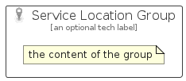

# ServiceLocation


```text
azure-17/Item/General/ServiceLocation
```

```text
include('azure-17/Item/General/ServiceLocation')
```


| Illustration | ServiceLocation | ServiceLocationCard | ServiceLocationGroup |
| :---: | :---: | :---: | :---: |
|  |  |  |  |


## Sprites
The item provides the following sriptes:

- `<$ServiceLocationXs>`
- `<$ServiceLocationSm>`
- `<$ServiceLocationMd>`
- `<$ServiceLocationLg>`


## ServiceLocation

### Load remotely
```plantuml
@startuml
' configures the library
!global $LIB_BASE_LOCATION="https://raw.githubusercontent.com/tmorin/plantuml-libs/master/distribution"

' loads the library's bootstrap
!include $LIB_BASE_LOCATION/bootstrap.puml

' loads the package bootstrap
include('azure-17/bootstrap')

' loads the Item which embeds the element ServiceLocation
include('azure-17/Item/General/ServiceLocation')

' renders the element
ServiceLocation('ServiceLocation', 'Service Location', 'an optional tech label', 'an optional description')
@enduml
```

### Load locally
```plantuml
@startuml
' configures the library
!global $INCLUSION_MODE="local"
!global $LIB_BASE_LOCATION="../../.."

' loads the library's bootstrap
!include $LIB_BASE_LOCATION/bootstrap.puml

' loads the package bootstrap
include('azure-17/bootstrap')

' loads the Item which embeds the element ServiceLocation
include('azure-17/Item/General/ServiceLocation')

' renders the element
ServiceLocation('ServiceLocation', 'Service Location', 'an optional tech label', 'an optional description')
@enduml
```

## ServiceLocationCard

### Load remotely
```plantuml
@startuml
' configures the library
!global $LIB_BASE_LOCATION="https://raw.githubusercontent.com/tmorin/plantuml-libs/master/distribution"

' loads the library's bootstrap
!include $LIB_BASE_LOCATION/bootstrap.puml

' loads the package bootstrap
include('azure-17/bootstrap')

' loads the Item which embeds the element ServiceLocationCard
include('azure-17/Item/General/ServiceLocation')

' renders the element
ServiceLocationCard('ServiceLocationCard', 'Service Location Card', 'an optional description')
@enduml
```

### Load locally
```plantuml
@startuml
' configures the library
!global $INCLUSION_MODE="local"
!global $LIB_BASE_LOCATION="../../.."

' loads the library's bootstrap
!include $LIB_BASE_LOCATION/bootstrap.puml

' loads the package bootstrap
include('azure-17/bootstrap')

' loads the Item which embeds the element ServiceLocationCard
include('azure-17/Item/General/ServiceLocation')

' renders the element
ServiceLocationCard('ServiceLocationCard', 'Service Location Card', 'an optional description')
@enduml
```

## ServiceLocationGroup

### Load remotely
```plantuml
@startuml
' configures the library
!global $LIB_BASE_LOCATION="https://raw.githubusercontent.com/tmorin/plantuml-libs/master/distribution"

' loads the library's bootstrap
!include $LIB_BASE_LOCATION/bootstrap.puml

' loads the package bootstrap
include('azure-17/bootstrap')

' loads the Item which embeds the element ServiceLocationGroup
include('azure-17/Item/General/ServiceLocation')

' renders the element
ServiceLocationGroup('ServiceLocationGroup', 'Service Location Group', 'an optional tech label') {
    note as note
        the content of the group
    end note
}
@enduml
```

### Load locally
```plantuml
@startuml
' configures the library
!global $INCLUSION_MODE="local"
!global $LIB_BASE_LOCATION="../../.."

' loads the library's bootstrap
!include $LIB_BASE_LOCATION/bootstrap.puml

' loads the package bootstrap
include('azure-17/bootstrap')

' loads the Item which embeds the element ServiceLocationGroup
include('azure-17/Item/General/ServiceLocation')

' renders the element
ServiceLocationGroup('ServiceLocationGroup', 'Service Location Group', 'an optional tech label') {
    note as note
        the content of the group
    end note
}
@enduml
```

