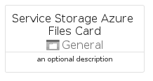

# ServiceStorageAzureFiles


```text
azure-17/Item/General/ServiceStorageAzureFiles
```

```text
include('azure-17/Item/General/ServiceStorageAzureFiles')
```


| Illustration | ServiceStorageAzureFiles | ServiceStorageAzureFilesCard | ServiceStorageAzureFilesGroup |
| :---: | :---: | :---: | :---: |
|  |  |  |  |


## Sprites
The item provides the following sriptes:

- `<$ServiceStorageAzureFilesXs>`
- `<$ServiceStorageAzureFilesSm>`
- `<$ServiceStorageAzureFilesMd>`
- `<$ServiceStorageAzureFilesLg>`


## ServiceStorageAzureFiles

### Load remotely
```plantuml
@startuml
' configures the library
!global $LIB_BASE_LOCATION="https://raw.githubusercontent.com/tmorin/plantuml-libs/master/distribution"

' loads the library's bootstrap
!include $LIB_BASE_LOCATION/bootstrap.puml

' loads the package bootstrap
include('azure-17/bootstrap')

' loads the Item which embeds the element ServiceStorageAzureFiles
include('azure-17/Item/General/ServiceStorageAzureFiles')

' renders the element
ServiceStorageAzureFiles('ServiceStorageAzureFiles', 'Service Storage Azure Files', 'an optional tech label', 'an optional description')
@enduml
```

### Load locally
```plantuml
@startuml
' configures the library
!global $INCLUSION_MODE="local"
!global $LIB_BASE_LOCATION="../../.."

' loads the library's bootstrap
!include $LIB_BASE_LOCATION/bootstrap.puml

' loads the package bootstrap
include('azure-17/bootstrap')

' loads the Item which embeds the element ServiceStorageAzureFiles
include('azure-17/Item/General/ServiceStorageAzureFiles')

' renders the element
ServiceStorageAzureFiles('ServiceStorageAzureFiles', 'Service Storage Azure Files', 'an optional tech label', 'an optional description')
@enduml
```

## ServiceStorageAzureFilesCard

### Load remotely
```plantuml
@startuml
' configures the library
!global $LIB_BASE_LOCATION="https://raw.githubusercontent.com/tmorin/plantuml-libs/master/distribution"

' loads the library's bootstrap
!include $LIB_BASE_LOCATION/bootstrap.puml

' loads the package bootstrap
include('azure-17/bootstrap')

' loads the Item which embeds the element ServiceStorageAzureFilesCard
include('azure-17/Item/General/ServiceStorageAzureFiles')

' renders the element
ServiceStorageAzureFilesCard('ServiceStorageAzureFilesCard', 'Service Storage Azure Files Card', 'an optional description')
@enduml
```

### Load locally
```plantuml
@startuml
' configures the library
!global $INCLUSION_MODE="local"
!global $LIB_BASE_LOCATION="../../.."

' loads the library's bootstrap
!include $LIB_BASE_LOCATION/bootstrap.puml

' loads the package bootstrap
include('azure-17/bootstrap')

' loads the Item which embeds the element ServiceStorageAzureFilesCard
include('azure-17/Item/General/ServiceStorageAzureFiles')

' renders the element
ServiceStorageAzureFilesCard('ServiceStorageAzureFilesCard', 'Service Storage Azure Files Card', 'an optional description')
@enduml
```

## ServiceStorageAzureFilesGroup

### Load remotely
```plantuml
@startuml
' configures the library
!global $LIB_BASE_LOCATION="https://raw.githubusercontent.com/tmorin/plantuml-libs/master/distribution"

' loads the library's bootstrap
!include $LIB_BASE_LOCATION/bootstrap.puml

' loads the package bootstrap
include('azure-17/bootstrap')

' loads the Item which embeds the element ServiceStorageAzureFilesGroup
include('azure-17/Item/General/ServiceStorageAzureFiles')

' renders the element
ServiceStorageAzureFilesGroup('ServiceStorageAzureFilesGroup', 'Service Storage Azure Files Group', 'an optional tech label') {
    note as note
        the content of the group
    end note
}
@enduml
```

### Load locally
```plantuml
@startuml
' configures the library
!global $INCLUSION_MODE="local"
!global $LIB_BASE_LOCATION="../../.."

' loads the library's bootstrap
!include $LIB_BASE_LOCATION/bootstrap.puml

' loads the package bootstrap
include('azure-17/bootstrap')

' loads the Item which embeds the element ServiceStorageAzureFilesGroup
include('azure-17/Item/General/ServiceStorageAzureFiles')

' renders the element
ServiceStorageAzureFilesGroup('ServiceStorageAzureFilesGroup', 'Service Storage Azure Files Group', 'an optional tech label') {
    note as note
        the content of the group
    end note
}
@enduml
```

