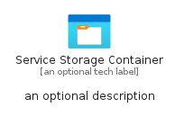
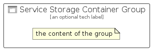

# ServiceStorageContainer


```text
azure-17/Item/General/ServiceStorageContainer
```

```text
include('azure-17/Item/General/ServiceStorageContainer')
```


| Illustration | ServiceStorageContainer | ServiceStorageContainerCard | ServiceStorageContainerGroup |
| :---: | :---: | :---: | :---: |
|  |  |  |  |


## Sprites
The item provides the following sriptes:

- `<$ServiceStorageContainerXs>`
- `<$ServiceStorageContainerSm>`
- `<$ServiceStorageContainerMd>`
- `<$ServiceStorageContainerLg>`


## ServiceStorageContainer

### Load remotely
```plantuml
@startuml
' configures the library
!global $LIB_BASE_LOCATION="https://raw.githubusercontent.com/tmorin/plantuml-libs/master/distribution"

' loads the library's bootstrap
!include $LIB_BASE_LOCATION/bootstrap.puml

' loads the package bootstrap
include('azure-17/bootstrap')

' loads the Item which embeds the element ServiceStorageContainer
include('azure-17/Item/General/ServiceStorageContainer')

' renders the element
ServiceStorageContainer('ServiceStorageContainer', 'Service Storage Container', 'an optional tech label', 'an optional description')
@enduml
```

### Load locally
```plantuml
@startuml
' configures the library
!global $INCLUSION_MODE="local"
!global $LIB_BASE_LOCATION="../../.."

' loads the library's bootstrap
!include $LIB_BASE_LOCATION/bootstrap.puml

' loads the package bootstrap
include('azure-17/bootstrap')

' loads the Item which embeds the element ServiceStorageContainer
include('azure-17/Item/General/ServiceStorageContainer')

' renders the element
ServiceStorageContainer('ServiceStorageContainer', 'Service Storage Container', 'an optional tech label', 'an optional description')
@enduml
```

## ServiceStorageContainerCard

### Load remotely
```plantuml
@startuml
' configures the library
!global $LIB_BASE_LOCATION="https://raw.githubusercontent.com/tmorin/plantuml-libs/master/distribution"

' loads the library's bootstrap
!include $LIB_BASE_LOCATION/bootstrap.puml

' loads the package bootstrap
include('azure-17/bootstrap')

' loads the Item which embeds the element ServiceStorageContainerCard
include('azure-17/Item/General/ServiceStorageContainer')

' renders the element
ServiceStorageContainerCard('ServiceStorageContainerCard', 'Service Storage Container Card', 'an optional description')
@enduml
```

### Load locally
```plantuml
@startuml
' configures the library
!global $INCLUSION_MODE="local"
!global $LIB_BASE_LOCATION="../../.."

' loads the library's bootstrap
!include $LIB_BASE_LOCATION/bootstrap.puml

' loads the package bootstrap
include('azure-17/bootstrap')

' loads the Item which embeds the element ServiceStorageContainerCard
include('azure-17/Item/General/ServiceStorageContainer')

' renders the element
ServiceStorageContainerCard('ServiceStorageContainerCard', 'Service Storage Container Card', 'an optional description')
@enduml
```

## ServiceStorageContainerGroup

### Load remotely
```plantuml
@startuml
' configures the library
!global $LIB_BASE_LOCATION="https://raw.githubusercontent.com/tmorin/plantuml-libs/master/distribution"

' loads the library's bootstrap
!include $LIB_BASE_LOCATION/bootstrap.puml

' loads the package bootstrap
include('azure-17/bootstrap')

' loads the Item which embeds the element ServiceStorageContainerGroup
include('azure-17/Item/General/ServiceStorageContainer')

' renders the element
ServiceStorageContainerGroup('ServiceStorageContainerGroup', 'Service Storage Container Group', 'an optional tech label') {
    note as note
        the content of the group
    end note
}
@enduml
```

### Load locally
```plantuml
@startuml
' configures the library
!global $INCLUSION_MODE="local"
!global $LIB_BASE_LOCATION="../../.."

' loads the library's bootstrap
!include $LIB_BASE_LOCATION/bootstrap.puml

' loads the package bootstrap
include('azure-17/bootstrap')

' loads the Item which embeds the element ServiceStorageContainerGroup
include('azure-17/Item/General/ServiceStorageContainer')

' renders the element
ServiceStorageContainerGroup('ServiceStorageContainerGroup', 'Service Storage Container Group', 'an optional tech label') {
    note as note
        the content of the group
    end note
}
@enduml
```

