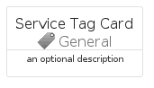

# ServiceTag


```text
azure-17/Item/General/ServiceTag
```

```text
include('azure-17/Item/General/ServiceTag')
```


| Illustration | ServiceTag | ServiceTagCard | ServiceTagGroup |
| :---: | :---: | :---: | :---: |
|  |  |  |  |


## Sprites
The item provides the following sriptes:

- `<$ServiceTagXs>`
- `<$ServiceTagSm>`
- `<$ServiceTagMd>`
- `<$ServiceTagLg>`


## ServiceTag

### Load remotely
```plantuml
@startuml
' configures the library
!global $LIB_BASE_LOCATION="https://raw.githubusercontent.com/tmorin/plantuml-libs/master/distribution"

' loads the library's bootstrap
!include $LIB_BASE_LOCATION/bootstrap.puml

' loads the package bootstrap
include('azure-17/bootstrap')

' loads the Item which embeds the element ServiceTag
include('azure-17/Item/General/ServiceTag')

' renders the element
ServiceTag('ServiceTag', 'Service Tag', 'an optional tech label', 'an optional description')
@enduml
```

### Load locally
```plantuml
@startuml
' configures the library
!global $INCLUSION_MODE="local"
!global $LIB_BASE_LOCATION="../../.."

' loads the library's bootstrap
!include $LIB_BASE_LOCATION/bootstrap.puml

' loads the package bootstrap
include('azure-17/bootstrap')

' loads the Item which embeds the element ServiceTag
include('azure-17/Item/General/ServiceTag')

' renders the element
ServiceTag('ServiceTag', 'Service Tag', 'an optional tech label', 'an optional description')
@enduml
```

## ServiceTagCard

### Load remotely
```plantuml
@startuml
' configures the library
!global $LIB_BASE_LOCATION="https://raw.githubusercontent.com/tmorin/plantuml-libs/master/distribution"

' loads the library's bootstrap
!include $LIB_BASE_LOCATION/bootstrap.puml

' loads the package bootstrap
include('azure-17/bootstrap')

' loads the Item which embeds the element ServiceTagCard
include('azure-17/Item/General/ServiceTag')

' renders the element
ServiceTagCard('ServiceTagCard', 'Service Tag Card', 'an optional description')
@enduml
```

### Load locally
```plantuml
@startuml
' configures the library
!global $INCLUSION_MODE="local"
!global $LIB_BASE_LOCATION="../../.."

' loads the library's bootstrap
!include $LIB_BASE_LOCATION/bootstrap.puml

' loads the package bootstrap
include('azure-17/bootstrap')

' loads the Item which embeds the element ServiceTagCard
include('azure-17/Item/General/ServiceTag')

' renders the element
ServiceTagCard('ServiceTagCard', 'Service Tag Card', 'an optional description')
@enduml
```

## ServiceTagGroup

### Load remotely
```plantuml
@startuml
' configures the library
!global $LIB_BASE_LOCATION="https://raw.githubusercontent.com/tmorin/plantuml-libs/master/distribution"

' loads the library's bootstrap
!include $LIB_BASE_LOCATION/bootstrap.puml

' loads the package bootstrap
include('azure-17/bootstrap')

' loads the Item which embeds the element ServiceTagGroup
include('azure-17/Item/General/ServiceTag')

' renders the element
ServiceTagGroup('ServiceTagGroup', 'Service Tag Group', 'an optional tech label') {
    note as note
        the content of the group
    end note
}
@enduml
```

### Load locally
```plantuml
@startuml
' configures the library
!global $INCLUSION_MODE="local"
!global $LIB_BASE_LOCATION="../../.."

' loads the library's bootstrap
!include $LIB_BASE_LOCATION/bootstrap.puml

' loads the package bootstrap
include('azure-17/bootstrap')

' loads the Item which embeds the element ServiceTagGroup
include('azure-17/Item/General/ServiceTag')

' renders the element
ServiceTagGroup('ServiceTagGroup', 'Service Tag Group', 'an optional tech label') {
    note as note
        the content of the group
    end note
}
@enduml
```

