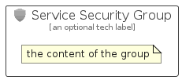

# ServiceSecurity


```text
azure-17/Item/Identity/ServiceSecurity
```

```text
include('azure-17/Item/Identity/ServiceSecurity')
```


| Illustration | ServiceSecurity | ServiceSecurityCard | ServiceSecurityGroup |
| :---: | :---: | :---: | :---: |
|  |  |  |  |


## Sprites
The item provides the following sriptes:

- `<$ServiceSecurityXs>`
- `<$ServiceSecuritySm>`
- `<$ServiceSecurityMd>`
- `<$ServiceSecurityLg>`


## ServiceSecurity

### Load remotely
```plantuml
@startuml
' configures the library
!global $LIB_BASE_LOCATION="https://raw.githubusercontent.com/tmorin/plantuml-libs/master/distribution"

' loads the library's bootstrap
!include $LIB_BASE_LOCATION/bootstrap.puml

' loads the package bootstrap
include('azure-17/bootstrap')

' loads the Item which embeds the element ServiceSecurity
include('azure-17/Item/Identity/ServiceSecurity')

' renders the element
ServiceSecurity('ServiceSecurity', 'Service Security', 'an optional tech label', 'an optional description')
@enduml
```

### Load locally
```plantuml
@startuml
' configures the library
!global $INCLUSION_MODE="local"
!global $LIB_BASE_LOCATION="../../.."

' loads the library's bootstrap
!include $LIB_BASE_LOCATION/bootstrap.puml

' loads the package bootstrap
include('azure-17/bootstrap')

' loads the Item which embeds the element ServiceSecurity
include('azure-17/Item/Identity/ServiceSecurity')

' renders the element
ServiceSecurity('ServiceSecurity', 'Service Security', 'an optional tech label', 'an optional description')
@enduml
```

## ServiceSecurityCard

### Load remotely
```plantuml
@startuml
' configures the library
!global $LIB_BASE_LOCATION="https://raw.githubusercontent.com/tmorin/plantuml-libs/master/distribution"

' loads the library's bootstrap
!include $LIB_BASE_LOCATION/bootstrap.puml

' loads the package bootstrap
include('azure-17/bootstrap')

' loads the Item which embeds the element ServiceSecurityCard
include('azure-17/Item/Identity/ServiceSecurity')

' renders the element
ServiceSecurityCard('ServiceSecurityCard', 'Service Security Card', 'an optional description')
@enduml
```

### Load locally
```plantuml
@startuml
' configures the library
!global $INCLUSION_MODE="local"
!global $LIB_BASE_LOCATION="../../.."

' loads the library's bootstrap
!include $LIB_BASE_LOCATION/bootstrap.puml

' loads the package bootstrap
include('azure-17/bootstrap')

' loads the Item which embeds the element ServiceSecurityCard
include('azure-17/Item/Identity/ServiceSecurity')

' renders the element
ServiceSecurityCard('ServiceSecurityCard', 'Service Security Card', 'an optional description')
@enduml
```

## ServiceSecurityGroup

### Load remotely
```plantuml
@startuml
' configures the library
!global $LIB_BASE_LOCATION="https://raw.githubusercontent.com/tmorin/plantuml-libs/master/distribution"

' loads the library's bootstrap
!include $LIB_BASE_LOCATION/bootstrap.puml

' loads the package bootstrap
include('azure-17/bootstrap')

' loads the Item which embeds the element ServiceSecurityGroup
include('azure-17/Item/Identity/ServiceSecurity')

' renders the element
ServiceSecurityGroup('ServiceSecurityGroup', 'Service Security Group', 'an optional tech label') {
    note as note
        the content of the group
    end note
}
@enduml
```

### Load locally
```plantuml
@startuml
' configures the library
!global $INCLUSION_MODE="local"
!global $LIB_BASE_LOCATION="../../.."

' loads the library's bootstrap
!include $LIB_BASE_LOCATION/bootstrap.puml

' loads the package bootstrap
include('azure-17/bootstrap')

' loads the Item which embeds the element ServiceSecurityGroup
include('azure-17/Item/Identity/ServiceSecurity')

' renders the element
ServiceSecurityGroup('ServiceSecurityGroup', 'Service Security Group', 'an optional tech label') {
    note as note
        the content of the group
    end note
}
@enduml
```

