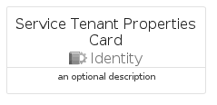

# ServiceTenantProperties


```text
azure-17/Item/Identity/ServiceTenantProperties
```

```text
include('azure-17/Item/Identity/ServiceTenantProperties')
```


| Illustration | ServiceTenantProperties | ServiceTenantPropertiesCard | ServiceTenantPropertiesGroup |
| :---: | :---: | :---: | :---: |
|  |  |  |  |


## Sprites
The item provides the following sriptes:

- `<$ServiceTenantPropertiesXs>`
- `<$ServiceTenantPropertiesSm>`
- `<$ServiceTenantPropertiesMd>`
- `<$ServiceTenantPropertiesLg>`


## ServiceTenantProperties

### Load remotely
```plantuml
@startuml
' configures the library
!global $LIB_BASE_LOCATION="https://raw.githubusercontent.com/tmorin/plantuml-libs/master/distribution"

' loads the library's bootstrap
!include $LIB_BASE_LOCATION/bootstrap.puml

' loads the package bootstrap
include('azure-17/bootstrap')

' loads the Item which embeds the element ServiceTenantProperties
include('azure-17/Item/Identity/ServiceTenantProperties')

' renders the element
ServiceTenantProperties('ServiceTenantProperties', 'Service Tenant Properties', 'an optional tech label', 'an optional description')
@enduml
```

### Load locally
```plantuml
@startuml
' configures the library
!global $INCLUSION_MODE="local"
!global $LIB_BASE_LOCATION="../../.."

' loads the library's bootstrap
!include $LIB_BASE_LOCATION/bootstrap.puml

' loads the package bootstrap
include('azure-17/bootstrap')

' loads the Item which embeds the element ServiceTenantProperties
include('azure-17/Item/Identity/ServiceTenantProperties')

' renders the element
ServiceTenantProperties('ServiceTenantProperties', 'Service Tenant Properties', 'an optional tech label', 'an optional description')
@enduml
```

## ServiceTenantPropertiesCard

### Load remotely
```plantuml
@startuml
' configures the library
!global $LIB_BASE_LOCATION="https://raw.githubusercontent.com/tmorin/plantuml-libs/master/distribution"

' loads the library's bootstrap
!include $LIB_BASE_LOCATION/bootstrap.puml

' loads the package bootstrap
include('azure-17/bootstrap')

' loads the Item which embeds the element ServiceTenantPropertiesCard
include('azure-17/Item/Identity/ServiceTenantProperties')

' renders the element
ServiceTenantPropertiesCard('ServiceTenantPropertiesCard', 'Service Tenant Properties Card', 'an optional description')
@enduml
```

### Load locally
```plantuml
@startuml
' configures the library
!global $INCLUSION_MODE="local"
!global $LIB_BASE_LOCATION="../../.."

' loads the library's bootstrap
!include $LIB_BASE_LOCATION/bootstrap.puml

' loads the package bootstrap
include('azure-17/bootstrap')

' loads the Item which embeds the element ServiceTenantPropertiesCard
include('azure-17/Item/Identity/ServiceTenantProperties')

' renders the element
ServiceTenantPropertiesCard('ServiceTenantPropertiesCard', 'Service Tenant Properties Card', 'an optional description')
@enduml
```

## ServiceTenantPropertiesGroup

### Load remotely
```plantuml
@startuml
' configures the library
!global $LIB_BASE_LOCATION="https://raw.githubusercontent.com/tmorin/plantuml-libs/master/distribution"

' loads the library's bootstrap
!include $LIB_BASE_LOCATION/bootstrap.puml

' loads the package bootstrap
include('azure-17/bootstrap')

' loads the Item which embeds the element ServiceTenantPropertiesGroup
include('azure-17/Item/Identity/ServiceTenantProperties')

' renders the element
ServiceTenantPropertiesGroup('ServiceTenantPropertiesGroup', 'Service Tenant Properties Group', 'an optional tech label') {
    note as note
        the content of the group
    end note
}
@enduml
```

### Load locally
```plantuml
@startuml
' configures the library
!global $INCLUSION_MODE="local"
!global $LIB_BASE_LOCATION="../../.."

' loads the library's bootstrap
!include $LIB_BASE_LOCATION/bootstrap.puml

' loads the package bootstrap
include('azure-17/bootstrap')

' loads the Item which embeds the element ServiceTenantPropertiesGroup
include('azure-17/Item/Identity/ServiceTenantProperties')

' renders the element
ServiceTenantPropertiesGroup('ServiceTenantPropertiesGroup', 'Service Tenant Properties Group', 'an optional tech label') {
    note as note
        the content of the group
    end note
}
@enduml
```

