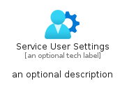

# ServiceUserSettings


```text
azure-17/Item/Identity/ServiceUserSettings
```

```text
include('azure-17/Item/Identity/ServiceUserSettings')
```


| Illustration | ServiceUserSettings | ServiceUserSettingsCard | ServiceUserSettingsGroup |
| :---: | :---: | :---: | :---: |
|  |  |  |  |


## Sprites
The item provides the following sriptes:

- `<$ServiceUserSettingsXs>`
- `<$ServiceUserSettingsSm>`
- `<$ServiceUserSettingsMd>`
- `<$ServiceUserSettingsLg>`


## ServiceUserSettings

### Load remotely
```plantuml
@startuml
' configures the library
!global $LIB_BASE_LOCATION="https://raw.githubusercontent.com/tmorin/plantuml-libs/master/distribution"

' loads the library's bootstrap
!include $LIB_BASE_LOCATION/bootstrap.puml

' loads the package bootstrap
include('azure-17/bootstrap')

' loads the Item which embeds the element ServiceUserSettings
include('azure-17/Item/Identity/ServiceUserSettings')

' renders the element
ServiceUserSettings('ServiceUserSettings', 'Service User Settings', 'an optional tech label', 'an optional description')
@enduml
```

### Load locally
```plantuml
@startuml
' configures the library
!global $INCLUSION_MODE="local"
!global $LIB_BASE_LOCATION="../../.."

' loads the library's bootstrap
!include $LIB_BASE_LOCATION/bootstrap.puml

' loads the package bootstrap
include('azure-17/bootstrap')

' loads the Item which embeds the element ServiceUserSettings
include('azure-17/Item/Identity/ServiceUserSettings')

' renders the element
ServiceUserSettings('ServiceUserSettings', 'Service User Settings', 'an optional tech label', 'an optional description')
@enduml
```

## ServiceUserSettingsCard

### Load remotely
```plantuml
@startuml
' configures the library
!global $LIB_BASE_LOCATION="https://raw.githubusercontent.com/tmorin/plantuml-libs/master/distribution"

' loads the library's bootstrap
!include $LIB_BASE_LOCATION/bootstrap.puml

' loads the package bootstrap
include('azure-17/bootstrap')

' loads the Item which embeds the element ServiceUserSettingsCard
include('azure-17/Item/Identity/ServiceUserSettings')

' renders the element
ServiceUserSettingsCard('ServiceUserSettingsCard', 'Service User Settings Card', 'an optional description')
@enduml
```

### Load locally
```plantuml
@startuml
' configures the library
!global $INCLUSION_MODE="local"
!global $LIB_BASE_LOCATION="../../.."

' loads the library's bootstrap
!include $LIB_BASE_LOCATION/bootstrap.puml

' loads the package bootstrap
include('azure-17/bootstrap')

' loads the Item which embeds the element ServiceUserSettingsCard
include('azure-17/Item/Identity/ServiceUserSettings')

' renders the element
ServiceUserSettingsCard('ServiceUserSettingsCard', 'Service User Settings Card', 'an optional description')
@enduml
```

## ServiceUserSettingsGroup

### Load remotely
```plantuml
@startuml
' configures the library
!global $LIB_BASE_LOCATION="https://raw.githubusercontent.com/tmorin/plantuml-libs/master/distribution"

' loads the library's bootstrap
!include $LIB_BASE_LOCATION/bootstrap.puml

' loads the package bootstrap
include('azure-17/bootstrap')

' loads the Item which embeds the element ServiceUserSettingsGroup
include('azure-17/Item/Identity/ServiceUserSettings')

' renders the element
ServiceUserSettingsGroup('ServiceUserSettingsGroup', 'Service User Settings Group', 'an optional tech label') {
    note as note
        the content of the group
    end note
}
@enduml
```

### Load locally
```plantuml
@startuml
' configures the library
!global $INCLUSION_MODE="local"
!global $LIB_BASE_LOCATION="../../.."

' loads the library's bootstrap
!include $LIB_BASE_LOCATION/bootstrap.puml

' loads the package bootstrap
include('azure-17/bootstrap')

' loads the Item which embeds the element ServiceUserSettingsGroup
include('azure-17/Item/Identity/ServiceUserSettings')

' renders the element
ServiceUserSettingsGroup('ServiceUserSettingsGroup', 'Service User Settings Group', 'an optional tech label') {
    note as note
        the content of the group
    end note
}
@enduml
```

