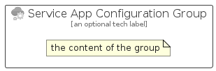

# ServiceAppConfiguration


```text
azure-17/Item/Integration/ServiceAppConfiguration
```

```text
include('azure-17/Item/Integration/ServiceAppConfiguration')
```


| Illustration | ServiceAppConfiguration | ServiceAppConfigurationCard | ServiceAppConfigurationGroup |
| :---: | :---: | :---: | :---: |
|  |  |  |  |


## Sprites
The item provides the following sriptes:

- `<$ServiceAppConfigurationXs>`
- `<$ServiceAppConfigurationSm>`
- `<$ServiceAppConfigurationMd>`
- `<$ServiceAppConfigurationLg>`


## ServiceAppConfiguration

### Load remotely
```plantuml
@startuml
' configures the library
!global $LIB_BASE_LOCATION="https://raw.githubusercontent.com/tmorin/plantuml-libs/master/distribution"

' loads the library's bootstrap
!include $LIB_BASE_LOCATION/bootstrap.puml

' loads the package bootstrap
include('azure-17/bootstrap')

' loads the Item which embeds the element ServiceAppConfiguration
include('azure-17/Item/Integration/ServiceAppConfiguration')

' renders the element
ServiceAppConfiguration('ServiceAppConfiguration', 'Service App Configuration', 'an optional tech label', 'an optional description')
@enduml
```

### Load locally
```plantuml
@startuml
' configures the library
!global $INCLUSION_MODE="local"
!global $LIB_BASE_LOCATION="../../.."

' loads the library's bootstrap
!include $LIB_BASE_LOCATION/bootstrap.puml

' loads the package bootstrap
include('azure-17/bootstrap')

' loads the Item which embeds the element ServiceAppConfiguration
include('azure-17/Item/Integration/ServiceAppConfiguration')

' renders the element
ServiceAppConfiguration('ServiceAppConfiguration', 'Service App Configuration', 'an optional tech label', 'an optional description')
@enduml
```

## ServiceAppConfigurationCard

### Load remotely
```plantuml
@startuml
' configures the library
!global $LIB_BASE_LOCATION="https://raw.githubusercontent.com/tmorin/plantuml-libs/master/distribution"

' loads the library's bootstrap
!include $LIB_BASE_LOCATION/bootstrap.puml

' loads the package bootstrap
include('azure-17/bootstrap')

' loads the Item which embeds the element ServiceAppConfigurationCard
include('azure-17/Item/Integration/ServiceAppConfiguration')

' renders the element
ServiceAppConfigurationCard('ServiceAppConfigurationCard', 'Service App Configuration Card', 'an optional description')
@enduml
```

### Load locally
```plantuml
@startuml
' configures the library
!global $INCLUSION_MODE="local"
!global $LIB_BASE_LOCATION="../../.."

' loads the library's bootstrap
!include $LIB_BASE_LOCATION/bootstrap.puml

' loads the package bootstrap
include('azure-17/bootstrap')

' loads the Item which embeds the element ServiceAppConfigurationCard
include('azure-17/Item/Integration/ServiceAppConfiguration')

' renders the element
ServiceAppConfigurationCard('ServiceAppConfigurationCard', 'Service App Configuration Card', 'an optional description')
@enduml
```

## ServiceAppConfigurationGroup

### Load remotely
```plantuml
@startuml
' configures the library
!global $LIB_BASE_LOCATION="https://raw.githubusercontent.com/tmorin/plantuml-libs/master/distribution"

' loads the library's bootstrap
!include $LIB_BASE_LOCATION/bootstrap.puml

' loads the package bootstrap
include('azure-17/bootstrap')

' loads the Item which embeds the element ServiceAppConfigurationGroup
include('azure-17/Item/Integration/ServiceAppConfiguration')

' renders the element
ServiceAppConfigurationGroup('ServiceAppConfigurationGroup', 'Service App Configuration Group', 'an optional tech label') {
    note as note
        the content of the group
    end note
}
@enduml
```

### Load locally
```plantuml
@startuml
' configures the library
!global $INCLUSION_MODE="local"
!global $LIB_BASE_LOCATION="../../.."

' loads the library's bootstrap
!include $LIB_BASE_LOCATION/bootstrap.puml

' loads the package bootstrap
include('azure-17/bootstrap')

' loads the Item which embeds the element ServiceAppConfigurationGroup
include('azure-17/Item/Integration/ServiceAppConfiguration')

' renders the element
ServiceAppConfigurationGroup('ServiceAppConfigurationGroup', 'Service App Configuration Group', 'an optional tech label') {
    note as note
        the content of the group
    end note
}
@enduml
```

