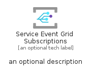

# ServiceEventGridSubscriptions


```text
azure-17/Item/Integration/ServiceEventGridSubscriptions
```

```text
include('azure-17/Item/Integration/ServiceEventGridSubscriptions')
```


| Illustration | ServiceEventGridSubscriptions | ServiceEventGridSubscriptionsCard | ServiceEventGridSubscriptionsGroup |
| :---: | :---: | :---: | :---: |
|  |  |  |  |


## Sprites
The item provides the following sriptes:

- `<$ServiceEventGridSubscriptionsXs>`
- `<$ServiceEventGridSubscriptionsSm>`
- `<$ServiceEventGridSubscriptionsMd>`
- `<$ServiceEventGridSubscriptionsLg>`


## ServiceEventGridSubscriptions

### Load remotely
```plantuml
@startuml
' configures the library
!global $LIB_BASE_LOCATION="https://raw.githubusercontent.com/tmorin/plantuml-libs/master/distribution"

' loads the library's bootstrap
!include $LIB_BASE_LOCATION/bootstrap.puml

' loads the package bootstrap
include('azure-17/bootstrap')

' loads the Item which embeds the element ServiceEventGridSubscriptions
include('azure-17/Item/Integration/ServiceEventGridSubscriptions')

' renders the element
ServiceEventGridSubscriptions('ServiceEventGridSubscriptions', 'Service Event Grid Subscriptions', 'an optional tech label', 'an optional description')
@enduml
```

### Load locally
```plantuml
@startuml
' configures the library
!global $INCLUSION_MODE="local"
!global $LIB_BASE_LOCATION="../../.."

' loads the library's bootstrap
!include $LIB_BASE_LOCATION/bootstrap.puml

' loads the package bootstrap
include('azure-17/bootstrap')

' loads the Item which embeds the element ServiceEventGridSubscriptions
include('azure-17/Item/Integration/ServiceEventGridSubscriptions')

' renders the element
ServiceEventGridSubscriptions('ServiceEventGridSubscriptions', 'Service Event Grid Subscriptions', 'an optional tech label', 'an optional description')
@enduml
```

## ServiceEventGridSubscriptionsCard

### Load remotely
```plantuml
@startuml
' configures the library
!global $LIB_BASE_LOCATION="https://raw.githubusercontent.com/tmorin/plantuml-libs/master/distribution"

' loads the library's bootstrap
!include $LIB_BASE_LOCATION/bootstrap.puml

' loads the package bootstrap
include('azure-17/bootstrap')

' loads the Item which embeds the element ServiceEventGridSubscriptionsCard
include('azure-17/Item/Integration/ServiceEventGridSubscriptions')

' renders the element
ServiceEventGridSubscriptionsCard('ServiceEventGridSubscriptionsCard', 'Service Event Grid Subscriptions Card', 'an optional description')
@enduml
```

### Load locally
```plantuml
@startuml
' configures the library
!global $INCLUSION_MODE="local"
!global $LIB_BASE_LOCATION="../../.."

' loads the library's bootstrap
!include $LIB_BASE_LOCATION/bootstrap.puml

' loads the package bootstrap
include('azure-17/bootstrap')

' loads the Item which embeds the element ServiceEventGridSubscriptionsCard
include('azure-17/Item/Integration/ServiceEventGridSubscriptions')

' renders the element
ServiceEventGridSubscriptionsCard('ServiceEventGridSubscriptionsCard', 'Service Event Grid Subscriptions Card', 'an optional description')
@enduml
```

## ServiceEventGridSubscriptionsGroup

### Load remotely
```plantuml
@startuml
' configures the library
!global $LIB_BASE_LOCATION="https://raw.githubusercontent.com/tmorin/plantuml-libs/master/distribution"

' loads the library's bootstrap
!include $LIB_BASE_LOCATION/bootstrap.puml

' loads the package bootstrap
include('azure-17/bootstrap')

' loads the Item which embeds the element ServiceEventGridSubscriptionsGroup
include('azure-17/Item/Integration/ServiceEventGridSubscriptions')

' renders the element
ServiceEventGridSubscriptionsGroup('ServiceEventGridSubscriptionsGroup', 'Service Event Grid Subscriptions Group', 'an optional tech label') {
    note as note
        the content of the group
    end note
}
@enduml
```

### Load locally
```plantuml
@startuml
' configures the library
!global $INCLUSION_MODE="local"
!global $LIB_BASE_LOCATION="../../.."

' loads the library's bootstrap
!include $LIB_BASE_LOCATION/bootstrap.puml

' loads the package bootstrap
include('azure-17/bootstrap')

' loads the Item which embeds the element ServiceEventGridSubscriptionsGroup
include('azure-17/Item/Integration/ServiceEventGridSubscriptions')

' renders the element
ServiceEventGridSubscriptionsGroup('ServiceEventGridSubscriptionsGroup', 'Service Event Grid Subscriptions Group', 'an optional tech label') {
    note as note
        the content of the group
    end note
}
@enduml
```

