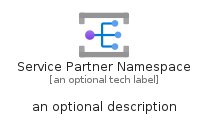
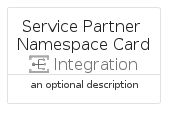

# ServicePartnerNamespace


```text
azure-17/Item/Integration/ServicePartnerNamespace
```

```text
include('azure-17/Item/Integration/ServicePartnerNamespace')
```


| Illustration | ServicePartnerNamespace | ServicePartnerNamespaceCard | ServicePartnerNamespaceGroup |
| :---: | :---: | :---: | :---: |
|  |  |  |  |


## Sprites
The item provides the following sriptes:

- `<$ServicePartnerNamespaceXs>`
- `<$ServicePartnerNamespaceSm>`
- `<$ServicePartnerNamespaceMd>`
- `<$ServicePartnerNamespaceLg>`


## ServicePartnerNamespace

### Load remotely
```plantuml
@startuml
' configures the library
!global $LIB_BASE_LOCATION="https://raw.githubusercontent.com/tmorin/plantuml-libs/master/distribution"

' loads the library's bootstrap
!include $LIB_BASE_LOCATION/bootstrap.puml

' loads the package bootstrap
include('azure-17/bootstrap')

' loads the Item which embeds the element ServicePartnerNamespace
include('azure-17/Item/Integration/ServicePartnerNamespace')

' renders the element
ServicePartnerNamespace('ServicePartnerNamespace', 'Service Partner Namespace', 'an optional tech label', 'an optional description')
@enduml
```

### Load locally
```plantuml
@startuml
' configures the library
!global $INCLUSION_MODE="local"
!global $LIB_BASE_LOCATION="../../.."

' loads the library's bootstrap
!include $LIB_BASE_LOCATION/bootstrap.puml

' loads the package bootstrap
include('azure-17/bootstrap')

' loads the Item which embeds the element ServicePartnerNamespace
include('azure-17/Item/Integration/ServicePartnerNamespace')

' renders the element
ServicePartnerNamespace('ServicePartnerNamespace', 'Service Partner Namespace', 'an optional tech label', 'an optional description')
@enduml
```

## ServicePartnerNamespaceCard

### Load remotely
```plantuml
@startuml
' configures the library
!global $LIB_BASE_LOCATION="https://raw.githubusercontent.com/tmorin/plantuml-libs/master/distribution"

' loads the library's bootstrap
!include $LIB_BASE_LOCATION/bootstrap.puml

' loads the package bootstrap
include('azure-17/bootstrap')

' loads the Item which embeds the element ServicePartnerNamespaceCard
include('azure-17/Item/Integration/ServicePartnerNamespace')

' renders the element
ServicePartnerNamespaceCard('ServicePartnerNamespaceCard', 'Service Partner Namespace Card', 'an optional description')
@enduml
```

### Load locally
```plantuml
@startuml
' configures the library
!global $INCLUSION_MODE="local"
!global $LIB_BASE_LOCATION="../../.."

' loads the library's bootstrap
!include $LIB_BASE_LOCATION/bootstrap.puml

' loads the package bootstrap
include('azure-17/bootstrap')

' loads the Item which embeds the element ServicePartnerNamespaceCard
include('azure-17/Item/Integration/ServicePartnerNamespace')

' renders the element
ServicePartnerNamespaceCard('ServicePartnerNamespaceCard', 'Service Partner Namespace Card', 'an optional description')
@enduml
```

## ServicePartnerNamespaceGroup

### Load remotely
```plantuml
@startuml
' configures the library
!global $LIB_BASE_LOCATION="https://raw.githubusercontent.com/tmorin/plantuml-libs/master/distribution"

' loads the library's bootstrap
!include $LIB_BASE_LOCATION/bootstrap.puml

' loads the package bootstrap
include('azure-17/bootstrap')

' loads the Item which embeds the element ServicePartnerNamespaceGroup
include('azure-17/Item/Integration/ServicePartnerNamespace')

' renders the element
ServicePartnerNamespaceGroup('ServicePartnerNamespaceGroup', 'Service Partner Namespace Group', 'an optional tech label') {
    note as note
        the content of the group
    end note
}
@enduml
```

### Load locally
```plantuml
@startuml
' configures the library
!global $INCLUSION_MODE="local"
!global $LIB_BASE_LOCATION="../../.."

' loads the library's bootstrap
!include $LIB_BASE_LOCATION/bootstrap.puml

' loads the package bootstrap
include('azure-17/bootstrap')

' loads the Item which embeds the element ServicePartnerNamespaceGroup
include('azure-17/Item/Integration/ServicePartnerNamespace')

' renders the element
ServicePartnerNamespaceGroup('ServicePartnerNamespaceGroup', 'Service Partner Namespace Group', 'an optional tech label') {
    note as note
        the content of the group
    end note
}
@enduml
```

