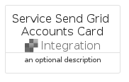
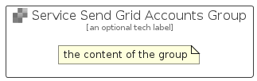

# ServiceSendGridAccounts


```text
azure-17/Item/Integration/ServiceSendGridAccounts
```

```text
include('azure-17/Item/Integration/ServiceSendGridAccounts')
```


| Illustration | ServiceSendGridAccounts | ServiceSendGridAccountsCard | ServiceSendGridAccountsGroup |
| :---: | :---: | :---: | :---: |
|  |  |  |  |


## Sprites
The item provides the following sriptes:

- `<$ServiceSendGridAccountsXs>`
- `<$ServiceSendGridAccountsSm>`
- `<$ServiceSendGridAccountsMd>`
- `<$ServiceSendGridAccountsLg>`


## ServiceSendGridAccounts

### Load remotely
```plantuml
@startuml
' configures the library
!global $LIB_BASE_LOCATION="https://raw.githubusercontent.com/tmorin/plantuml-libs/master/distribution"

' loads the library's bootstrap
!include $LIB_BASE_LOCATION/bootstrap.puml

' loads the package bootstrap
include('azure-17/bootstrap')

' loads the Item which embeds the element ServiceSendGridAccounts
include('azure-17/Item/Integration/ServiceSendGridAccounts')

' renders the element
ServiceSendGridAccounts('ServiceSendGridAccounts', 'Service Send Grid Accounts', 'an optional tech label', 'an optional description')
@enduml
```

### Load locally
```plantuml
@startuml
' configures the library
!global $INCLUSION_MODE="local"
!global $LIB_BASE_LOCATION="../../.."

' loads the library's bootstrap
!include $LIB_BASE_LOCATION/bootstrap.puml

' loads the package bootstrap
include('azure-17/bootstrap')

' loads the Item which embeds the element ServiceSendGridAccounts
include('azure-17/Item/Integration/ServiceSendGridAccounts')

' renders the element
ServiceSendGridAccounts('ServiceSendGridAccounts', 'Service Send Grid Accounts', 'an optional tech label', 'an optional description')
@enduml
```

## ServiceSendGridAccountsCard

### Load remotely
```plantuml
@startuml
' configures the library
!global $LIB_BASE_LOCATION="https://raw.githubusercontent.com/tmorin/plantuml-libs/master/distribution"

' loads the library's bootstrap
!include $LIB_BASE_LOCATION/bootstrap.puml

' loads the package bootstrap
include('azure-17/bootstrap')

' loads the Item which embeds the element ServiceSendGridAccountsCard
include('azure-17/Item/Integration/ServiceSendGridAccounts')

' renders the element
ServiceSendGridAccountsCard('ServiceSendGridAccountsCard', 'Service Send Grid Accounts Card', 'an optional description')
@enduml
```

### Load locally
```plantuml
@startuml
' configures the library
!global $INCLUSION_MODE="local"
!global $LIB_BASE_LOCATION="../../.."

' loads the library's bootstrap
!include $LIB_BASE_LOCATION/bootstrap.puml

' loads the package bootstrap
include('azure-17/bootstrap')

' loads the Item which embeds the element ServiceSendGridAccountsCard
include('azure-17/Item/Integration/ServiceSendGridAccounts')

' renders the element
ServiceSendGridAccountsCard('ServiceSendGridAccountsCard', 'Service Send Grid Accounts Card', 'an optional description')
@enduml
```

## ServiceSendGridAccountsGroup

### Load remotely
```plantuml
@startuml
' configures the library
!global $LIB_BASE_LOCATION="https://raw.githubusercontent.com/tmorin/plantuml-libs/master/distribution"

' loads the library's bootstrap
!include $LIB_BASE_LOCATION/bootstrap.puml

' loads the package bootstrap
include('azure-17/bootstrap')

' loads the Item which embeds the element ServiceSendGridAccountsGroup
include('azure-17/Item/Integration/ServiceSendGridAccounts')

' renders the element
ServiceSendGridAccountsGroup('ServiceSendGridAccountsGroup', 'Service Send Grid Accounts Group', 'an optional tech label') {
    note as note
        the content of the group
    end note
}
@enduml
```

### Load locally
```plantuml
@startuml
' configures the library
!global $INCLUSION_MODE="local"
!global $LIB_BASE_LOCATION="../../.."

' loads the library's bootstrap
!include $LIB_BASE_LOCATION/bootstrap.puml

' loads the package bootstrap
include('azure-17/bootstrap')

' loads the Item which embeds the element ServiceSendGridAccountsGroup
include('azure-17/Item/Integration/ServiceSendGridAccounts')

' renders the element
ServiceSendGridAccountsGroup('ServiceSendGridAccountsGroup', 'Service Send Grid Accounts Group', 'an optional tech label') {
    note as note
        the content of the group
    end note
}
@enduml
```

