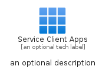
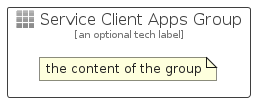

# ServiceClientApps


```text
azure-17/Item/Intune/ServiceClientApps
```

```text
include('azure-17/Item/Intune/ServiceClientApps')
```


| Illustration | ServiceClientApps | ServiceClientAppsCard | ServiceClientAppsGroup |
| :---: | :---: | :---: | :---: |
|  |  |  |  |


## Sprites
The item provides the following sriptes:

- `<$ServiceClientAppsXs>`
- `<$ServiceClientAppsSm>`
- `<$ServiceClientAppsMd>`
- `<$ServiceClientAppsLg>`


## ServiceClientApps

### Load remotely
```plantuml
@startuml
' configures the library
!global $LIB_BASE_LOCATION="https://raw.githubusercontent.com/tmorin/plantuml-libs/master/distribution"

' loads the library's bootstrap
!include $LIB_BASE_LOCATION/bootstrap.puml

' loads the package bootstrap
include('azure-17/bootstrap')

' loads the Item which embeds the element ServiceClientApps
include('azure-17/Item/Intune/ServiceClientApps')

' renders the element
ServiceClientApps('ServiceClientApps', 'Service Client Apps', 'an optional tech label', 'an optional description')
@enduml
```

### Load locally
```plantuml
@startuml
' configures the library
!global $INCLUSION_MODE="local"
!global $LIB_BASE_LOCATION="../../.."

' loads the library's bootstrap
!include $LIB_BASE_LOCATION/bootstrap.puml

' loads the package bootstrap
include('azure-17/bootstrap')

' loads the Item which embeds the element ServiceClientApps
include('azure-17/Item/Intune/ServiceClientApps')

' renders the element
ServiceClientApps('ServiceClientApps', 'Service Client Apps', 'an optional tech label', 'an optional description')
@enduml
```

## ServiceClientAppsCard

### Load remotely
```plantuml
@startuml
' configures the library
!global $LIB_BASE_LOCATION="https://raw.githubusercontent.com/tmorin/plantuml-libs/master/distribution"

' loads the library's bootstrap
!include $LIB_BASE_LOCATION/bootstrap.puml

' loads the package bootstrap
include('azure-17/bootstrap')

' loads the Item which embeds the element ServiceClientAppsCard
include('azure-17/Item/Intune/ServiceClientApps')

' renders the element
ServiceClientAppsCard('ServiceClientAppsCard', 'Service Client Apps Card', 'an optional description')
@enduml
```

### Load locally
```plantuml
@startuml
' configures the library
!global $INCLUSION_MODE="local"
!global $LIB_BASE_LOCATION="../../.."

' loads the library's bootstrap
!include $LIB_BASE_LOCATION/bootstrap.puml

' loads the package bootstrap
include('azure-17/bootstrap')

' loads the Item which embeds the element ServiceClientAppsCard
include('azure-17/Item/Intune/ServiceClientApps')

' renders the element
ServiceClientAppsCard('ServiceClientAppsCard', 'Service Client Apps Card', 'an optional description')
@enduml
```

## ServiceClientAppsGroup

### Load remotely
```plantuml
@startuml
' configures the library
!global $LIB_BASE_LOCATION="https://raw.githubusercontent.com/tmorin/plantuml-libs/master/distribution"

' loads the library's bootstrap
!include $LIB_BASE_LOCATION/bootstrap.puml

' loads the package bootstrap
include('azure-17/bootstrap')

' loads the Item which embeds the element ServiceClientAppsGroup
include('azure-17/Item/Intune/ServiceClientApps')

' renders the element
ServiceClientAppsGroup('ServiceClientAppsGroup', 'Service Client Apps Group', 'an optional tech label') {
    note as note
        the content of the group
    end note
}
@enduml
```

### Load locally
```plantuml
@startuml
' configures the library
!global $INCLUSION_MODE="local"
!global $LIB_BASE_LOCATION="../../.."

' loads the library's bootstrap
!include $LIB_BASE_LOCATION/bootstrap.puml

' loads the package bootstrap
include('azure-17/bootstrap')

' loads the Item which embeds the element ServiceClientAppsGroup
include('azure-17/Item/Intune/ServiceClientApps')

' renders the element
ServiceClientAppsGroup('ServiceClientAppsGroup', 'Service Client Apps Group', 'an optional tech label') {
    note as note
        the content of the group
    end note
}
@enduml
```

