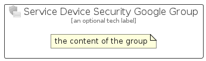

# ServiceDeviceSecurityGoogle


```text
azure-17/Item/Intune/ServiceDeviceSecurityGoogle
```

```text
include('azure-17/Item/Intune/ServiceDeviceSecurityGoogle')
```


| Illustration | ServiceDeviceSecurityGoogle | ServiceDeviceSecurityGoogleCard | ServiceDeviceSecurityGoogleGroup |
| :---: | :---: | :---: | :---: |
|  |  |  |  |


## Sprites
The item provides the following sriptes:

- `<$ServiceDeviceSecurityGoogleXs>`
- `<$ServiceDeviceSecurityGoogleSm>`
- `<$ServiceDeviceSecurityGoogleMd>`
- `<$ServiceDeviceSecurityGoogleLg>`


## ServiceDeviceSecurityGoogle

### Load remotely
```plantuml
@startuml
' configures the library
!global $LIB_BASE_LOCATION="https://raw.githubusercontent.com/tmorin/plantuml-libs/master/distribution"

' loads the library's bootstrap
!include $LIB_BASE_LOCATION/bootstrap.puml

' loads the package bootstrap
include('azure-17/bootstrap')

' loads the Item which embeds the element ServiceDeviceSecurityGoogle
include('azure-17/Item/Intune/ServiceDeviceSecurityGoogle')

' renders the element
ServiceDeviceSecurityGoogle('ServiceDeviceSecurityGoogle', 'Service Device Security Google', 'an optional tech label', 'an optional description')
@enduml
```

### Load locally
```plantuml
@startuml
' configures the library
!global $INCLUSION_MODE="local"
!global $LIB_BASE_LOCATION="../../.."

' loads the library's bootstrap
!include $LIB_BASE_LOCATION/bootstrap.puml

' loads the package bootstrap
include('azure-17/bootstrap')

' loads the Item which embeds the element ServiceDeviceSecurityGoogle
include('azure-17/Item/Intune/ServiceDeviceSecurityGoogle')

' renders the element
ServiceDeviceSecurityGoogle('ServiceDeviceSecurityGoogle', 'Service Device Security Google', 'an optional tech label', 'an optional description')
@enduml
```

## ServiceDeviceSecurityGoogleCard

### Load remotely
```plantuml
@startuml
' configures the library
!global $LIB_BASE_LOCATION="https://raw.githubusercontent.com/tmorin/plantuml-libs/master/distribution"

' loads the library's bootstrap
!include $LIB_BASE_LOCATION/bootstrap.puml

' loads the package bootstrap
include('azure-17/bootstrap')

' loads the Item which embeds the element ServiceDeviceSecurityGoogleCard
include('azure-17/Item/Intune/ServiceDeviceSecurityGoogle')

' renders the element
ServiceDeviceSecurityGoogleCard('ServiceDeviceSecurityGoogleCard', 'Service Device Security Google Card', 'an optional description')
@enduml
```

### Load locally
```plantuml
@startuml
' configures the library
!global $INCLUSION_MODE="local"
!global $LIB_BASE_LOCATION="../../.."

' loads the library's bootstrap
!include $LIB_BASE_LOCATION/bootstrap.puml

' loads the package bootstrap
include('azure-17/bootstrap')

' loads the Item which embeds the element ServiceDeviceSecurityGoogleCard
include('azure-17/Item/Intune/ServiceDeviceSecurityGoogle')

' renders the element
ServiceDeviceSecurityGoogleCard('ServiceDeviceSecurityGoogleCard', 'Service Device Security Google Card', 'an optional description')
@enduml
```

## ServiceDeviceSecurityGoogleGroup

### Load remotely
```plantuml
@startuml
' configures the library
!global $LIB_BASE_LOCATION="https://raw.githubusercontent.com/tmorin/plantuml-libs/master/distribution"

' loads the library's bootstrap
!include $LIB_BASE_LOCATION/bootstrap.puml

' loads the package bootstrap
include('azure-17/bootstrap')

' loads the Item which embeds the element ServiceDeviceSecurityGoogleGroup
include('azure-17/Item/Intune/ServiceDeviceSecurityGoogle')

' renders the element
ServiceDeviceSecurityGoogleGroup('ServiceDeviceSecurityGoogleGroup', 'Service Device Security Google Group', 'an optional tech label') {
    note as note
        the content of the group
    end note
}
@enduml
```

### Load locally
```plantuml
@startuml
' configures the library
!global $INCLUSION_MODE="local"
!global $LIB_BASE_LOCATION="../../.."

' loads the library's bootstrap
!include $LIB_BASE_LOCATION/bootstrap.puml

' loads the package bootstrap
include('azure-17/bootstrap')

' loads the Item which embeds the element ServiceDeviceSecurityGoogleGroup
include('azure-17/Item/Intune/ServiceDeviceSecurityGoogle')

' renders the element
ServiceDeviceSecurityGoogleGroup('ServiceDeviceSecurityGoogleGroup', 'Service Device Security Google Group', 'an optional tech label') {
    note as note
        the content of the group
    end note
}
@enduml
```

