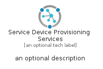
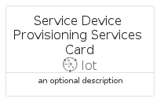

# ServiceDeviceProvisioningServices


```text
azure-17/Item/Iot/ServiceDeviceProvisioningServices
```

```text
include('azure-17/Item/Iot/ServiceDeviceProvisioningServices')
```


| Illustration | ServiceDeviceProvisioningServices | ServiceDeviceProvisioningServicesCard | ServiceDeviceProvisioningServicesGroup |
| :---: | :---: | :---: | :---: |
|  |  |  |  |


## Sprites
The item provides the following sriptes:

- `<$ServiceDeviceProvisioningServicesXs>`
- `<$ServiceDeviceProvisioningServicesSm>`
- `<$ServiceDeviceProvisioningServicesMd>`
- `<$ServiceDeviceProvisioningServicesLg>`


## ServiceDeviceProvisioningServices

### Load remotely
```plantuml
@startuml
' configures the library
!global $LIB_BASE_LOCATION="https://raw.githubusercontent.com/tmorin/plantuml-libs/master/distribution"

' loads the library's bootstrap
!include $LIB_BASE_LOCATION/bootstrap.puml

' loads the package bootstrap
include('azure-17/bootstrap')

' loads the Item which embeds the element ServiceDeviceProvisioningServices
include('azure-17/Item/Iot/ServiceDeviceProvisioningServices')

' renders the element
ServiceDeviceProvisioningServices('ServiceDeviceProvisioningServices', 'Service Device Provisioning Services', 'an optional tech label', 'an optional description')
@enduml
```

### Load locally
```plantuml
@startuml
' configures the library
!global $INCLUSION_MODE="local"
!global $LIB_BASE_LOCATION="../../.."

' loads the library's bootstrap
!include $LIB_BASE_LOCATION/bootstrap.puml

' loads the package bootstrap
include('azure-17/bootstrap')

' loads the Item which embeds the element ServiceDeviceProvisioningServices
include('azure-17/Item/Iot/ServiceDeviceProvisioningServices')

' renders the element
ServiceDeviceProvisioningServices('ServiceDeviceProvisioningServices', 'Service Device Provisioning Services', 'an optional tech label', 'an optional description')
@enduml
```

## ServiceDeviceProvisioningServicesCard

### Load remotely
```plantuml
@startuml
' configures the library
!global $LIB_BASE_LOCATION="https://raw.githubusercontent.com/tmorin/plantuml-libs/master/distribution"

' loads the library's bootstrap
!include $LIB_BASE_LOCATION/bootstrap.puml

' loads the package bootstrap
include('azure-17/bootstrap')

' loads the Item which embeds the element ServiceDeviceProvisioningServicesCard
include('azure-17/Item/Iot/ServiceDeviceProvisioningServices')

' renders the element
ServiceDeviceProvisioningServicesCard('ServiceDeviceProvisioningServicesCard', 'Service Device Provisioning Services Card', 'an optional description')
@enduml
```

### Load locally
```plantuml
@startuml
' configures the library
!global $INCLUSION_MODE="local"
!global $LIB_BASE_LOCATION="../../.."

' loads the library's bootstrap
!include $LIB_BASE_LOCATION/bootstrap.puml

' loads the package bootstrap
include('azure-17/bootstrap')

' loads the Item which embeds the element ServiceDeviceProvisioningServicesCard
include('azure-17/Item/Iot/ServiceDeviceProvisioningServices')

' renders the element
ServiceDeviceProvisioningServicesCard('ServiceDeviceProvisioningServicesCard', 'Service Device Provisioning Services Card', 'an optional description')
@enduml
```

## ServiceDeviceProvisioningServicesGroup

### Load remotely
```plantuml
@startuml
' configures the library
!global $LIB_BASE_LOCATION="https://raw.githubusercontent.com/tmorin/plantuml-libs/master/distribution"

' loads the library's bootstrap
!include $LIB_BASE_LOCATION/bootstrap.puml

' loads the package bootstrap
include('azure-17/bootstrap')

' loads the Item which embeds the element ServiceDeviceProvisioningServicesGroup
include('azure-17/Item/Iot/ServiceDeviceProvisioningServices')

' renders the element
ServiceDeviceProvisioningServicesGroup('ServiceDeviceProvisioningServicesGroup', 'Service Device Provisioning Services Group', 'an optional tech label') {
    note as note
        the content of the group
    end note
}
@enduml
```

### Load locally
```plantuml
@startuml
' configures the library
!global $INCLUSION_MODE="local"
!global $LIB_BASE_LOCATION="../../.."

' loads the library's bootstrap
!include $LIB_BASE_LOCATION/bootstrap.puml

' loads the package bootstrap
include('azure-17/bootstrap')

' loads the Item which embeds the element ServiceDeviceProvisioningServicesGroup
include('azure-17/Item/Iot/ServiceDeviceProvisioningServices')

' renders the element
ServiceDeviceProvisioningServicesGroup('ServiceDeviceProvisioningServicesGroup', 'Service Device Provisioning Services Group', 'an optional tech label') {
    note as note
        the content of the group
    end note
}
@enduml
```

