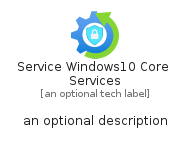

# ServiceWindows10CoreServices


```text
azure-17/Item/Iot/ServiceWindows10CoreServices
```

```text
include('azure-17/Item/Iot/ServiceWindows10CoreServices')
```


| Illustration | ServiceWindows10CoreServices | ServiceWindows10CoreServicesCard | ServiceWindows10CoreServicesGroup |
| :---: | :---: | :---: | :---: |
|  |  |  |  |


## Sprites
The item provides the following sriptes:

- `<$ServiceWindows10CoreServicesXs>`
- `<$ServiceWindows10CoreServicesSm>`
- `<$ServiceWindows10CoreServicesMd>`
- `<$ServiceWindows10CoreServicesLg>`


## ServiceWindows10CoreServices

### Load remotely
```plantuml
@startuml
' configures the library
!global $LIB_BASE_LOCATION="https://raw.githubusercontent.com/tmorin/plantuml-libs/master/distribution"

' loads the library's bootstrap
!include $LIB_BASE_LOCATION/bootstrap.puml

' loads the package bootstrap
include('azure-17/bootstrap')

' loads the Item which embeds the element ServiceWindows10CoreServices
include('azure-17/Item/Iot/ServiceWindows10CoreServices')

' renders the element
ServiceWindows10CoreServices('ServiceWindows10CoreServices', 'Service Windows10 Core Services', 'an optional tech label', 'an optional description')
@enduml
```

### Load locally
```plantuml
@startuml
' configures the library
!global $INCLUSION_MODE="local"
!global $LIB_BASE_LOCATION="../../.."

' loads the library's bootstrap
!include $LIB_BASE_LOCATION/bootstrap.puml

' loads the package bootstrap
include('azure-17/bootstrap')

' loads the Item which embeds the element ServiceWindows10CoreServices
include('azure-17/Item/Iot/ServiceWindows10CoreServices')

' renders the element
ServiceWindows10CoreServices('ServiceWindows10CoreServices', 'Service Windows10 Core Services', 'an optional tech label', 'an optional description')
@enduml
```

## ServiceWindows10CoreServicesCard

### Load remotely
```plantuml
@startuml
' configures the library
!global $LIB_BASE_LOCATION="https://raw.githubusercontent.com/tmorin/plantuml-libs/master/distribution"

' loads the library's bootstrap
!include $LIB_BASE_LOCATION/bootstrap.puml

' loads the package bootstrap
include('azure-17/bootstrap')

' loads the Item which embeds the element ServiceWindows10CoreServicesCard
include('azure-17/Item/Iot/ServiceWindows10CoreServices')

' renders the element
ServiceWindows10CoreServicesCard('ServiceWindows10CoreServicesCard', 'Service Windows10 Core Services Card', 'an optional description')
@enduml
```

### Load locally
```plantuml
@startuml
' configures the library
!global $INCLUSION_MODE="local"
!global $LIB_BASE_LOCATION="../../.."

' loads the library's bootstrap
!include $LIB_BASE_LOCATION/bootstrap.puml

' loads the package bootstrap
include('azure-17/bootstrap')

' loads the Item which embeds the element ServiceWindows10CoreServicesCard
include('azure-17/Item/Iot/ServiceWindows10CoreServices')

' renders the element
ServiceWindows10CoreServicesCard('ServiceWindows10CoreServicesCard', 'Service Windows10 Core Services Card', 'an optional description')
@enduml
```

## ServiceWindows10CoreServicesGroup

### Load remotely
```plantuml
@startuml
' configures the library
!global $LIB_BASE_LOCATION="https://raw.githubusercontent.com/tmorin/plantuml-libs/master/distribution"

' loads the library's bootstrap
!include $LIB_BASE_LOCATION/bootstrap.puml

' loads the package bootstrap
include('azure-17/bootstrap')

' loads the Item which embeds the element ServiceWindows10CoreServicesGroup
include('azure-17/Item/Iot/ServiceWindows10CoreServices')

' renders the element
ServiceWindows10CoreServicesGroup('ServiceWindows10CoreServicesGroup', 'Service Windows10 Core Services Group', 'an optional tech label') {
    note as note
        the content of the group
    end note
}
@enduml
```

### Load locally
```plantuml
@startuml
' configures the library
!global $INCLUSION_MODE="local"
!global $LIB_BASE_LOCATION="../../.."

' loads the library's bootstrap
!include $LIB_BASE_LOCATION/bootstrap.puml

' loads the package bootstrap
include('azure-17/bootstrap')

' loads the Item which embeds the element ServiceWindows10CoreServicesGroup
include('azure-17/Item/Iot/ServiceWindows10CoreServices')

' renders the element
ServiceWindows10CoreServicesGroup('ServiceWindows10CoreServicesGroup', 'Service Windows10 Core Services Group', 'an optional tech label') {
    note as note
        the content of the group
    end note
}
@enduml
```

