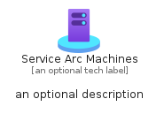
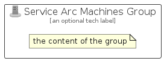

# ServiceArcMachines


```text
azure-17/Item/ManagementGovernance/ServiceArcMachines
```

```text
include('azure-17/Item/ManagementGovernance/ServiceArcMachines')
```


| Illustration | ServiceArcMachines | ServiceArcMachinesCard | ServiceArcMachinesGroup |
| :---: | :---: | :---: | :---: |
|  |  |  |  |


## Sprites
The item provides the following sriptes:

- `<$ServiceArcMachinesXs>`
- `<$ServiceArcMachinesSm>`
- `<$ServiceArcMachinesMd>`
- `<$ServiceArcMachinesLg>`


## ServiceArcMachines

### Load remotely
```plantuml
@startuml
' configures the library
!global $LIB_BASE_LOCATION="https://raw.githubusercontent.com/tmorin/plantuml-libs/master/distribution"

' loads the library's bootstrap
!include $LIB_BASE_LOCATION/bootstrap.puml

' loads the package bootstrap
include('azure-17/bootstrap')

' loads the Item which embeds the element ServiceArcMachines
include('azure-17/Item/ManagementGovernance/ServiceArcMachines')

' renders the element
ServiceArcMachines('ServiceArcMachines', 'Service Arc Machines', 'an optional tech label', 'an optional description')
@enduml
```

### Load locally
```plantuml
@startuml
' configures the library
!global $INCLUSION_MODE="local"
!global $LIB_BASE_LOCATION="../../.."

' loads the library's bootstrap
!include $LIB_BASE_LOCATION/bootstrap.puml

' loads the package bootstrap
include('azure-17/bootstrap')

' loads the Item which embeds the element ServiceArcMachines
include('azure-17/Item/ManagementGovernance/ServiceArcMachines')

' renders the element
ServiceArcMachines('ServiceArcMachines', 'Service Arc Machines', 'an optional tech label', 'an optional description')
@enduml
```

## ServiceArcMachinesCard

### Load remotely
```plantuml
@startuml
' configures the library
!global $LIB_BASE_LOCATION="https://raw.githubusercontent.com/tmorin/plantuml-libs/master/distribution"

' loads the library's bootstrap
!include $LIB_BASE_LOCATION/bootstrap.puml

' loads the package bootstrap
include('azure-17/bootstrap')

' loads the Item which embeds the element ServiceArcMachinesCard
include('azure-17/Item/ManagementGovernance/ServiceArcMachines')

' renders the element
ServiceArcMachinesCard('ServiceArcMachinesCard', 'Service Arc Machines Card', 'an optional description')
@enduml
```

### Load locally
```plantuml
@startuml
' configures the library
!global $INCLUSION_MODE="local"
!global $LIB_BASE_LOCATION="../../.."

' loads the library's bootstrap
!include $LIB_BASE_LOCATION/bootstrap.puml

' loads the package bootstrap
include('azure-17/bootstrap')

' loads the Item which embeds the element ServiceArcMachinesCard
include('azure-17/Item/ManagementGovernance/ServiceArcMachines')

' renders the element
ServiceArcMachinesCard('ServiceArcMachinesCard', 'Service Arc Machines Card', 'an optional description')
@enduml
```

## ServiceArcMachinesGroup

### Load remotely
```plantuml
@startuml
' configures the library
!global $LIB_BASE_LOCATION="https://raw.githubusercontent.com/tmorin/plantuml-libs/master/distribution"

' loads the library's bootstrap
!include $LIB_BASE_LOCATION/bootstrap.puml

' loads the package bootstrap
include('azure-17/bootstrap')

' loads the Item which embeds the element ServiceArcMachinesGroup
include('azure-17/Item/ManagementGovernance/ServiceArcMachines')

' renders the element
ServiceArcMachinesGroup('ServiceArcMachinesGroup', 'Service Arc Machines Group', 'an optional tech label') {
    note as note
        the content of the group
    end note
}
@enduml
```

### Load locally
```plantuml
@startuml
' configures the library
!global $INCLUSION_MODE="local"
!global $LIB_BASE_LOCATION="../../.."

' loads the library's bootstrap
!include $LIB_BASE_LOCATION/bootstrap.puml

' loads the package bootstrap
include('azure-17/bootstrap')

' loads the Item which embeds the element ServiceArcMachinesGroup
include('azure-17/Item/ManagementGovernance/ServiceArcMachines')

' renders the element
ServiceArcMachinesGroup('ServiceArcMachinesGroup', 'Service Arc Machines Group', 'an optional tech label') {
    note as note
        the content of the group
    end note
}
@enduml
```

