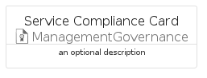

# ServiceCompliance


```text
azure-17/Item/ManagementGovernance/ServiceCompliance
```

```text
include('azure-17/Item/ManagementGovernance/ServiceCompliance')
```


| Illustration | ServiceCompliance | ServiceComplianceCard | ServiceComplianceGroup |
| :---: | :---: | :---: | :---: |
|  |  |  |  |


## Sprites
The item provides the following sriptes:

- `<$ServiceComplianceXs>`
- `<$ServiceComplianceSm>`
- `<$ServiceComplianceMd>`
- `<$ServiceComplianceLg>`


## ServiceCompliance

### Load remotely
```plantuml
@startuml
' configures the library
!global $LIB_BASE_LOCATION="https://raw.githubusercontent.com/tmorin/plantuml-libs/master/distribution"

' loads the library's bootstrap
!include $LIB_BASE_LOCATION/bootstrap.puml

' loads the package bootstrap
include('azure-17/bootstrap')

' loads the Item which embeds the element ServiceCompliance
include('azure-17/Item/ManagementGovernance/ServiceCompliance')

' renders the element
ServiceCompliance('ServiceCompliance', 'Service Compliance', 'an optional tech label', 'an optional description')
@enduml
```

### Load locally
```plantuml
@startuml
' configures the library
!global $INCLUSION_MODE="local"
!global $LIB_BASE_LOCATION="../../.."

' loads the library's bootstrap
!include $LIB_BASE_LOCATION/bootstrap.puml

' loads the package bootstrap
include('azure-17/bootstrap')

' loads the Item which embeds the element ServiceCompliance
include('azure-17/Item/ManagementGovernance/ServiceCompliance')

' renders the element
ServiceCompliance('ServiceCompliance', 'Service Compliance', 'an optional tech label', 'an optional description')
@enduml
```

## ServiceComplianceCard

### Load remotely
```plantuml
@startuml
' configures the library
!global $LIB_BASE_LOCATION="https://raw.githubusercontent.com/tmorin/plantuml-libs/master/distribution"

' loads the library's bootstrap
!include $LIB_BASE_LOCATION/bootstrap.puml

' loads the package bootstrap
include('azure-17/bootstrap')

' loads the Item which embeds the element ServiceComplianceCard
include('azure-17/Item/ManagementGovernance/ServiceCompliance')

' renders the element
ServiceComplianceCard('ServiceComplianceCard', 'Service Compliance Card', 'an optional description')
@enduml
```

### Load locally
```plantuml
@startuml
' configures the library
!global $INCLUSION_MODE="local"
!global $LIB_BASE_LOCATION="../../.."

' loads the library's bootstrap
!include $LIB_BASE_LOCATION/bootstrap.puml

' loads the package bootstrap
include('azure-17/bootstrap')

' loads the Item which embeds the element ServiceComplianceCard
include('azure-17/Item/ManagementGovernance/ServiceCompliance')

' renders the element
ServiceComplianceCard('ServiceComplianceCard', 'Service Compliance Card', 'an optional description')
@enduml
```

## ServiceComplianceGroup

### Load remotely
```plantuml
@startuml
' configures the library
!global $LIB_BASE_LOCATION="https://raw.githubusercontent.com/tmorin/plantuml-libs/master/distribution"

' loads the library's bootstrap
!include $LIB_BASE_LOCATION/bootstrap.puml

' loads the package bootstrap
include('azure-17/bootstrap')

' loads the Item which embeds the element ServiceComplianceGroup
include('azure-17/Item/ManagementGovernance/ServiceCompliance')

' renders the element
ServiceComplianceGroup('ServiceComplianceGroup', 'Service Compliance Group', 'an optional tech label') {
    note as note
        the content of the group
    end note
}
@enduml
```

### Load locally
```plantuml
@startuml
' configures the library
!global $INCLUSION_MODE="local"
!global $LIB_BASE_LOCATION="../../.."

' loads the library's bootstrap
!include $LIB_BASE_LOCATION/bootstrap.puml

' loads the package bootstrap
include('azure-17/bootstrap')

' loads the Item which embeds the element ServiceComplianceGroup
include('azure-17/Item/ManagementGovernance/ServiceCompliance')

' renders the element
ServiceComplianceGroup('ServiceComplianceGroup', 'Service Compliance Group', 'an optional tech label') {
    note as note
        the content of the group
    end note
}
@enduml
```

