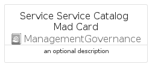

# ServiceServiceCatalogMad


```text
azure-17/Item/ManagementGovernance/ServiceServiceCatalogMad
```

```text
include('azure-17/Item/ManagementGovernance/ServiceServiceCatalogMad')
```


| Illustration | ServiceServiceCatalogMad | ServiceServiceCatalogMadCard | ServiceServiceCatalogMadGroup |
| :---: | :---: | :---: | :---: |
|  |  |  |  |


## Sprites
The item provides the following sriptes:

- `<$ServiceServiceCatalogMadXs>`
- `<$ServiceServiceCatalogMadSm>`
- `<$ServiceServiceCatalogMadMd>`
- `<$ServiceServiceCatalogMadLg>`


## ServiceServiceCatalogMad

### Load remotely
```plantuml
@startuml
' configures the library
!global $LIB_BASE_LOCATION="https://raw.githubusercontent.com/tmorin/plantuml-libs/master/distribution"

' loads the library's bootstrap
!include $LIB_BASE_LOCATION/bootstrap.puml

' loads the package bootstrap
include('azure-17/bootstrap')

' loads the Item which embeds the element ServiceServiceCatalogMad
include('azure-17/Item/ManagementGovernance/ServiceServiceCatalogMad')

' renders the element
ServiceServiceCatalogMad('ServiceServiceCatalogMad', 'Service Service Catalog Mad', 'an optional tech label', 'an optional description')
@enduml
```

### Load locally
```plantuml
@startuml
' configures the library
!global $INCLUSION_MODE="local"
!global $LIB_BASE_LOCATION="../../.."

' loads the library's bootstrap
!include $LIB_BASE_LOCATION/bootstrap.puml

' loads the package bootstrap
include('azure-17/bootstrap')

' loads the Item which embeds the element ServiceServiceCatalogMad
include('azure-17/Item/ManagementGovernance/ServiceServiceCatalogMad')

' renders the element
ServiceServiceCatalogMad('ServiceServiceCatalogMad', 'Service Service Catalog Mad', 'an optional tech label', 'an optional description')
@enduml
```

## ServiceServiceCatalogMadCard

### Load remotely
```plantuml
@startuml
' configures the library
!global $LIB_BASE_LOCATION="https://raw.githubusercontent.com/tmorin/plantuml-libs/master/distribution"

' loads the library's bootstrap
!include $LIB_BASE_LOCATION/bootstrap.puml

' loads the package bootstrap
include('azure-17/bootstrap')

' loads the Item which embeds the element ServiceServiceCatalogMadCard
include('azure-17/Item/ManagementGovernance/ServiceServiceCatalogMad')

' renders the element
ServiceServiceCatalogMadCard('ServiceServiceCatalogMadCard', 'Service Service Catalog Mad Card', 'an optional description')
@enduml
```

### Load locally
```plantuml
@startuml
' configures the library
!global $INCLUSION_MODE="local"
!global $LIB_BASE_LOCATION="../../.."

' loads the library's bootstrap
!include $LIB_BASE_LOCATION/bootstrap.puml

' loads the package bootstrap
include('azure-17/bootstrap')

' loads the Item which embeds the element ServiceServiceCatalogMadCard
include('azure-17/Item/ManagementGovernance/ServiceServiceCatalogMad')

' renders the element
ServiceServiceCatalogMadCard('ServiceServiceCatalogMadCard', 'Service Service Catalog Mad Card', 'an optional description')
@enduml
```

## ServiceServiceCatalogMadGroup

### Load remotely
```plantuml
@startuml
' configures the library
!global $LIB_BASE_LOCATION="https://raw.githubusercontent.com/tmorin/plantuml-libs/master/distribution"

' loads the library's bootstrap
!include $LIB_BASE_LOCATION/bootstrap.puml

' loads the package bootstrap
include('azure-17/bootstrap')

' loads the Item which embeds the element ServiceServiceCatalogMadGroup
include('azure-17/Item/ManagementGovernance/ServiceServiceCatalogMad')

' renders the element
ServiceServiceCatalogMadGroup('ServiceServiceCatalogMadGroup', 'Service Service Catalog Mad Group', 'an optional tech label') {
    note as note
        the content of the group
    end note
}
@enduml
```

### Load locally
```plantuml
@startuml
' configures the library
!global $INCLUSION_MODE="local"
!global $LIB_BASE_LOCATION="../../.."

' loads the library's bootstrap
!include $LIB_BASE_LOCATION/bootstrap.puml

' loads the package bootstrap
include('azure-17/bootstrap')

' loads the Item which embeds the element ServiceServiceCatalogMadGroup
include('azure-17/Item/ManagementGovernance/ServiceServiceCatalogMad')

' renders the element
ServiceServiceCatalogMadGroup('ServiceServiceCatalogMadGroup', 'Service Service Catalog Mad Group', 'an optional tech label') {
    note as note
        the content of the group
    end note
}
@enduml
```

