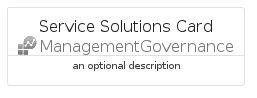
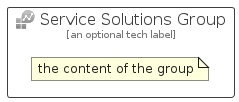

# ServiceSolutions


```text
azure-17/Item/ManagementGovernance/ServiceSolutions
```

```text
include('azure-17/Item/ManagementGovernance/ServiceSolutions')
```


| Illustration | ServiceSolutions | ServiceSolutionsCard | ServiceSolutionsGroup |
| :---: | :---: | :---: | :---: |
|  |  |  |  |


## Sprites
The item provides the following sriptes:

- `<$ServiceSolutionsXs>`
- `<$ServiceSolutionsSm>`
- `<$ServiceSolutionsMd>`
- `<$ServiceSolutionsLg>`


## ServiceSolutions

### Load remotely
```plantuml
@startuml
' configures the library
!global $LIB_BASE_LOCATION="https://raw.githubusercontent.com/tmorin/plantuml-libs/master/distribution"

' loads the library's bootstrap
!include $LIB_BASE_LOCATION/bootstrap.puml

' loads the package bootstrap
include('azure-17/bootstrap')

' loads the Item which embeds the element ServiceSolutions
include('azure-17/Item/ManagementGovernance/ServiceSolutions')

' renders the element
ServiceSolutions('ServiceSolutions', 'Service Solutions', 'an optional tech label', 'an optional description')
@enduml
```

### Load locally
```plantuml
@startuml
' configures the library
!global $INCLUSION_MODE="local"
!global $LIB_BASE_LOCATION="../../.."

' loads the library's bootstrap
!include $LIB_BASE_LOCATION/bootstrap.puml

' loads the package bootstrap
include('azure-17/bootstrap')

' loads the Item which embeds the element ServiceSolutions
include('azure-17/Item/ManagementGovernance/ServiceSolutions')

' renders the element
ServiceSolutions('ServiceSolutions', 'Service Solutions', 'an optional tech label', 'an optional description')
@enduml
```

## ServiceSolutionsCard

### Load remotely
```plantuml
@startuml
' configures the library
!global $LIB_BASE_LOCATION="https://raw.githubusercontent.com/tmorin/plantuml-libs/master/distribution"

' loads the library's bootstrap
!include $LIB_BASE_LOCATION/bootstrap.puml

' loads the package bootstrap
include('azure-17/bootstrap')

' loads the Item which embeds the element ServiceSolutionsCard
include('azure-17/Item/ManagementGovernance/ServiceSolutions')

' renders the element
ServiceSolutionsCard('ServiceSolutionsCard', 'Service Solutions Card', 'an optional description')
@enduml
```

### Load locally
```plantuml
@startuml
' configures the library
!global $INCLUSION_MODE="local"
!global $LIB_BASE_LOCATION="../../.."

' loads the library's bootstrap
!include $LIB_BASE_LOCATION/bootstrap.puml

' loads the package bootstrap
include('azure-17/bootstrap')

' loads the Item which embeds the element ServiceSolutionsCard
include('azure-17/Item/ManagementGovernance/ServiceSolutions')

' renders the element
ServiceSolutionsCard('ServiceSolutionsCard', 'Service Solutions Card', 'an optional description')
@enduml
```

## ServiceSolutionsGroup

### Load remotely
```plantuml
@startuml
' configures the library
!global $LIB_BASE_LOCATION="https://raw.githubusercontent.com/tmorin/plantuml-libs/master/distribution"

' loads the library's bootstrap
!include $LIB_BASE_LOCATION/bootstrap.puml

' loads the package bootstrap
include('azure-17/bootstrap')

' loads the Item which embeds the element ServiceSolutionsGroup
include('azure-17/Item/ManagementGovernance/ServiceSolutions')

' renders the element
ServiceSolutionsGroup('ServiceSolutionsGroup', 'Service Solutions Group', 'an optional tech label') {
    note as note
        the content of the group
    end note
}
@enduml
```

### Load locally
```plantuml
@startuml
' configures the library
!global $INCLUSION_MODE="local"
!global $LIB_BASE_LOCATION="../../.."

' loads the library's bootstrap
!include $LIB_BASE_LOCATION/bootstrap.puml

' loads the package bootstrap
include('azure-17/bootstrap')

' loads the Item which embeds the element ServiceSolutionsGroup
include('azure-17/Item/ManagementGovernance/ServiceSolutions')

' renders the element
ServiceSolutionsGroup('ServiceSolutionsGroup', 'Service Solutions Group', 'an optional tech label') {
    note as note
        the content of the group
    end note
}
@enduml
```

