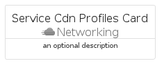

# ServiceCdnProfiles


```text
azure-17/Item/Networking/ServiceCdnProfiles
```

```text
include('azure-17/Item/Networking/ServiceCdnProfiles')
```


| Illustration | ServiceCdnProfiles | ServiceCdnProfilesCard | ServiceCdnProfilesGroup |
| :---: | :---: | :---: | :---: |
|  |  |  |  |


## Sprites
The item provides the following sriptes:

- `<$ServiceCdnProfilesXs>`
- `<$ServiceCdnProfilesSm>`
- `<$ServiceCdnProfilesMd>`
- `<$ServiceCdnProfilesLg>`


## ServiceCdnProfiles

### Load remotely
```plantuml
@startuml
' configures the library
!global $LIB_BASE_LOCATION="https://raw.githubusercontent.com/tmorin/plantuml-libs/master/distribution"

' loads the library's bootstrap
!include $LIB_BASE_LOCATION/bootstrap.puml

' loads the package bootstrap
include('azure-17/bootstrap')

' loads the Item which embeds the element ServiceCdnProfiles
include('azure-17/Item/Networking/ServiceCdnProfiles')

' renders the element
ServiceCdnProfiles('ServiceCdnProfiles', 'Service Cdn Profiles', 'an optional tech label', 'an optional description')
@enduml
```

### Load locally
```plantuml
@startuml
' configures the library
!global $INCLUSION_MODE="local"
!global $LIB_BASE_LOCATION="../../.."

' loads the library's bootstrap
!include $LIB_BASE_LOCATION/bootstrap.puml

' loads the package bootstrap
include('azure-17/bootstrap')

' loads the Item which embeds the element ServiceCdnProfiles
include('azure-17/Item/Networking/ServiceCdnProfiles')

' renders the element
ServiceCdnProfiles('ServiceCdnProfiles', 'Service Cdn Profiles', 'an optional tech label', 'an optional description')
@enduml
```

## ServiceCdnProfilesCard

### Load remotely
```plantuml
@startuml
' configures the library
!global $LIB_BASE_LOCATION="https://raw.githubusercontent.com/tmorin/plantuml-libs/master/distribution"

' loads the library's bootstrap
!include $LIB_BASE_LOCATION/bootstrap.puml

' loads the package bootstrap
include('azure-17/bootstrap')

' loads the Item which embeds the element ServiceCdnProfilesCard
include('azure-17/Item/Networking/ServiceCdnProfiles')

' renders the element
ServiceCdnProfilesCard('ServiceCdnProfilesCard', 'Service Cdn Profiles Card', 'an optional description')
@enduml
```

### Load locally
```plantuml
@startuml
' configures the library
!global $INCLUSION_MODE="local"
!global $LIB_BASE_LOCATION="../../.."

' loads the library's bootstrap
!include $LIB_BASE_LOCATION/bootstrap.puml

' loads the package bootstrap
include('azure-17/bootstrap')

' loads the Item which embeds the element ServiceCdnProfilesCard
include('azure-17/Item/Networking/ServiceCdnProfiles')

' renders the element
ServiceCdnProfilesCard('ServiceCdnProfilesCard', 'Service Cdn Profiles Card', 'an optional description')
@enduml
```

## ServiceCdnProfilesGroup

### Load remotely
```plantuml
@startuml
' configures the library
!global $LIB_BASE_LOCATION="https://raw.githubusercontent.com/tmorin/plantuml-libs/master/distribution"

' loads the library's bootstrap
!include $LIB_BASE_LOCATION/bootstrap.puml

' loads the package bootstrap
include('azure-17/bootstrap')

' loads the Item which embeds the element ServiceCdnProfilesGroup
include('azure-17/Item/Networking/ServiceCdnProfiles')

' renders the element
ServiceCdnProfilesGroup('ServiceCdnProfilesGroup', 'Service Cdn Profiles Group', 'an optional tech label') {
    note as note
        the content of the group
    end note
}
@enduml
```

### Load locally
```plantuml
@startuml
' configures the library
!global $INCLUSION_MODE="local"
!global $LIB_BASE_LOCATION="../../.."

' loads the library's bootstrap
!include $LIB_BASE_LOCATION/bootstrap.puml

' loads the package bootstrap
include('azure-17/bootstrap')

' loads the Item which embeds the element ServiceCdnProfilesGroup
include('azure-17/Item/Networking/ServiceCdnProfiles')

' renders the element
ServiceCdnProfilesGroup('ServiceCdnProfilesGroup', 'Service Cdn Profiles Group', 'an optional tech label') {
    note as note
        the content of the group
    end note
}
@enduml
```

