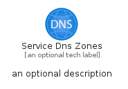
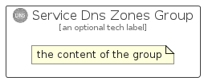

# ServiceDnsZones


```text
azure-17/Item/Networking/ServiceDnsZones
```

```text
include('azure-17/Item/Networking/ServiceDnsZones')
```


| Illustration | ServiceDnsZones | ServiceDnsZonesCard | ServiceDnsZonesGroup |
| :---: | :---: | :---: | :---: |
|  |  |  |  |


## Sprites
The item provides the following sriptes:

- `<$ServiceDnsZonesXs>`
- `<$ServiceDnsZonesSm>`
- `<$ServiceDnsZonesMd>`
- `<$ServiceDnsZonesLg>`


## ServiceDnsZones

### Load remotely
```plantuml
@startuml
' configures the library
!global $LIB_BASE_LOCATION="https://raw.githubusercontent.com/tmorin/plantuml-libs/master/distribution"

' loads the library's bootstrap
!include $LIB_BASE_LOCATION/bootstrap.puml

' loads the package bootstrap
include('azure-17/bootstrap')

' loads the Item which embeds the element ServiceDnsZones
include('azure-17/Item/Networking/ServiceDnsZones')

' renders the element
ServiceDnsZones('ServiceDnsZones', 'Service Dns Zones', 'an optional tech label', 'an optional description')
@enduml
```

### Load locally
```plantuml
@startuml
' configures the library
!global $INCLUSION_MODE="local"
!global $LIB_BASE_LOCATION="../../.."

' loads the library's bootstrap
!include $LIB_BASE_LOCATION/bootstrap.puml

' loads the package bootstrap
include('azure-17/bootstrap')

' loads the Item which embeds the element ServiceDnsZones
include('azure-17/Item/Networking/ServiceDnsZones')

' renders the element
ServiceDnsZones('ServiceDnsZones', 'Service Dns Zones', 'an optional tech label', 'an optional description')
@enduml
```

## ServiceDnsZonesCard

### Load remotely
```plantuml
@startuml
' configures the library
!global $LIB_BASE_LOCATION="https://raw.githubusercontent.com/tmorin/plantuml-libs/master/distribution"

' loads the library's bootstrap
!include $LIB_BASE_LOCATION/bootstrap.puml

' loads the package bootstrap
include('azure-17/bootstrap')

' loads the Item which embeds the element ServiceDnsZonesCard
include('azure-17/Item/Networking/ServiceDnsZones')

' renders the element
ServiceDnsZonesCard('ServiceDnsZonesCard', 'Service Dns Zones Card', 'an optional description')
@enduml
```

### Load locally
```plantuml
@startuml
' configures the library
!global $INCLUSION_MODE="local"
!global $LIB_BASE_LOCATION="../../.."

' loads the library's bootstrap
!include $LIB_BASE_LOCATION/bootstrap.puml

' loads the package bootstrap
include('azure-17/bootstrap')

' loads the Item which embeds the element ServiceDnsZonesCard
include('azure-17/Item/Networking/ServiceDnsZones')

' renders the element
ServiceDnsZonesCard('ServiceDnsZonesCard', 'Service Dns Zones Card', 'an optional description')
@enduml
```

## ServiceDnsZonesGroup

### Load remotely
```plantuml
@startuml
' configures the library
!global $LIB_BASE_LOCATION="https://raw.githubusercontent.com/tmorin/plantuml-libs/master/distribution"

' loads the library's bootstrap
!include $LIB_BASE_LOCATION/bootstrap.puml

' loads the package bootstrap
include('azure-17/bootstrap')

' loads the Item which embeds the element ServiceDnsZonesGroup
include('azure-17/Item/Networking/ServiceDnsZones')

' renders the element
ServiceDnsZonesGroup('ServiceDnsZonesGroup', 'Service Dns Zones Group', 'an optional tech label') {
    note as note
        the content of the group
    end note
}
@enduml
```

### Load locally
```plantuml
@startuml
' configures the library
!global $INCLUSION_MODE="local"
!global $LIB_BASE_LOCATION="../../.."

' loads the library's bootstrap
!include $LIB_BASE_LOCATION/bootstrap.puml

' loads the package bootstrap
include('azure-17/bootstrap')

' loads the Item which embeds the element ServiceDnsZonesGroup
include('azure-17/Item/Networking/ServiceDnsZones')

' renders the element
ServiceDnsZonesGroup('ServiceDnsZonesGroup', 'Service Dns Zones Group', 'an optional tech label') {
    note as note
        the content of the group
    end note
}
@enduml
```

