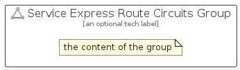

# ServiceExpressRouteCircuits


```text
azure-17/Item/Networking/ServiceExpressRouteCircuits
```

```text
include('azure-17/Item/Networking/ServiceExpressRouteCircuits')
```


| Illustration | ServiceExpressRouteCircuits | ServiceExpressRouteCircuitsCard | ServiceExpressRouteCircuitsGroup |
| :---: | :---: | :---: | :---: |
|  |  |  |  |


## Sprites
The item provides the following sriptes:

- `<$ServiceExpressRouteCircuitsXs>`
- `<$ServiceExpressRouteCircuitsSm>`
- `<$ServiceExpressRouteCircuitsMd>`
- `<$ServiceExpressRouteCircuitsLg>`


## ServiceExpressRouteCircuits

### Load remotely
```plantuml
@startuml
' configures the library
!global $LIB_BASE_LOCATION="https://raw.githubusercontent.com/tmorin/plantuml-libs/master/distribution"

' loads the library's bootstrap
!include $LIB_BASE_LOCATION/bootstrap.puml

' loads the package bootstrap
include('azure-17/bootstrap')

' loads the Item which embeds the element ServiceExpressRouteCircuits
include('azure-17/Item/Networking/ServiceExpressRouteCircuits')

' renders the element
ServiceExpressRouteCircuits('ServiceExpressRouteCircuits', 'Service Express Route Circuits', 'an optional tech label', 'an optional description')
@enduml
```

### Load locally
```plantuml
@startuml
' configures the library
!global $INCLUSION_MODE="local"
!global $LIB_BASE_LOCATION="../../.."

' loads the library's bootstrap
!include $LIB_BASE_LOCATION/bootstrap.puml

' loads the package bootstrap
include('azure-17/bootstrap')

' loads the Item which embeds the element ServiceExpressRouteCircuits
include('azure-17/Item/Networking/ServiceExpressRouteCircuits')

' renders the element
ServiceExpressRouteCircuits('ServiceExpressRouteCircuits', 'Service Express Route Circuits', 'an optional tech label', 'an optional description')
@enduml
```

## ServiceExpressRouteCircuitsCard

### Load remotely
```plantuml
@startuml
' configures the library
!global $LIB_BASE_LOCATION="https://raw.githubusercontent.com/tmorin/plantuml-libs/master/distribution"

' loads the library's bootstrap
!include $LIB_BASE_LOCATION/bootstrap.puml

' loads the package bootstrap
include('azure-17/bootstrap')

' loads the Item which embeds the element ServiceExpressRouteCircuitsCard
include('azure-17/Item/Networking/ServiceExpressRouteCircuits')

' renders the element
ServiceExpressRouteCircuitsCard('ServiceExpressRouteCircuitsCard', 'Service Express Route Circuits Card', 'an optional description')
@enduml
```

### Load locally
```plantuml
@startuml
' configures the library
!global $INCLUSION_MODE="local"
!global $LIB_BASE_LOCATION="../../.."

' loads the library's bootstrap
!include $LIB_BASE_LOCATION/bootstrap.puml

' loads the package bootstrap
include('azure-17/bootstrap')

' loads the Item which embeds the element ServiceExpressRouteCircuitsCard
include('azure-17/Item/Networking/ServiceExpressRouteCircuits')

' renders the element
ServiceExpressRouteCircuitsCard('ServiceExpressRouteCircuitsCard', 'Service Express Route Circuits Card', 'an optional description')
@enduml
```

## ServiceExpressRouteCircuitsGroup

### Load remotely
```plantuml
@startuml
' configures the library
!global $LIB_BASE_LOCATION="https://raw.githubusercontent.com/tmorin/plantuml-libs/master/distribution"

' loads the library's bootstrap
!include $LIB_BASE_LOCATION/bootstrap.puml

' loads the package bootstrap
include('azure-17/bootstrap')

' loads the Item which embeds the element ServiceExpressRouteCircuitsGroup
include('azure-17/Item/Networking/ServiceExpressRouteCircuits')

' renders the element
ServiceExpressRouteCircuitsGroup('ServiceExpressRouteCircuitsGroup', 'Service Express Route Circuits Group', 'an optional tech label') {
    note as note
        the content of the group
    end note
}
@enduml
```

### Load locally
```plantuml
@startuml
' configures the library
!global $INCLUSION_MODE="local"
!global $LIB_BASE_LOCATION="../../.."

' loads the library's bootstrap
!include $LIB_BASE_LOCATION/bootstrap.puml

' loads the package bootstrap
include('azure-17/bootstrap')

' loads the Item which embeds the element ServiceExpressRouteCircuitsGroup
include('azure-17/Item/Networking/ServiceExpressRouteCircuits')

' renders the element
ServiceExpressRouteCircuitsGroup('ServiceExpressRouteCircuitsGroup', 'Service Express Route Circuits Group', 'an optional tech label') {
    note as note
        the content of the group
    end note
}
@enduml
```

