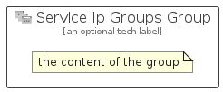

# ServiceIpGroups


```text
azure-17/Item/Networking/ServiceIpGroups
```

```text
include('azure-17/Item/Networking/ServiceIpGroups')
```


| Illustration | ServiceIpGroups | ServiceIpGroupsCard | ServiceIpGroupsGroup |
| :---: | :---: | :---: | :---: |
|  |  |  |  |


## Sprites
The item provides the following sriptes:

- `<$ServiceIpGroupsXs>`
- `<$ServiceIpGroupsSm>`
- `<$ServiceIpGroupsMd>`
- `<$ServiceIpGroupsLg>`


## ServiceIpGroups

### Load remotely
```plantuml
@startuml
' configures the library
!global $LIB_BASE_LOCATION="https://raw.githubusercontent.com/tmorin/plantuml-libs/master/distribution"

' loads the library's bootstrap
!include $LIB_BASE_LOCATION/bootstrap.puml

' loads the package bootstrap
include('azure-17/bootstrap')

' loads the Item which embeds the element ServiceIpGroups
include('azure-17/Item/Networking/ServiceIpGroups')

' renders the element
ServiceIpGroups('ServiceIpGroups', 'Service Ip Groups', 'an optional tech label', 'an optional description')
@enduml
```

### Load locally
```plantuml
@startuml
' configures the library
!global $INCLUSION_MODE="local"
!global $LIB_BASE_LOCATION="../../.."

' loads the library's bootstrap
!include $LIB_BASE_LOCATION/bootstrap.puml

' loads the package bootstrap
include('azure-17/bootstrap')

' loads the Item which embeds the element ServiceIpGroups
include('azure-17/Item/Networking/ServiceIpGroups')

' renders the element
ServiceIpGroups('ServiceIpGroups', 'Service Ip Groups', 'an optional tech label', 'an optional description')
@enduml
```

## ServiceIpGroupsCard

### Load remotely
```plantuml
@startuml
' configures the library
!global $LIB_BASE_LOCATION="https://raw.githubusercontent.com/tmorin/plantuml-libs/master/distribution"

' loads the library's bootstrap
!include $LIB_BASE_LOCATION/bootstrap.puml

' loads the package bootstrap
include('azure-17/bootstrap')

' loads the Item which embeds the element ServiceIpGroupsCard
include('azure-17/Item/Networking/ServiceIpGroups')

' renders the element
ServiceIpGroupsCard('ServiceIpGroupsCard', 'Service Ip Groups Card', 'an optional description')
@enduml
```

### Load locally
```plantuml
@startuml
' configures the library
!global $INCLUSION_MODE="local"
!global $LIB_BASE_LOCATION="../../.."

' loads the library's bootstrap
!include $LIB_BASE_LOCATION/bootstrap.puml

' loads the package bootstrap
include('azure-17/bootstrap')

' loads the Item which embeds the element ServiceIpGroupsCard
include('azure-17/Item/Networking/ServiceIpGroups')

' renders the element
ServiceIpGroupsCard('ServiceIpGroupsCard', 'Service Ip Groups Card', 'an optional description')
@enduml
```

## ServiceIpGroupsGroup

### Load remotely
```plantuml
@startuml
' configures the library
!global $LIB_BASE_LOCATION="https://raw.githubusercontent.com/tmorin/plantuml-libs/master/distribution"

' loads the library's bootstrap
!include $LIB_BASE_LOCATION/bootstrap.puml

' loads the package bootstrap
include('azure-17/bootstrap')

' loads the Item which embeds the element ServiceIpGroupsGroup
include('azure-17/Item/Networking/ServiceIpGroups')

' renders the element
ServiceIpGroupsGroup('ServiceIpGroupsGroup', 'Service Ip Groups Group', 'an optional tech label') {
    note as note
        the content of the group
    end note
}
@enduml
```

### Load locally
```plantuml
@startuml
' configures the library
!global $INCLUSION_MODE="local"
!global $LIB_BASE_LOCATION="../../.."

' loads the library's bootstrap
!include $LIB_BASE_LOCATION/bootstrap.puml

' loads the package bootstrap
include('azure-17/bootstrap')

' loads the Item which embeds the element ServiceIpGroupsGroup
include('azure-17/Item/Networking/ServiceIpGroups')

' renders the element
ServiceIpGroupsGroup('ServiceIpGroupsGroup', 'Service Ip Groups Group', 'an optional tech label') {
    note as note
        the content of the group
    end note
}
@enduml
```

