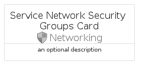
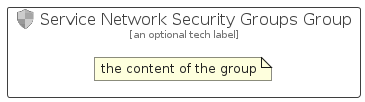

# ServiceNetworkSecurityGroups


```text
azure-17/Item/Networking/ServiceNetworkSecurityGroups
```

```text
include('azure-17/Item/Networking/ServiceNetworkSecurityGroups')
```


| Illustration | ServiceNetworkSecurityGroups | ServiceNetworkSecurityGroupsCard | ServiceNetworkSecurityGroupsGroup |
| :---: | :---: | :---: | :---: |
|  |  |  |  |


## Sprites
The item provides the following sriptes:

- `<$ServiceNetworkSecurityGroupsXs>`
- `<$ServiceNetworkSecurityGroupsSm>`
- `<$ServiceNetworkSecurityGroupsMd>`
- `<$ServiceNetworkSecurityGroupsLg>`


## ServiceNetworkSecurityGroups

### Load remotely
```plantuml
@startuml
' configures the library
!global $LIB_BASE_LOCATION="https://raw.githubusercontent.com/tmorin/plantuml-libs/master/distribution"

' loads the library's bootstrap
!include $LIB_BASE_LOCATION/bootstrap.puml

' loads the package bootstrap
include('azure-17/bootstrap')

' loads the Item which embeds the element ServiceNetworkSecurityGroups
include('azure-17/Item/Networking/ServiceNetworkSecurityGroups')

' renders the element
ServiceNetworkSecurityGroups('ServiceNetworkSecurityGroups', 'Service Network Security Groups', 'an optional tech label', 'an optional description')
@enduml
```

### Load locally
```plantuml
@startuml
' configures the library
!global $INCLUSION_MODE="local"
!global $LIB_BASE_LOCATION="../../.."

' loads the library's bootstrap
!include $LIB_BASE_LOCATION/bootstrap.puml

' loads the package bootstrap
include('azure-17/bootstrap')

' loads the Item which embeds the element ServiceNetworkSecurityGroups
include('azure-17/Item/Networking/ServiceNetworkSecurityGroups')

' renders the element
ServiceNetworkSecurityGroups('ServiceNetworkSecurityGroups', 'Service Network Security Groups', 'an optional tech label', 'an optional description')
@enduml
```

## ServiceNetworkSecurityGroupsCard

### Load remotely
```plantuml
@startuml
' configures the library
!global $LIB_BASE_LOCATION="https://raw.githubusercontent.com/tmorin/plantuml-libs/master/distribution"

' loads the library's bootstrap
!include $LIB_BASE_LOCATION/bootstrap.puml

' loads the package bootstrap
include('azure-17/bootstrap')

' loads the Item which embeds the element ServiceNetworkSecurityGroupsCard
include('azure-17/Item/Networking/ServiceNetworkSecurityGroups')

' renders the element
ServiceNetworkSecurityGroupsCard('ServiceNetworkSecurityGroupsCard', 'Service Network Security Groups Card', 'an optional description')
@enduml
```

### Load locally
```plantuml
@startuml
' configures the library
!global $INCLUSION_MODE="local"
!global $LIB_BASE_LOCATION="../../.."

' loads the library's bootstrap
!include $LIB_BASE_LOCATION/bootstrap.puml

' loads the package bootstrap
include('azure-17/bootstrap')

' loads the Item which embeds the element ServiceNetworkSecurityGroupsCard
include('azure-17/Item/Networking/ServiceNetworkSecurityGroups')

' renders the element
ServiceNetworkSecurityGroupsCard('ServiceNetworkSecurityGroupsCard', 'Service Network Security Groups Card', 'an optional description')
@enduml
```

## ServiceNetworkSecurityGroupsGroup

### Load remotely
```plantuml
@startuml
' configures the library
!global $LIB_BASE_LOCATION="https://raw.githubusercontent.com/tmorin/plantuml-libs/master/distribution"

' loads the library's bootstrap
!include $LIB_BASE_LOCATION/bootstrap.puml

' loads the package bootstrap
include('azure-17/bootstrap')

' loads the Item which embeds the element ServiceNetworkSecurityGroupsGroup
include('azure-17/Item/Networking/ServiceNetworkSecurityGroups')

' renders the element
ServiceNetworkSecurityGroupsGroup('ServiceNetworkSecurityGroupsGroup', 'Service Network Security Groups Group', 'an optional tech label') {
    note as note
        the content of the group
    end note
}
@enduml
```

### Load locally
```plantuml
@startuml
' configures the library
!global $INCLUSION_MODE="local"
!global $LIB_BASE_LOCATION="../../.."

' loads the library's bootstrap
!include $LIB_BASE_LOCATION/bootstrap.puml

' loads the package bootstrap
include('azure-17/bootstrap')

' loads the Item which embeds the element ServiceNetworkSecurityGroupsGroup
include('azure-17/Item/Networking/ServiceNetworkSecurityGroups')

' renders the element
ServiceNetworkSecurityGroupsGroup('ServiceNetworkSecurityGroupsGroup', 'Service Network Security Groups Group', 'an optional tech label') {
    note as note
        the content of the group
    end note
}
@enduml
```

