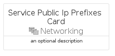

# ServicePublicIpPrefixes


```text
azure-17/Item/Networking/ServicePublicIpPrefixes
```

```text
include('azure-17/Item/Networking/ServicePublicIpPrefixes')
```


| Illustration | ServicePublicIpPrefixes | ServicePublicIpPrefixesCard | ServicePublicIpPrefixesGroup |
| :---: | :---: | :---: | :---: |
|  |  |  |  |


## Sprites
The item provides the following sriptes:

- `<$ServicePublicIpPrefixesXs>`
- `<$ServicePublicIpPrefixesSm>`
- `<$ServicePublicIpPrefixesMd>`
- `<$ServicePublicIpPrefixesLg>`


## ServicePublicIpPrefixes

### Load remotely
```plantuml
@startuml
' configures the library
!global $LIB_BASE_LOCATION="https://raw.githubusercontent.com/tmorin/plantuml-libs/master/distribution"

' loads the library's bootstrap
!include $LIB_BASE_LOCATION/bootstrap.puml

' loads the package bootstrap
include('azure-17/bootstrap')

' loads the Item which embeds the element ServicePublicIpPrefixes
include('azure-17/Item/Networking/ServicePublicIpPrefixes')

' renders the element
ServicePublicIpPrefixes('ServicePublicIpPrefixes', 'Service Public Ip Prefixes', 'an optional tech label', 'an optional description')
@enduml
```

### Load locally
```plantuml
@startuml
' configures the library
!global $INCLUSION_MODE="local"
!global $LIB_BASE_LOCATION="../../.."

' loads the library's bootstrap
!include $LIB_BASE_LOCATION/bootstrap.puml

' loads the package bootstrap
include('azure-17/bootstrap')

' loads the Item which embeds the element ServicePublicIpPrefixes
include('azure-17/Item/Networking/ServicePublicIpPrefixes')

' renders the element
ServicePublicIpPrefixes('ServicePublicIpPrefixes', 'Service Public Ip Prefixes', 'an optional tech label', 'an optional description')
@enduml
```

## ServicePublicIpPrefixesCard

### Load remotely
```plantuml
@startuml
' configures the library
!global $LIB_BASE_LOCATION="https://raw.githubusercontent.com/tmorin/plantuml-libs/master/distribution"

' loads the library's bootstrap
!include $LIB_BASE_LOCATION/bootstrap.puml

' loads the package bootstrap
include('azure-17/bootstrap')

' loads the Item which embeds the element ServicePublicIpPrefixesCard
include('azure-17/Item/Networking/ServicePublicIpPrefixes')

' renders the element
ServicePublicIpPrefixesCard('ServicePublicIpPrefixesCard', 'Service Public Ip Prefixes Card', 'an optional description')
@enduml
```

### Load locally
```plantuml
@startuml
' configures the library
!global $INCLUSION_MODE="local"
!global $LIB_BASE_LOCATION="../../.."

' loads the library's bootstrap
!include $LIB_BASE_LOCATION/bootstrap.puml

' loads the package bootstrap
include('azure-17/bootstrap')

' loads the Item which embeds the element ServicePublicIpPrefixesCard
include('azure-17/Item/Networking/ServicePublicIpPrefixes')

' renders the element
ServicePublicIpPrefixesCard('ServicePublicIpPrefixesCard', 'Service Public Ip Prefixes Card', 'an optional description')
@enduml
```

## ServicePublicIpPrefixesGroup

### Load remotely
```plantuml
@startuml
' configures the library
!global $LIB_BASE_LOCATION="https://raw.githubusercontent.com/tmorin/plantuml-libs/master/distribution"

' loads the library's bootstrap
!include $LIB_BASE_LOCATION/bootstrap.puml

' loads the package bootstrap
include('azure-17/bootstrap')

' loads the Item which embeds the element ServicePublicIpPrefixesGroup
include('azure-17/Item/Networking/ServicePublicIpPrefixes')

' renders the element
ServicePublicIpPrefixesGroup('ServicePublicIpPrefixesGroup', 'Service Public Ip Prefixes Group', 'an optional tech label') {
    note as note
        the content of the group
    end note
}
@enduml
```

### Load locally
```plantuml
@startuml
' configures the library
!global $INCLUSION_MODE="local"
!global $LIB_BASE_LOCATION="../../.."

' loads the library's bootstrap
!include $LIB_BASE_LOCATION/bootstrap.puml

' loads the package bootstrap
include('azure-17/bootstrap')

' loads the Item which embeds the element ServicePublicIpPrefixesGroup
include('azure-17/Item/Networking/ServicePublicIpPrefixes')

' renders the element
ServicePublicIpPrefixesGroup('ServicePublicIpPrefixesGroup', 'Service Public Ip Prefixes Group', 'an optional tech label') {
    note as note
        the content of the group
    end note
}
@enduml
```

