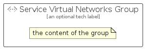

# ServiceVirtualNetworks


```text
azure-17/Item/Networking/ServiceVirtualNetworks
```

```text
include('azure-17/Item/Networking/ServiceVirtualNetworks')
```


| Illustration | ServiceVirtualNetworks | ServiceVirtualNetworksCard | ServiceVirtualNetworksGroup |
| :---: | :---: | :---: | :---: |
|  |  |  |  |


## Sprites
The item provides the following sriptes:

- `<$ServiceVirtualNetworksXs>`
- `<$ServiceVirtualNetworksSm>`
- `<$ServiceVirtualNetworksMd>`
- `<$ServiceVirtualNetworksLg>`


## ServiceVirtualNetworks

### Load remotely
```plantuml
@startuml
' configures the library
!global $LIB_BASE_LOCATION="https://raw.githubusercontent.com/tmorin/plantuml-libs/master/distribution"

' loads the library's bootstrap
!include $LIB_BASE_LOCATION/bootstrap.puml

' loads the package bootstrap
include('azure-17/bootstrap')

' loads the Item which embeds the element ServiceVirtualNetworks
include('azure-17/Item/Networking/ServiceVirtualNetworks')

' renders the element
ServiceVirtualNetworks('ServiceVirtualNetworks', 'Service Virtual Networks', 'an optional tech label', 'an optional description')
@enduml
```

### Load locally
```plantuml
@startuml
' configures the library
!global $INCLUSION_MODE="local"
!global $LIB_BASE_LOCATION="../../.."

' loads the library's bootstrap
!include $LIB_BASE_LOCATION/bootstrap.puml

' loads the package bootstrap
include('azure-17/bootstrap')

' loads the Item which embeds the element ServiceVirtualNetworks
include('azure-17/Item/Networking/ServiceVirtualNetworks')

' renders the element
ServiceVirtualNetworks('ServiceVirtualNetworks', 'Service Virtual Networks', 'an optional tech label', 'an optional description')
@enduml
```

## ServiceVirtualNetworksCard

### Load remotely
```plantuml
@startuml
' configures the library
!global $LIB_BASE_LOCATION="https://raw.githubusercontent.com/tmorin/plantuml-libs/master/distribution"

' loads the library's bootstrap
!include $LIB_BASE_LOCATION/bootstrap.puml

' loads the package bootstrap
include('azure-17/bootstrap')

' loads the Item which embeds the element ServiceVirtualNetworksCard
include('azure-17/Item/Networking/ServiceVirtualNetworks')

' renders the element
ServiceVirtualNetworksCard('ServiceVirtualNetworksCard', 'Service Virtual Networks Card', 'an optional description')
@enduml
```

### Load locally
```plantuml
@startuml
' configures the library
!global $INCLUSION_MODE="local"
!global $LIB_BASE_LOCATION="../../.."

' loads the library's bootstrap
!include $LIB_BASE_LOCATION/bootstrap.puml

' loads the package bootstrap
include('azure-17/bootstrap')

' loads the Item which embeds the element ServiceVirtualNetworksCard
include('azure-17/Item/Networking/ServiceVirtualNetworks')

' renders the element
ServiceVirtualNetworksCard('ServiceVirtualNetworksCard', 'Service Virtual Networks Card', 'an optional description')
@enduml
```

## ServiceVirtualNetworksGroup

### Load remotely
```plantuml
@startuml
' configures the library
!global $LIB_BASE_LOCATION="https://raw.githubusercontent.com/tmorin/plantuml-libs/master/distribution"

' loads the library's bootstrap
!include $LIB_BASE_LOCATION/bootstrap.puml

' loads the package bootstrap
include('azure-17/bootstrap')

' loads the Item which embeds the element ServiceVirtualNetworksGroup
include('azure-17/Item/Networking/ServiceVirtualNetworks')

' renders the element
ServiceVirtualNetworksGroup('ServiceVirtualNetworksGroup', 'Service Virtual Networks Group', 'an optional tech label') {
    note as note
        the content of the group
    end note
}
@enduml
```

### Load locally
```plantuml
@startuml
' configures the library
!global $INCLUSION_MODE="local"
!global $LIB_BASE_LOCATION="../../.."

' loads the library's bootstrap
!include $LIB_BASE_LOCATION/bootstrap.puml

' loads the package bootstrap
include('azure-17/bootstrap')

' loads the Item which embeds the element ServiceVirtualNetworksGroup
include('azure-17/Item/Networking/ServiceVirtualNetworks')

' renders the element
ServiceVirtualNetworksGroup('ServiceVirtualNetworksGroup', 'Service Virtual Networks Group', 'an optional tech label') {
    note as note
        the content of the group
    end note
}
@enduml
```

