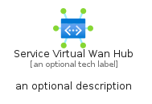

# ServiceVirtualWanHub


```text
azure-17/Item/Networking/ServiceVirtualWanHub
```

```text
include('azure-17/Item/Networking/ServiceVirtualWanHub')
```


| Illustration | ServiceVirtualWanHub | ServiceVirtualWanHubCard | ServiceVirtualWanHubGroup |
| :---: | :---: | :---: | :---: |
|  |  |  |  |


## Sprites
The item provides the following sriptes:

- `<$ServiceVirtualWanHubXs>`
- `<$ServiceVirtualWanHubSm>`
- `<$ServiceVirtualWanHubMd>`
- `<$ServiceVirtualWanHubLg>`


## ServiceVirtualWanHub

### Load remotely
```plantuml
@startuml
' configures the library
!global $LIB_BASE_LOCATION="https://raw.githubusercontent.com/tmorin/plantuml-libs/master/distribution"

' loads the library's bootstrap
!include $LIB_BASE_LOCATION/bootstrap.puml

' loads the package bootstrap
include('azure-17/bootstrap')

' loads the Item which embeds the element ServiceVirtualWanHub
include('azure-17/Item/Networking/ServiceVirtualWanHub')

' renders the element
ServiceVirtualWanHub('ServiceVirtualWanHub', 'Service Virtual Wan Hub', 'an optional tech label', 'an optional description')
@enduml
```

### Load locally
```plantuml
@startuml
' configures the library
!global $INCLUSION_MODE="local"
!global $LIB_BASE_LOCATION="../../.."

' loads the library's bootstrap
!include $LIB_BASE_LOCATION/bootstrap.puml

' loads the package bootstrap
include('azure-17/bootstrap')

' loads the Item which embeds the element ServiceVirtualWanHub
include('azure-17/Item/Networking/ServiceVirtualWanHub')

' renders the element
ServiceVirtualWanHub('ServiceVirtualWanHub', 'Service Virtual Wan Hub', 'an optional tech label', 'an optional description')
@enduml
```

## ServiceVirtualWanHubCard

### Load remotely
```plantuml
@startuml
' configures the library
!global $LIB_BASE_LOCATION="https://raw.githubusercontent.com/tmorin/plantuml-libs/master/distribution"

' loads the library's bootstrap
!include $LIB_BASE_LOCATION/bootstrap.puml

' loads the package bootstrap
include('azure-17/bootstrap')

' loads the Item which embeds the element ServiceVirtualWanHubCard
include('azure-17/Item/Networking/ServiceVirtualWanHub')

' renders the element
ServiceVirtualWanHubCard('ServiceVirtualWanHubCard', 'Service Virtual Wan Hub Card', 'an optional description')
@enduml
```

### Load locally
```plantuml
@startuml
' configures the library
!global $INCLUSION_MODE="local"
!global $LIB_BASE_LOCATION="../../.."

' loads the library's bootstrap
!include $LIB_BASE_LOCATION/bootstrap.puml

' loads the package bootstrap
include('azure-17/bootstrap')

' loads the Item which embeds the element ServiceVirtualWanHubCard
include('azure-17/Item/Networking/ServiceVirtualWanHub')

' renders the element
ServiceVirtualWanHubCard('ServiceVirtualWanHubCard', 'Service Virtual Wan Hub Card', 'an optional description')
@enduml
```

## ServiceVirtualWanHubGroup

### Load remotely
```plantuml
@startuml
' configures the library
!global $LIB_BASE_LOCATION="https://raw.githubusercontent.com/tmorin/plantuml-libs/master/distribution"

' loads the library's bootstrap
!include $LIB_BASE_LOCATION/bootstrap.puml

' loads the package bootstrap
include('azure-17/bootstrap')

' loads the Item which embeds the element ServiceVirtualWanHubGroup
include('azure-17/Item/Networking/ServiceVirtualWanHub')

' renders the element
ServiceVirtualWanHubGroup('ServiceVirtualWanHubGroup', 'Service Virtual Wan Hub Group', 'an optional tech label') {
    note as note
        the content of the group
    end note
}
@enduml
```

### Load locally
```plantuml
@startuml
' configures the library
!global $INCLUSION_MODE="local"
!global $LIB_BASE_LOCATION="../../.."

' loads the library's bootstrap
!include $LIB_BASE_LOCATION/bootstrap.puml

' loads the package bootstrap
include('azure-17/bootstrap')

' loads the Item which embeds the element ServiceVirtualWanHubGroup
include('azure-17/Item/Networking/ServiceVirtualWanHub')

' renders the element
ServiceVirtualWanHubGroup('ServiceVirtualWanHubGroup', 'Service Virtual Wan Hub Group', 'an optional tech label') {
    note as note
        the content of the group
    end note
}
@enduml
```

