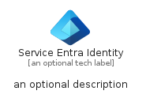
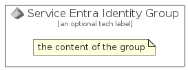

# ServiceEntraIdentity


```text
azure-17/Item/NewIcons/ServiceEntraIdentity
```

```text
include('azure-17/Item/NewIcons/ServiceEntraIdentity')
```


| Illustration | ServiceEntraIdentity | ServiceEntraIdentityCard | ServiceEntraIdentityGroup |
| :---: | :---: | :---: | :---: |
|  |  |  |  |


## Sprites
The item provides the following sriptes:

- `<$ServiceEntraIdentityXs>`
- `<$ServiceEntraIdentitySm>`
- `<$ServiceEntraIdentityMd>`
- `<$ServiceEntraIdentityLg>`


## ServiceEntraIdentity

### Load remotely
```plantuml
@startuml
' configures the library
!global $LIB_BASE_LOCATION="https://raw.githubusercontent.com/tmorin/plantuml-libs/master/distribution"

' loads the library's bootstrap
!include $LIB_BASE_LOCATION/bootstrap.puml

' loads the package bootstrap
include('azure-17/bootstrap')

' loads the Item which embeds the element ServiceEntraIdentity
include('azure-17/Item/NewIcons/ServiceEntraIdentity')

' renders the element
ServiceEntraIdentity('ServiceEntraIdentity', 'Service Entra Identity', 'an optional tech label', 'an optional description')
@enduml
```

### Load locally
```plantuml
@startuml
' configures the library
!global $INCLUSION_MODE="local"
!global $LIB_BASE_LOCATION="../../.."

' loads the library's bootstrap
!include $LIB_BASE_LOCATION/bootstrap.puml

' loads the package bootstrap
include('azure-17/bootstrap')

' loads the Item which embeds the element ServiceEntraIdentity
include('azure-17/Item/NewIcons/ServiceEntraIdentity')

' renders the element
ServiceEntraIdentity('ServiceEntraIdentity', 'Service Entra Identity', 'an optional tech label', 'an optional description')
@enduml
```

## ServiceEntraIdentityCard

### Load remotely
```plantuml
@startuml
' configures the library
!global $LIB_BASE_LOCATION="https://raw.githubusercontent.com/tmorin/plantuml-libs/master/distribution"

' loads the library's bootstrap
!include $LIB_BASE_LOCATION/bootstrap.puml

' loads the package bootstrap
include('azure-17/bootstrap')

' loads the Item which embeds the element ServiceEntraIdentityCard
include('azure-17/Item/NewIcons/ServiceEntraIdentity')

' renders the element
ServiceEntraIdentityCard('ServiceEntraIdentityCard', 'Service Entra Identity Card', 'an optional description')
@enduml
```

### Load locally
```plantuml
@startuml
' configures the library
!global $INCLUSION_MODE="local"
!global $LIB_BASE_LOCATION="../../.."

' loads the library's bootstrap
!include $LIB_BASE_LOCATION/bootstrap.puml

' loads the package bootstrap
include('azure-17/bootstrap')

' loads the Item which embeds the element ServiceEntraIdentityCard
include('azure-17/Item/NewIcons/ServiceEntraIdentity')

' renders the element
ServiceEntraIdentityCard('ServiceEntraIdentityCard', 'Service Entra Identity Card', 'an optional description')
@enduml
```

## ServiceEntraIdentityGroup

### Load remotely
```plantuml
@startuml
' configures the library
!global $LIB_BASE_LOCATION="https://raw.githubusercontent.com/tmorin/plantuml-libs/master/distribution"

' loads the library's bootstrap
!include $LIB_BASE_LOCATION/bootstrap.puml

' loads the package bootstrap
include('azure-17/bootstrap')

' loads the Item which embeds the element ServiceEntraIdentityGroup
include('azure-17/Item/NewIcons/ServiceEntraIdentity')

' renders the element
ServiceEntraIdentityGroup('ServiceEntraIdentityGroup', 'Service Entra Identity Group', 'an optional tech label') {
    note as note
        the content of the group
    end note
}
@enduml
```

### Load locally
```plantuml
@startuml
' configures the library
!global $INCLUSION_MODE="local"
!global $LIB_BASE_LOCATION="../../.."

' loads the library's bootstrap
!include $LIB_BASE_LOCATION/bootstrap.puml

' loads the package bootstrap
include('azure-17/bootstrap')

' loads the Item which embeds the element ServiceEntraIdentityGroup
include('azure-17/Item/NewIcons/ServiceEntraIdentity')

' renders the element
ServiceEntraIdentityGroup('ServiceEntraIdentityGroup', 'Service Entra Identity Group', 'an optional tech label') {
    note as note
        the content of the group
    end note
}
@enduml
```

