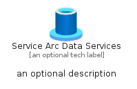
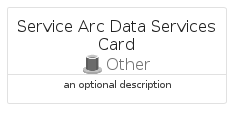

# ServiceArcDataServices


```text
azure-17/Item/Other/ServiceArcDataServices
```

```text
include('azure-17/Item/Other/ServiceArcDataServices')
```


| Illustration | ServiceArcDataServices | ServiceArcDataServicesCard | ServiceArcDataServicesGroup |
| :---: | :---: | :---: | :---: |
|  |  |  |  |


## Sprites
The item provides the following sriptes:

- `<$ServiceArcDataServicesXs>`
- `<$ServiceArcDataServicesSm>`
- `<$ServiceArcDataServicesMd>`
- `<$ServiceArcDataServicesLg>`


## ServiceArcDataServices

### Load remotely
```plantuml
@startuml
' configures the library
!global $LIB_BASE_LOCATION="https://raw.githubusercontent.com/tmorin/plantuml-libs/master/distribution"

' loads the library's bootstrap
!include $LIB_BASE_LOCATION/bootstrap.puml

' loads the package bootstrap
include('azure-17/bootstrap')

' loads the Item which embeds the element ServiceArcDataServices
include('azure-17/Item/Other/ServiceArcDataServices')

' renders the element
ServiceArcDataServices('ServiceArcDataServices', 'Service Arc Data Services', 'an optional tech label', 'an optional description')
@enduml
```

### Load locally
```plantuml
@startuml
' configures the library
!global $INCLUSION_MODE="local"
!global $LIB_BASE_LOCATION="../../.."

' loads the library's bootstrap
!include $LIB_BASE_LOCATION/bootstrap.puml

' loads the package bootstrap
include('azure-17/bootstrap')

' loads the Item which embeds the element ServiceArcDataServices
include('azure-17/Item/Other/ServiceArcDataServices')

' renders the element
ServiceArcDataServices('ServiceArcDataServices', 'Service Arc Data Services', 'an optional tech label', 'an optional description')
@enduml
```

## ServiceArcDataServicesCard

### Load remotely
```plantuml
@startuml
' configures the library
!global $LIB_BASE_LOCATION="https://raw.githubusercontent.com/tmorin/plantuml-libs/master/distribution"

' loads the library's bootstrap
!include $LIB_BASE_LOCATION/bootstrap.puml

' loads the package bootstrap
include('azure-17/bootstrap')

' loads the Item which embeds the element ServiceArcDataServicesCard
include('azure-17/Item/Other/ServiceArcDataServices')

' renders the element
ServiceArcDataServicesCard('ServiceArcDataServicesCard', 'Service Arc Data Services Card', 'an optional description')
@enduml
```

### Load locally
```plantuml
@startuml
' configures the library
!global $INCLUSION_MODE="local"
!global $LIB_BASE_LOCATION="../../.."

' loads the library's bootstrap
!include $LIB_BASE_LOCATION/bootstrap.puml

' loads the package bootstrap
include('azure-17/bootstrap')

' loads the Item which embeds the element ServiceArcDataServicesCard
include('azure-17/Item/Other/ServiceArcDataServices')

' renders the element
ServiceArcDataServicesCard('ServiceArcDataServicesCard', 'Service Arc Data Services Card', 'an optional description')
@enduml
```

## ServiceArcDataServicesGroup

### Load remotely
```plantuml
@startuml
' configures the library
!global $LIB_BASE_LOCATION="https://raw.githubusercontent.com/tmorin/plantuml-libs/master/distribution"

' loads the library's bootstrap
!include $LIB_BASE_LOCATION/bootstrap.puml

' loads the package bootstrap
include('azure-17/bootstrap')

' loads the Item which embeds the element ServiceArcDataServicesGroup
include('azure-17/Item/Other/ServiceArcDataServices')

' renders the element
ServiceArcDataServicesGroup('ServiceArcDataServicesGroup', 'Service Arc Data Services Group', 'an optional tech label') {
    note as note
        the content of the group
    end note
}
@enduml
```

### Load locally
```plantuml
@startuml
' configures the library
!global $INCLUSION_MODE="local"
!global $LIB_BASE_LOCATION="../../.."

' loads the library's bootstrap
!include $LIB_BASE_LOCATION/bootstrap.puml

' loads the package bootstrap
include('azure-17/bootstrap')

' loads the Item which embeds the element ServiceArcDataServicesGroup
include('azure-17/Item/Other/ServiceArcDataServices')

' renders the element
ServiceArcDataServicesGroup('ServiceArcDataServicesGroup', 'Service Arc Data Services Group', 'an optional tech label') {
    note as note
        the content of the group
    end note
}
@enduml
```

