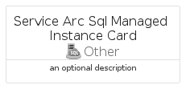

# ServiceArcSqlManagedInstance


```text
azure-17/Item/Other/ServiceArcSqlManagedInstance
```

```text
include('azure-17/Item/Other/ServiceArcSqlManagedInstance')
```


| Illustration | ServiceArcSqlManagedInstance | ServiceArcSqlManagedInstanceCard | ServiceArcSqlManagedInstanceGroup |
| :---: | :---: | :---: | :---: |
|  |  |  |  |


## Sprites
The item provides the following sriptes:

- `<$ServiceArcSqlManagedInstanceXs>`
- `<$ServiceArcSqlManagedInstanceSm>`
- `<$ServiceArcSqlManagedInstanceMd>`
- `<$ServiceArcSqlManagedInstanceLg>`


## ServiceArcSqlManagedInstance

### Load remotely
```plantuml
@startuml
' configures the library
!global $LIB_BASE_LOCATION="https://raw.githubusercontent.com/tmorin/plantuml-libs/master/distribution"

' loads the library's bootstrap
!include $LIB_BASE_LOCATION/bootstrap.puml

' loads the package bootstrap
include('azure-17/bootstrap')

' loads the Item which embeds the element ServiceArcSqlManagedInstance
include('azure-17/Item/Other/ServiceArcSqlManagedInstance')

' renders the element
ServiceArcSqlManagedInstance('ServiceArcSqlManagedInstance', 'Service Arc Sql Managed Instance', 'an optional tech label', 'an optional description')
@enduml
```

### Load locally
```plantuml
@startuml
' configures the library
!global $INCLUSION_MODE="local"
!global $LIB_BASE_LOCATION="../../.."

' loads the library's bootstrap
!include $LIB_BASE_LOCATION/bootstrap.puml

' loads the package bootstrap
include('azure-17/bootstrap')

' loads the Item which embeds the element ServiceArcSqlManagedInstance
include('azure-17/Item/Other/ServiceArcSqlManagedInstance')

' renders the element
ServiceArcSqlManagedInstance('ServiceArcSqlManagedInstance', 'Service Arc Sql Managed Instance', 'an optional tech label', 'an optional description')
@enduml
```

## ServiceArcSqlManagedInstanceCard

### Load remotely
```plantuml
@startuml
' configures the library
!global $LIB_BASE_LOCATION="https://raw.githubusercontent.com/tmorin/plantuml-libs/master/distribution"

' loads the library's bootstrap
!include $LIB_BASE_LOCATION/bootstrap.puml

' loads the package bootstrap
include('azure-17/bootstrap')

' loads the Item which embeds the element ServiceArcSqlManagedInstanceCard
include('azure-17/Item/Other/ServiceArcSqlManagedInstance')

' renders the element
ServiceArcSqlManagedInstanceCard('ServiceArcSqlManagedInstanceCard', 'Service Arc Sql Managed Instance Card', 'an optional description')
@enduml
```

### Load locally
```plantuml
@startuml
' configures the library
!global $INCLUSION_MODE="local"
!global $LIB_BASE_LOCATION="../../.."

' loads the library's bootstrap
!include $LIB_BASE_LOCATION/bootstrap.puml

' loads the package bootstrap
include('azure-17/bootstrap')

' loads the Item which embeds the element ServiceArcSqlManagedInstanceCard
include('azure-17/Item/Other/ServiceArcSqlManagedInstance')

' renders the element
ServiceArcSqlManagedInstanceCard('ServiceArcSqlManagedInstanceCard', 'Service Arc Sql Managed Instance Card', 'an optional description')
@enduml
```

## ServiceArcSqlManagedInstanceGroup

### Load remotely
```plantuml
@startuml
' configures the library
!global $LIB_BASE_LOCATION="https://raw.githubusercontent.com/tmorin/plantuml-libs/master/distribution"

' loads the library's bootstrap
!include $LIB_BASE_LOCATION/bootstrap.puml

' loads the package bootstrap
include('azure-17/bootstrap')

' loads the Item which embeds the element ServiceArcSqlManagedInstanceGroup
include('azure-17/Item/Other/ServiceArcSqlManagedInstance')

' renders the element
ServiceArcSqlManagedInstanceGroup('ServiceArcSqlManagedInstanceGroup', 'Service Arc Sql Managed Instance Group', 'an optional tech label') {
    note as note
        the content of the group
    end note
}
@enduml
```

### Load locally
```plantuml
@startuml
' configures the library
!global $INCLUSION_MODE="local"
!global $LIB_BASE_LOCATION="../../.."

' loads the library's bootstrap
!include $LIB_BASE_LOCATION/bootstrap.puml

' loads the package bootstrap
include('azure-17/bootstrap')

' loads the Item which embeds the element ServiceArcSqlManagedInstanceGroup
include('azure-17/Item/Other/ServiceArcSqlManagedInstance')

' renders the element
ServiceArcSqlManagedInstanceGroup('ServiceArcSqlManagedInstanceGroup', 'Service Arc Sql Managed Instance Group', 'an optional tech label') {
    note as note
        the content of the group
    end note
}
@enduml
```

