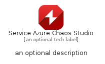
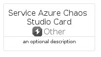
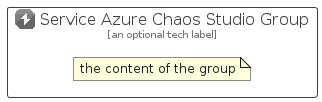

# ServiceAzureChaosStudio


```text
azure-17/Item/Other/ServiceAzureChaosStudio
```

```text
include('azure-17/Item/Other/ServiceAzureChaosStudio')
```


| Illustration | ServiceAzureChaosStudio | ServiceAzureChaosStudioCard | ServiceAzureChaosStudioGroup |
| :---: | :---: | :---: | :---: |
|  |  |  |  |


## Sprites
The item provides the following sriptes:

- `<$ServiceAzureChaosStudioXs>`
- `<$ServiceAzureChaosStudioSm>`
- `<$ServiceAzureChaosStudioMd>`
- `<$ServiceAzureChaosStudioLg>`


## ServiceAzureChaosStudio

### Load remotely
```plantuml
@startuml
' configures the library
!global $LIB_BASE_LOCATION="https://raw.githubusercontent.com/tmorin/plantuml-libs/master/distribution"

' loads the library's bootstrap
!include $LIB_BASE_LOCATION/bootstrap.puml

' loads the package bootstrap
include('azure-17/bootstrap')

' loads the Item which embeds the element ServiceAzureChaosStudio
include('azure-17/Item/Other/ServiceAzureChaosStudio')

' renders the element
ServiceAzureChaosStudio('ServiceAzureChaosStudio', 'Service Azure Chaos Studio', 'an optional tech label', 'an optional description')
@enduml
```

### Load locally
```plantuml
@startuml
' configures the library
!global $INCLUSION_MODE="local"
!global $LIB_BASE_LOCATION="../../.."

' loads the library's bootstrap
!include $LIB_BASE_LOCATION/bootstrap.puml

' loads the package bootstrap
include('azure-17/bootstrap')

' loads the Item which embeds the element ServiceAzureChaosStudio
include('azure-17/Item/Other/ServiceAzureChaosStudio')

' renders the element
ServiceAzureChaosStudio('ServiceAzureChaosStudio', 'Service Azure Chaos Studio', 'an optional tech label', 'an optional description')
@enduml
```

## ServiceAzureChaosStudioCard

### Load remotely
```plantuml
@startuml
' configures the library
!global $LIB_BASE_LOCATION="https://raw.githubusercontent.com/tmorin/plantuml-libs/master/distribution"

' loads the library's bootstrap
!include $LIB_BASE_LOCATION/bootstrap.puml

' loads the package bootstrap
include('azure-17/bootstrap')

' loads the Item which embeds the element ServiceAzureChaosStudioCard
include('azure-17/Item/Other/ServiceAzureChaosStudio')

' renders the element
ServiceAzureChaosStudioCard('ServiceAzureChaosStudioCard', 'Service Azure Chaos Studio Card', 'an optional description')
@enduml
```

### Load locally
```plantuml
@startuml
' configures the library
!global $INCLUSION_MODE="local"
!global $LIB_BASE_LOCATION="../../.."

' loads the library's bootstrap
!include $LIB_BASE_LOCATION/bootstrap.puml

' loads the package bootstrap
include('azure-17/bootstrap')

' loads the Item which embeds the element ServiceAzureChaosStudioCard
include('azure-17/Item/Other/ServiceAzureChaosStudio')

' renders the element
ServiceAzureChaosStudioCard('ServiceAzureChaosStudioCard', 'Service Azure Chaos Studio Card', 'an optional description')
@enduml
```

## ServiceAzureChaosStudioGroup

### Load remotely
```plantuml
@startuml
' configures the library
!global $LIB_BASE_LOCATION="https://raw.githubusercontent.com/tmorin/plantuml-libs/master/distribution"

' loads the library's bootstrap
!include $LIB_BASE_LOCATION/bootstrap.puml

' loads the package bootstrap
include('azure-17/bootstrap')

' loads the Item which embeds the element ServiceAzureChaosStudioGroup
include('azure-17/Item/Other/ServiceAzureChaosStudio')

' renders the element
ServiceAzureChaosStudioGroup('ServiceAzureChaosStudioGroup', 'Service Azure Chaos Studio Group', 'an optional tech label') {
    note as note
        the content of the group
    end note
}
@enduml
```

### Load locally
```plantuml
@startuml
' configures the library
!global $INCLUSION_MODE="local"
!global $LIB_BASE_LOCATION="../../.."

' loads the library's bootstrap
!include $LIB_BASE_LOCATION/bootstrap.puml

' loads the package bootstrap
include('azure-17/bootstrap')

' loads the Item which embeds the element ServiceAzureChaosStudioGroup
include('azure-17/Item/Other/ServiceAzureChaosStudio')

' renders the element
ServiceAzureChaosStudioGroup('ServiceAzureChaosStudioGroup', 'Service Azure Chaos Studio Group', 'an optional tech label') {
    note as note
        the content of the group
    end note
}
@enduml
```

