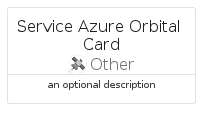

# ServiceAzureOrbital


```text
azure-17/Item/Other/ServiceAzureOrbital
```

```text
include('azure-17/Item/Other/ServiceAzureOrbital')
```


| Illustration | ServiceAzureOrbital | ServiceAzureOrbitalCard | ServiceAzureOrbitalGroup |
| :---: | :---: | :---: | :---: |
|  |  |  |  |


## Sprites
The item provides the following sriptes:

- `<$ServiceAzureOrbitalXs>`
- `<$ServiceAzureOrbitalSm>`
- `<$ServiceAzureOrbitalMd>`
- `<$ServiceAzureOrbitalLg>`


## ServiceAzureOrbital

### Load remotely
```plantuml
@startuml
' configures the library
!global $LIB_BASE_LOCATION="https://raw.githubusercontent.com/tmorin/plantuml-libs/master/distribution"

' loads the library's bootstrap
!include $LIB_BASE_LOCATION/bootstrap.puml

' loads the package bootstrap
include('azure-17/bootstrap')

' loads the Item which embeds the element ServiceAzureOrbital
include('azure-17/Item/Other/ServiceAzureOrbital')

' renders the element
ServiceAzureOrbital('ServiceAzureOrbital', 'Service Azure Orbital', 'an optional tech label', 'an optional description')
@enduml
```

### Load locally
```plantuml
@startuml
' configures the library
!global $INCLUSION_MODE="local"
!global $LIB_BASE_LOCATION="../../.."

' loads the library's bootstrap
!include $LIB_BASE_LOCATION/bootstrap.puml

' loads the package bootstrap
include('azure-17/bootstrap')

' loads the Item which embeds the element ServiceAzureOrbital
include('azure-17/Item/Other/ServiceAzureOrbital')

' renders the element
ServiceAzureOrbital('ServiceAzureOrbital', 'Service Azure Orbital', 'an optional tech label', 'an optional description')
@enduml
```

## ServiceAzureOrbitalCard

### Load remotely
```plantuml
@startuml
' configures the library
!global $LIB_BASE_LOCATION="https://raw.githubusercontent.com/tmorin/plantuml-libs/master/distribution"

' loads the library's bootstrap
!include $LIB_BASE_LOCATION/bootstrap.puml

' loads the package bootstrap
include('azure-17/bootstrap')

' loads the Item which embeds the element ServiceAzureOrbitalCard
include('azure-17/Item/Other/ServiceAzureOrbital')

' renders the element
ServiceAzureOrbitalCard('ServiceAzureOrbitalCard', 'Service Azure Orbital Card', 'an optional description')
@enduml
```

### Load locally
```plantuml
@startuml
' configures the library
!global $INCLUSION_MODE="local"
!global $LIB_BASE_LOCATION="../../.."

' loads the library's bootstrap
!include $LIB_BASE_LOCATION/bootstrap.puml

' loads the package bootstrap
include('azure-17/bootstrap')

' loads the Item which embeds the element ServiceAzureOrbitalCard
include('azure-17/Item/Other/ServiceAzureOrbital')

' renders the element
ServiceAzureOrbitalCard('ServiceAzureOrbitalCard', 'Service Azure Orbital Card', 'an optional description')
@enduml
```

## ServiceAzureOrbitalGroup

### Load remotely
```plantuml
@startuml
' configures the library
!global $LIB_BASE_LOCATION="https://raw.githubusercontent.com/tmorin/plantuml-libs/master/distribution"

' loads the library's bootstrap
!include $LIB_BASE_LOCATION/bootstrap.puml

' loads the package bootstrap
include('azure-17/bootstrap')

' loads the Item which embeds the element ServiceAzureOrbitalGroup
include('azure-17/Item/Other/ServiceAzureOrbital')

' renders the element
ServiceAzureOrbitalGroup('ServiceAzureOrbitalGroup', 'Service Azure Orbital Group', 'an optional tech label') {
    note as note
        the content of the group
    end note
}
@enduml
```

### Load locally
```plantuml
@startuml
' configures the library
!global $INCLUSION_MODE="local"
!global $LIB_BASE_LOCATION="../../.."

' loads the library's bootstrap
!include $LIB_BASE_LOCATION/bootstrap.puml

' loads the package bootstrap
include('azure-17/bootstrap')

' loads the Item which embeds the element ServiceAzureOrbitalGroup
include('azure-17/Item/Other/ServiceAzureOrbital')

' renders the element
ServiceAzureOrbitalGroup('ServiceAzureOrbitalGroup', 'Service Azure Orbital Group', 'an optional tech label') {
    note as note
        the content of the group
    end note
}
@enduml
```

