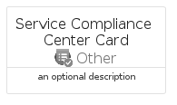

# ServiceComplianceCenter


```text
azure-17/Item/Other/ServiceComplianceCenter
```

```text
include('azure-17/Item/Other/ServiceComplianceCenter')
```


| Illustration | ServiceComplianceCenter | ServiceComplianceCenterCard | ServiceComplianceCenterGroup |
| :---: | :---: | :---: | :---: |
|  |  |  |  |


## Sprites
The item provides the following sriptes:

- `<$ServiceComplianceCenterXs>`
- `<$ServiceComplianceCenterSm>`
- `<$ServiceComplianceCenterMd>`
- `<$ServiceComplianceCenterLg>`


## ServiceComplianceCenter

### Load remotely
```plantuml
@startuml
' configures the library
!global $LIB_BASE_LOCATION="https://raw.githubusercontent.com/tmorin/plantuml-libs/master/distribution"

' loads the library's bootstrap
!include $LIB_BASE_LOCATION/bootstrap.puml

' loads the package bootstrap
include('azure-17/bootstrap')

' loads the Item which embeds the element ServiceComplianceCenter
include('azure-17/Item/Other/ServiceComplianceCenter')

' renders the element
ServiceComplianceCenter('ServiceComplianceCenter', 'Service Compliance Center', 'an optional tech label', 'an optional description')
@enduml
```

### Load locally
```plantuml
@startuml
' configures the library
!global $INCLUSION_MODE="local"
!global $LIB_BASE_LOCATION="../../.."

' loads the library's bootstrap
!include $LIB_BASE_LOCATION/bootstrap.puml

' loads the package bootstrap
include('azure-17/bootstrap')

' loads the Item which embeds the element ServiceComplianceCenter
include('azure-17/Item/Other/ServiceComplianceCenter')

' renders the element
ServiceComplianceCenter('ServiceComplianceCenter', 'Service Compliance Center', 'an optional tech label', 'an optional description')
@enduml
```

## ServiceComplianceCenterCard

### Load remotely
```plantuml
@startuml
' configures the library
!global $LIB_BASE_LOCATION="https://raw.githubusercontent.com/tmorin/plantuml-libs/master/distribution"

' loads the library's bootstrap
!include $LIB_BASE_LOCATION/bootstrap.puml

' loads the package bootstrap
include('azure-17/bootstrap')

' loads the Item which embeds the element ServiceComplianceCenterCard
include('azure-17/Item/Other/ServiceComplianceCenter')

' renders the element
ServiceComplianceCenterCard('ServiceComplianceCenterCard', 'Service Compliance Center Card', 'an optional description')
@enduml
```

### Load locally
```plantuml
@startuml
' configures the library
!global $INCLUSION_MODE="local"
!global $LIB_BASE_LOCATION="../../.."

' loads the library's bootstrap
!include $LIB_BASE_LOCATION/bootstrap.puml

' loads the package bootstrap
include('azure-17/bootstrap')

' loads the Item which embeds the element ServiceComplianceCenterCard
include('azure-17/Item/Other/ServiceComplianceCenter')

' renders the element
ServiceComplianceCenterCard('ServiceComplianceCenterCard', 'Service Compliance Center Card', 'an optional description')
@enduml
```

## ServiceComplianceCenterGroup

### Load remotely
```plantuml
@startuml
' configures the library
!global $LIB_BASE_LOCATION="https://raw.githubusercontent.com/tmorin/plantuml-libs/master/distribution"

' loads the library's bootstrap
!include $LIB_BASE_LOCATION/bootstrap.puml

' loads the package bootstrap
include('azure-17/bootstrap')

' loads the Item which embeds the element ServiceComplianceCenterGroup
include('azure-17/Item/Other/ServiceComplianceCenter')

' renders the element
ServiceComplianceCenterGroup('ServiceComplianceCenterGroup', 'Service Compliance Center Group', 'an optional tech label') {
    note as note
        the content of the group
    end note
}
@enduml
```

### Load locally
```plantuml
@startuml
' configures the library
!global $INCLUSION_MODE="local"
!global $LIB_BASE_LOCATION="../../.."

' loads the library's bootstrap
!include $LIB_BASE_LOCATION/bootstrap.puml

' loads the package bootstrap
include('azure-17/bootstrap')

' loads the Item which embeds the element ServiceComplianceCenterGroup
include('azure-17/Item/Other/ServiceComplianceCenter')

' renders the element
ServiceComplianceCenterGroup('ServiceComplianceCenterGroup', 'Service Compliance Center Group', 'an optional tech label') {
    note as note
        the content of the group
    end note
}
@enduml
```

