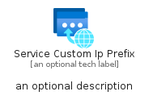

# ServiceCustomIpPrefix


```text
azure-17/Item/Other/ServiceCustomIpPrefix
```

```text
include('azure-17/Item/Other/ServiceCustomIpPrefix')
```


| Illustration | ServiceCustomIpPrefix | ServiceCustomIpPrefixCard | ServiceCustomIpPrefixGroup |
| :---: | :---: | :---: | :---: |
|  |  |  |  |


## Sprites
The item provides the following sriptes:

- `<$ServiceCustomIpPrefixXs>`
- `<$ServiceCustomIpPrefixSm>`
- `<$ServiceCustomIpPrefixMd>`
- `<$ServiceCustomIpPrefixLg>`


## ServiceCustomIpPrefix

### Load remotely
```plantuml
@startuml
' configures the library
!global $LIB_BASE_LOCATION="https://raw.githubusercontent.com/tmorin/plantuml-libs/master/distribution"

' loads the library's bootstrap
!include $LIB_BASE_LOCATION/bootstrap.puml

' loads the package bootstrap
include('azure-17/bootstrap')

' loads the Item which embeds the element ServiceCustomIpPrefix
include('azure-17/Item/Other/ServiceCustomIpPrefix')

' renders the element
ServiceCustomIpPrefix('ServiceCustomIpPrefix', 'Service Custom Ip Prefix', 'an optional tech label', 'an optional description')
@enduml
```

### Load locally
```plantuml
@startuml
' configures the library
!global $INCLUSION_MODE="local"
!global $LIB_BASE_LOCATION="../../.."

' loads the library's bootstrap
!include $LIB_BASE_LOCATION/bootstrap.puml

' loads the package bootstrap
include('azure-17/bootstrap')

' loads the Item which embeds the element ServiceCustomIpPrefix
include('azure-17/Item/Other/ServiceCustomIpPrefix')

' renders the element
ServiceCustomIpPrefix('ServiceCustomIpPrefix', 'Service Custom Ip Prefix', 'an optional tech label', 'an optional description')
@enduml
```

## ServiceCustomIpPrefixCard

### Load remotely
```plantuml
@startuml
' configures the library
!global $LIB_BASE_LOCATION="https://raw.githubusercontent.com/tmorin/plantuml-libs/master/distribution"

' loads the library's bootstrap
!include $LIB_BASE_LOCATION/bootstrap.puml

' loads the package bootstrap
include('azure-17/bootstrap')

' loads the Item which embeds the element ServiceCustomIpPrefixCard
include('azure-17/Item/Other/ServiceCustomIpPrefix')

' renders the element
ServiceCustomIpPrefixCard('ServiceCustomIpPrefixCard', 'Service Custom Ip Prefix Card', 'an optional description')
@enduml
```

### Load locally
```plantuml
@startuml
' configures the library
!global $INCLUSION_MODE="local"
!global $LIB_BASE_LOCATION="../../.."

' loads the library's bootstrap
!include $LIB_BASE_LOCATION/bootstrap.puml

' loads the package bootstrap
include('azure-17/bootstrap')

' loads the Item which embeds the element ServiceCustomIpPrefixCard
include('azure-17/Item/Other/ServiceCustomIpPrefix')

' renders the element
ServiceCustomIpPrefixCard('ServiceCustomIpPrefixCard', 'Service Custom Ip Prefix Card', 'an optional description')
@enduml
```

## ServiceCustomIpPrefixGroup

### Load remotely
```plantuml
@startuml
' configures the library
!global $LIB_BASE_LOCATION="https://raw.githubusercontent.com/tmorin/plantuml-libs/master/distribution"

' loads the library's bootstrap
!include $LIB_BASE_LOCATION/bootstrap.puml

' loads the package bootstrap
include('azure-17/bootstrap')

' loads the Item which embeds the element ServiceCustomIpPrefixGroup
include('azure-17/Item/Other/ServiceCustomIpPrefix')

' renders the element
ServiceCustomIpPrefixGroup('ServiceCustomIpPrefixGroup', 'Service Custom Ip Prefix Group', 'an optional tech label') {
    note as note
        the content of the group
    end note
}
@enduml
```

### Load locally
```plantuml
@startuml
' configures the library
!global $INCLUSION_MODE="local"
!global $LIB_BASE_LOCATION="../../.."

' loads the library's bootstrap
!include $LIB_BASE_LOCATION/bootstrap.puml

' loads the package bootstrap
include('azure-17/bootstrap')

' loads the Item which embeds the element ServiceCustomIpPrefixGroup
include('azure-17/Item/Other/ServiceCustomIpPrefix')

' renders the element
ServiceCustomIpPrefixGroup('ServiceCustomIpPrefixGroup', 'Service Custom Ip Prefix Group', 'an optional tech label') {
    note as note
        the content of the group
    end note
}
@enduml
```

