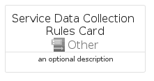
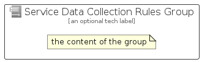

# ServiceDataCollectionRules


```text
azure-17/Item/Other/ServiceDataCollectionRules
```

```text
include('azure-17/Item/Other/ServiceDataCollectionRules')
```


| Illustration | ServiceDataCollectionRules | ServiceDataCollectionRulesCard | ServiceDataCollectionRulesGroup |
| :---: | :---: | :---: | :---: |
|  |  |  |  |


## Sprites
The item provides the following sriptes:

- `<$ServiceDataCollectionRulesXs>`
- `<$ServiceDataCollectionRulesSm>`
- `<$ServiceDataCollectionRulesMd>`
- `<$ServiceDataCollectionRulesLg>`


## ServiceDataCollectionRules

### Load remotely
```plantuml
@startuml
' configures the library
!global $LIB_BASE_LOCATION="https://raw.githubusercontent.com/tmorin/plantuml-libs/master/distribution"

' loads the library's bootstrap
!include $LIB_BASE_LOCATION/bootstrap.puml

' loads the package bootstrap
include('azure-17/bootstrap')

' loads the Item which embeds the element ServiceDataCollectionRules
include('azure-17/Item/Other/ServiceDataCollectionRules')

' renders the element
ServiceDataCollectionRules('ServiceDataCollectionRules', 'Service Data Collection Rules', 'an optional tech label', 'an optional description')
@enduml
```

### Load locally
```plantuml
@startuml
' configures the library
!global $INCLUSION_MODE="local"
!global $LIB_BASE_LOCATION="../../.."

' loads the library's bootstrap
!include $LIB_BASE_LOCATION/bootstrap.puml

' loads the package bootstrap
include('azure-17/bootstrap')

' loads the Item which embeds the element ServiceDataCollectionRules
include('azure-17/Item/Other/ServiceDataCollectionRules')

' renders the element
ServiceDataCollectionRules('ServiceDataCollectionRules', 'Service Data Collection Rules', 'an optional tech label', 'an optional description')
@enduml
```

## ServiceDataCollectionRulesCard

### Load remotely
```plantuml
@startuml
' configures the library
!global $LIB_BASE_LOCATION="https://raw.githubusercontent.com/tmorin/plantuml-libs/master/distribution"

' loads the library's bootstrap
!include $LIB_BASE_LOCATION/bootstrap.puml

' loads the package bootstrap
include('azure-17/bootstrap')

' loads the Item which embeds the element ServiceDataCollectionRulesCard
include('azure-17/Item/Other/ServiceDataCollectionRules')

' renders the element
ServiceDataCollectionRulesCard('ServiceDataCollectionRulesCard', 'Service Data Collection Rules Card', 'an optional description')
@enduml
```

### Load locally
```plantuml
@startuml
' configures the library
!global $INCLUSION_MODE="local"
!global $LIB_BASE_LOCATION="../../.."

' loads the library's bootstrap
!include $LIB_BASE_LOCATION/bootstrap.puml

' loads the package bootstrap
include('azure-17/bootstrap')

' loads the Item which embeds the element ServiceDataCollectionRulesCard
include('azure-17/Item/Other/ServiceDataCollectionRules')

' renders the element
ServiceDataCollectionRulesCard('ServiceDataCollectionRulesCard', 'Service Data Collection Rules Card', 'an optional description')
@enduml
```

## ServiceDataCollectionRulesGroup

### Load remotely
```plantuml
@startuml
' configures the library
!global $LIB_BASE_LOCATION="https://raw.githubusercontent.com/tmorin/plantuml-libs/master/distribution"

' loads the library's bootstrap
!include $LIB_BASE_LOCATION/bootstrap.puml

' loads the package bootstrap
include('azure-17/bootstrap')

' loads the Item which embeds the element ServiceDataCollectionRulesGroup
include('azure-17/Item/Other/ServiceDataCollectionRules')

' renders the element
ServiceDataCollectionRulesGroup('ServiceDataCollectionRulesGroup', 'Service Data Collection Rules Group', 'an optional tech label') {
    note as note
        the content of the group
    end note
}
@enduml
```

### Load locally
```plantuml
@startuml
' configures the library
!global $INCLUSION_MODE="local"
!global $LIB_BASE_LOCATION="../../.."

' loads the library's bootstrap
!include $LIB_BASE_LOCATION/bootstrap.puml

' loads the package bootstrap
include('azure-17/bootstrap')

' loads the Item which embeds the element ServiceDataCollectionRulesGroup
include('azure-17/Item/Other/ServiceDataCollectionRules')

' renders the element
ServiceDataCollectionRulesGroup('ServiceDataCollectionRulesGroup', 'Service Data Collection Rules Group', 'an optional tech label') {
    note as note
        the content of the group
    end note
}
@enduml
```

