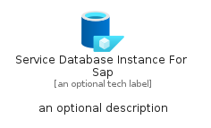
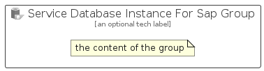

# ServiceDatabaseInstanceForSap


```text
azure-17/Item/Other/ServiceDatabaseInstanceForSap
```

```text
include('azure-17/Item/Other/ServiceDatabaseInstanceForSap')
```


| Illustration | ServiceDatabaseInstanceForSap | ServiceDatabaseInstanceForSapCard | ServiceDatabaseInstanceForSapGroup |
| :---: | :---: | :---: | :---: |
|  |  |  |  |


## Sprites
The item provides the following sriptes:

- `<$ServiceDatabaseInstanceForSapXs>`
- `<$ServiceDatabaseInstanceForSapSm>`
- `<$ServiceDatabaseInstanceForSapMd>`
- `<$ServiceDatabaseInstanceForSapLg>`


## ServiceDatabaseInstanceForSap

### Load remotely
```plantuml
@startuml
' configures the library
!global $LIB_BASE_LOCATION="https://raw.githubusercontent.com/tmorin/plantuml-libs/master/distribution"

' loads the library's bootstrap
!include $LIB_BASE_LOCATION/bootstrap.puml

' loads the package bootstrap
include('azure-17/bootstrap')

' loads the Item which embeds the element ServiceDatabaseInstanceForSap
include('azure-17/Item/Other/ServiceDatabaseInstanceForSap')

' renders the element
ServiceDatabaseInstanceForSap('ServiceDatabaseInstanceForSap', 'Service Database Instance For Sap', 'an optional tech label', 'an optional description')
@enduml
```

### Load locally
```plantuml
@startuml
' configures the library
!global $INCLUSION_MODE="local"
!global $LIB_BASE_LOCATION="../../.."

' loads the library's bootstrap
!include $LIB_BASE_LOCATION/bootstrap.puml

' loads the package bootstrap
include('azure-17/bootstrap')

' loads the Item which embeds the element ServiceDatabaseInstanceForSap
include('azure-17/Item/Other/ServiceDatabaseInstanceForSap')

' renders the element
ServiceDatabaseInstanceForSap('ServiceDatabaseInstanceForSap', 'Service Database Instance For Sap', 'an optional tech label', 'an optional description')
@enduml
```

## ServiceDatabaseInstanceForSapCard

### Load remotely
```plantuml
@startuml
' configures the library
!global $LIB_BASE_LOCATION="https://raw.githubusercontent.com/tmorin/plantuml-libs/master/distribution"

' loads the library's bootstrap
!include $LIB_BASE_LOCATION/bootstrap.puml

' loads the package bootstrap
include('azure-17/bootstrap')

' loads the Item which embeds the element ServiceDatabaseInstanceForSapCard
include('azure-17/Item/Other/ServiceDatabaseInstanceForSap')

' renders the element
ServiceDatabaseInstanceForSapCard('ServiceDatabaseInstanceForSapCard', 'Service Database Instance For Sap Card', 'an optional description')
@enduml
```

### Load locally
```plantuml
@startuml
' configures the library
!global $INCLUSION_MODE="local"
!global $LIB_BASE_LOCATION="../../.."

' loads the library's bootstrap
!include $LIB_BASE_LOCATION/bootstrap.puml

' loads the package bootstrap
include('azure-17/bootstrap')

' loads the Item which embeds the element ServiceDatabaseInstanceForSapCard
include('azure-17/Item/Other/ServiceDatabaseInstanceForSap')

' renders the element
ServiceDatabaseInstanceForSapCard('ServiceDatabaseInstanceForSapCard', 'Service Database Instance For Sap Card', 'an optional description')
@enduml
```

## ServiceDatabaseInstanceForSapGroup

### Load remotely
```plantuml
@startuml
' configures the library
!global $LIB_BASE_LOCATION="https://raw.githubusercontent.com/tmorin/plantuml-libs/master/distribution"

' loads the library's bootstrap
!include $LIB_BASE_LOCATION/bootstrap.puml

' loads the package bootstrap
include('azure-17/bootstrap')

' loads the Item which embeds the element ServiceDatabaseInstanceForSapGroup
include('azure-17/Item/Other/ServiceDatabaseInstanceForSap')

' renders the element
ServiceDatabaseInstanceForSapGroup('ServiceDatabaseInstanceForSapGroup', 'Service Database Instance For Sap Group', 'an optional tech label') {
    note as note
        the content of the group
    end note
}
@enduml
```

### Load locally
```plantuml
@startuml
' configures the library
!global $INCLUSION_MODE="local"
!global $LIB_BASE_LOCATION="../../.."

' loads the library's bootstrap
!include $LIB_BASE_LOCATION/bootstrap.puml

' loads the package bootstrap
include('azure-17/bootstrap')

' loads the Item which embeds the element ServiceDatabaseInstanceForSapGroup
include('azure-17/Item/Other/ServiceDatabaseInstanceForSap')

' renders the element
ServiceDatabaseInstanceForSapGroup('ServiceDatabaseInstanceForSapGroup', 'Service Database Instance For Sap Group', 'an optional tech label') {
    note as note
        the content of the group
    end note
}
@enduml
```

