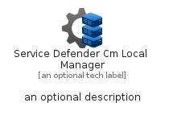
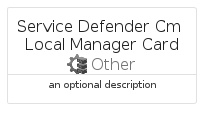
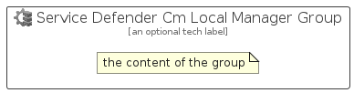

# ServiceDefenderCmLocalManager


```text
azure-17/Item/Other/ServiceDefenderCmLocalManager
```

```text
include('azure-17/Item/Other/ServiceDefenderCmLocalManager')
```


| Illustration | ServiceDefenderCmLocalManager | ServiceDefenderCmLocalManagerCard | ServiceDefenderCmLocalManagerGroup |
| :---: | :---: | :---: | :---: |
|  |  |  |  |


## Sprites
The item provides the following sriptes:

- `<$ServiceDefenderCmLocalManagerXs>`
- `<$ServiceDefenderCmLocalManagerSm>`
- `<$ServiceDefenderCmLocalManagerMd>`
- `<$ServiceDefenderCmLocalManagerLg>`


## ServiceDefenderCmLocalManager

### Load remotely
```plantuml
@startuml
' configures the library
!global $LIB_BASE_LOCATION="https://raw.githubusercontent.com/tmorin/plantuml-libs/master/distribution"

' loads the library's bootstrap
!include $LIB_BASE_LOCATION/bootstrap.puml

' loads the package bootstrap
include('azure-17/bootstrap')

' loads the Item which embeds the element ServiceDefenderCmLocalManager
include('azure-17/Item/Other/ServiceDefenderCmLocalManager')

' renders the element
ServiceDefenderCmLocalManager('ServiceDefenderCmLocalManager', 'Service Defender Cm Local Manager', 'an optional tech label', 'an optional description')
@enduml
```

### Load locally
```plantuml
@startuml
' configures the library
!global $INCLUSION_MODE="local"
!global $LIB_BASE_LOCATION="../../.."

' loads the library's bootstrap
!include $LIB_BASE_LOCATION/bootstrap.puml

' loads the package bootstrap
include('azure-17/bootstrap')

' loads the Item which embeds the element ServiceDefenderCmLocalManager
include('azure-17/Item/Other/ServiceDefenderCmLocalManager')

' renders the element
ServiceDefenderCmLocalManager('ServiceDefenderCmLocalManager', 'Service Defender Cm Local Manager', 'an optional tech label', 'an optional description')
@enduml
```

## ServiceDefenderCmLocalManagerCard

### Load remotely
```plantuml
@startuml
' configures the library
!global $LIB_BASE_LOCATION="https://raw.githubusercontent.com/tmorin/plantuml-libs/master/distribution"

' loads the library's bootstrap
!include $LIB_BASE_LOCATION/bootstrap.puml

' loads the package bootstrap
include('azure-17/bootstrap')

' loads the Item which embeds the element ServiceDefenderCmLocalManagerCard
include('azure-17/Item/Other/ServiceDefenderCmLocalManager')

' renders the element
ServiceDefenderCmLocalManagerCard('ServiceDefenderCmLocalManagerCard', 'Service Defender Cm Local Manager Card', 'an optional description')
@enduml
```

### Load locally
```plantuml
@startuml
' configures the library
!global $INCLUSION_MODE="local"
!global $LIB_BASE_LOCATION="../../.."

' loads the library's bootstrap
!include $LIB_BASE_LOCATION/bootstrap.puml

' loads the package bootstrap
include('azure-17/bootstrap')

' loads the Item which embeds the element ServiceDefenderCmLocalManagerCard
include('azure-17/Item/Other/ServiceDefenderCmLocalManager')

' renders the element
ServiceDefenderCmLocalManagerCard('ServiceDefenderCmLocalManagerCard', 'Service Defender Cm Local Manager Card', 'an optional description')
@enduml
```

## ServiceDefenderCmLocalManagerGroup

### Load remotely
```plantuml
@startuml
' configures the library
!global $LIB_BASE_LOCATION="https://raw.githubusercontent.com/tmorin/plantuml-libs/master/distribution"

' loads the library's bootstrap
!include $LIB_BASE_LOCATION/bootstrap.puml

' loads the package bootstrap
include('azure-17/bootstrap')

' loads the Item which embeds the element ServiceDefenderCmLocalManagerGroup
include('azure-17/Item/Other/ServiceDefenderCmLocalManager')

' renders the element
ServiceDefenderCmLocalManagerGroup('ServiceDefenderCmLocalManagerGroup', 'Service Defender Cm Local Manager Group', 'an optional tech label') {
    note as note
        the content of the group
    end note
}
@enduml
```

### Load locally
```plantuml
@startuml
' configures the library
!global $INCLUSION_MODE="local"
!global $LIB_BASE_LOCATION="../../.."

' loads the library's bootstrap
!include $LIB_BASE_LOCATION/bootstrap.puml

' loads the package bootstrap
include('azure-17/bootstrap')

' loads the Item which embeds the element ServiceDefenderCmLocalManagerGroup
include('azure-17/Item/Other/ServiceDefenderCmLocalManager')

' renders the element
ServiceDefenderCmLocalManagerGroup('ServiceDefenderCmLocalManagerGroup', 'Service Defender Cm Local Manager Group', 'an optional tech label') {
    note as note
        the content of the group
    end note
}
@enduml
```

