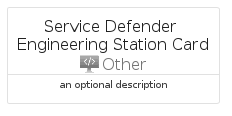

# ServiceDefenderEngineeringStation


```text
azure-17/Item/Other/ServiceDefenderEngineeringStation
```

```text
include('azure-17/Item/Other/ServiceDefenderEngineeringStation')
```


| Illustration | ServiceDefenderEngineeringStation | ServiceDefenderEngineeringStationCard | ServiceDefenderEngineeringStationGroup |
| :---: | :---: | :---: | :---: |
|  |  |  |  |


## Sprites
The item provides the following sriptes:

- `<$ServiceDefenderEngineeringStationXs>`
- `<$ServiceDefenderEngineeringStationSm>`
- `<$ServiceDefenderEngineeringStationMd>`
- `<$ServiceDefenderEngineeringStationLg>`


## ServiceDefenderEngineeringStation

### Load remotely
```plantuml
@startuml
' configures the library
!global $LIB_BASE_LOCATION="https://raw.githubusercontent.com/tmorin/plantuml-libs/master/distribution"

' loads the library's bootstrap
!include $LIB_BASE_LOCATION/bootstrap.puml

' loads the package bootstrap
include('azure-17/bootstrap')

' loads the Item which embeds the element ServiceDefenderEngineeringStation
include('azure-17/Item/Other/ServiceDefenderEngineeringStation')

' renders the element
ServiceDefenderEngineeringStation('ServiceDefenderEngineeringStation', 'Service Defender Engineering Station', 'an optional tech label', 'an optional description')
@enduml
```

### Load locally
```plantuml
@startuml
' configures the library
!global $INCLUSION_MODE="local"
!global $LIB_BASE_LOCATION="../../.."

' loads the library's bootstrap
!include $LIB_BASE_LOCATION/bootstrap.puml

' loads the package bootstrap
include('azure-17/bootstrap')

' loads the Item which embeds the element ServiceDefenderEngineeringStation
include('azure-17/Item/Other/ServiceDefenderEngineeringStation')

' renders the element
ServiceDefenderEngineeringStation('ServiceDefenderEngineeringStation', 'Service Defender Engineering Station', 'an optional tech label', 'an optional description')
@enduml
```

## ServiceDefenderEngineeringStationCard

### Load remotely
```plantuml
@startuml
' configures the library
!global $LIB_BASE_LOCATION="https://raw.githubusercontent.com/tmorin/plantuml-libs/master/distribution"

' loads the library's bootstrap
!include $LIB_BASE_LOCATION/bootstrap.puml

' loads the package bootstrap
include('azure-17/bootstrap')

' loads the Item which embeds the element ServiceDefenderEngineeringStationCard
include('azure-17/Item/Other/ServiceDefenderEngineeringStation')

' renders the element
ServiceDefenderEngineeringStationCard('ServiceDefenderEngineeringStationCard', 'Service Defender Engineering Station Card', 'an optional description')
@enduml
```

### Load locally
```plantuml
@startuml
' configures the library
!global $INCLUSION_MODE="local"
!global $LIB_BASE_LOCATION="../../.."

' loads the library's bootstrap
!include $LIB_BASE_LOCATION/bootstrap.puml

' loads the package bootstrap
include('azure-17/bootstrap')

' loads the Item which embeds the element ServiceDefenderEngineeringStationCard
include('azure-17/Item/Other/ServiceDefenderEngineeringStation')

' renders the element
ServiceDefenderEngineeringStationCard('ServiceDefenderEngineeringStationCard', 'Service Defender Engineering Station Card', 'an optional description')
@enduml
```

## ServiceDefenderEngineeringStationGroup

### Load remotely
```plantuml
@startuml
' configures the library
!global $LIB_BASE_LOCATION="https://raw.githubusercontent.com/tmorin/plantuml-libs/master/distribution"

' loads the library's bootstrap
!include $LIB_BASE_LOCATION/bootstrap.puml

' loads the package bootstrap
include('azure-17/bootstrap')

' loads the Item which embeds the element ServiceDefenderEngineeringStationGroup
include('azure-17/Item/Other/ServiceDefenderEngineeringStation')

' renders the element
ServiceDefenderEngineeringStationGroup('ServiceDefenderEngineeringStationGroup', 'Service Defender Engineering Station Group', 'an optional tech label') {
    note as note
        the content of the group
    end note
}
@enduml
```

### Load locally
```plantuml
@startuml
' configures the library
!global $INCLUSION_MODE="local"
!global $LIB_BASE_LOCATION="../../.."

' loads the library's bootstrap
!include $LIB_BASE_LOCATION/bootstrap.puml

' loads the package bootstrap
include('azure-17/bootstrap')

' loads the Item which embeds the element ServiceDefenderEngineeringStationGroup
include('azure-17/Item/Other/ServiceDefenderEngineeringStation')

' renders the element
ServiceDefenderEngineeringStationGroup('ServiceDefenderEngineeringStationGroup', 'Service Defender Engineering Station Group', 'an optional tech label') {
    note as note
        the content of the group
    end note
}
@enduml
```

