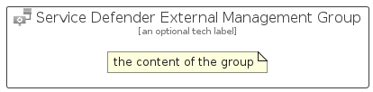

# ServiceDefenderExternalManagement


```text
azure-17/Item/Other/ServiceDefenderExternalManagement
```

```text
include('azure-17/Item/Other/ServiceDefenderExternalManagement')
```


| Illustration | ServiceDefenderExternalManagement | ServiceDefenderExternalManagementCard | ServiceDefenderExternalManagementGroup |
| :---: | :---: | :---: | :---: |
|  |  |  |  |


## Sprites
The item provides the following sriptes:

- `<$ServiceDefenderExternalManagementXs>`
- `<$ServiceDefenderExternalManagementSm>`
- `<$ServiceDefenderExternalManagementMd>`
- `<$ServiceDefenderExternalManagementLg>`


## ServiceDefenderExternalManagement

### Load remotely
```plantuml
@startuml
' configures the library
!global $LIB_BASE_LOCATION="https://raw.githubusercontent.com/tmorin/plantuml-libs/master/distribution"

' loads the library's bootstrap
!include $LIB_BASE_LOCATION/bootstrap.puml

' loads the package bootstrap
include('azure-17/bootstrap')

' loads the Item which embeds the element ServiceDefenderExternalManagement
include('azure-17/Item/Other/ServiceDefenderExternalManagement')

' renders the element
ServiceDefenderExternalManagement('ServiceDefenderExternalManagement', 'Service Defender External Management', 'an optional tech label', 'an optional description')
@enduml
```

### Load locally
```plantuml
@startuml
' configures the library
!global $INCLUSION_MODE="local"
!global $LIB_BASE_LOCATION="../../.."

' loads the library's bootstrap
!include $LIB_BASE_LOCATION/bootstrap.puml

' loads the package bootstrap
include('azure-17/bootstrap')

' loads the Item which embeds the element ServiceDefenderExternalManagement
include('azure-17/Item/Other/ServiceDefenderExternalManagement')

' renders the element
ServiceDefenderExternalManagement('ServiceDefenderExternalManagement', 'Service Defender External Management', 'an optional tech label', 'an optional description')
@enduml
```

## ServiceDefenderExternalManagementCard

### Load remotely
```plantuml
@startuml
' configures the library
!global $LIB_BASE_LOCATION="https://raw.githubusercontent.com/tmorin/plantuml-libs/master/distribution"

' loads the library's bootstrap
!include $LIB_BASE_LOCATION/bootstrap.puml

' loads the package bootstrap
include('azure-17/bootstrap')

' loads the Item which embeds the element ServiceDefenderExternalManagementCard
include('azure-17/Item/Other/ServiceDefenderExternalManagement')

' renders the element
ServiceDefenderExternalManagementCard('ServiceDefenderExternalManagementCard', 'Service Defender External Management Card', 'an optional description')
@enduml
```

### Load locally
```plantuml
@startuml
' configures the library
!global $INCLUSION_MODE="local"
!global $LIB_BASE_LOCATION="../../.."

' loads the library's bootstrap
!include $LIB_BASE_LOCATION/bootstrap.puml

' loads the package bootstrap
include('azure-17/bootstrap')

' loads the Item which embeds the element ServiceDefenderExternalManagementCard
include('azure-17/Item/Other/ServiceDefenderExternalManagement')

' renders the element
ServiceDefenderExternalManagementCard('ServiceDefenderExternalManagementCard', 'Service Defender External Management Card', 'an optional description')
@enduml
```

## ServiceDefenderExternalManagementGroup

### Load remotely
```plantuml
@startuml
' configures the library
!global $LIB_BASE_LOCATION="https://raw.githubusercontent.com/tmorin/plantuml-libs/master/distribution"

' loads the library's bootstrap
!include $LIB_BASE_LOCATION/bootstrap.puml

' loads the package bootstrap
include('azure-17/bootstrap')

' loads the Item which embeds the element ServiceDefenderExternalManagementGroup
include('azure-17/Item/Other/ServiceDefenderExternalManagement')

' renders the element
ServiceDefenderExternalManagementGroup('ServiceDefenderExternalManagementGroup', 'Service Defender External Management Group', 'an optional tech label') {
    note as note
        the content of the group
    end note
}
@enduml
```

### Load locally
```plantuml
@startuml
' configures the library
!global $INCLUSION_MODE="local"
!global $LIB_BASE_LOCATION="../../.."

' loads the library's bootstrap
!include $LIB_BASE_LOCATION/bootstrap.puml

' loads the package bootstrap
include('azure-17/bootstrap')

' loads the Item which embeds the element ServiceDefenderExternalManagementGroup
include('azure-17/Item/Other/ServiceDefenderExternalManagement')

' renders the element
ServiceDefenderExternalManagementGroup('ServiceDefenderExternalManagementGroup', 'Service Defender External Management Group', 'an optional tech label') {
    note as note
        the content of the group
    end note
}
@enduml
```

