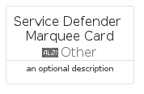

# ServiceDefenderMarquee


```text
azure-17/Item/Other/ServiceDefenderMarquee
```

```text
include('azure-17/Item/Other/ServiceDefenderMarquee')
```


| Illustration | ServiceDefenderMarquee | ServiceDefenderMarqueeCard | ServiceDefenderMarqueeGroup |
| :---: | :---: | :---: | :---: |
|  |  |  |  |


## Sprites
The item provides the following sriptes:

- `<$ServiceDefenderMarqueeXs>`
- `<$ServiceDefenderMarqueeSm>`
- `<$ServiceDefenderMarqueeMd>`
- `<$ServiceDefenderMarqueeLg>`


## ServiceDefenderMarquee

### Load remotely
```plantuml
@startuml
' configures the library
!global $LIB_BASE_LOCATION="https://raw.githubusercontent.com/tmorin/plantuml-libs/master/distribution"

' loads the library's bootstrap
!include $LIB_BASE_LOCATION/bootstrap.puml

' loads the package bootstrap
include('azure-17/bootstrap')

' loads the Item which embeds the element ServiceDefenderMarquee
include('azure-17/Item/Other/ServiceDefenderMarquee')

' renders the element
ServiceDefenderMarquee('ServiceDefenderMarquee', 'Service Defender Marquee', 'an optional tech label', 'an optional description')
@enduml
```

### Load locally
```plantuml
@startuml
' configures the library
!global $INCLUSION_MODE="local"
!global $LIB_BASE_LOCATION="../../.."

' loads the library's bootstrap
!include $LIB_BASE_LOCATION/bootstrap.puml

' loads the package bootstrap
include('azure-17/bootstrap')

' loads the Item which embeds the element ServiceDefenderMarquee
include('azure-17/Item/Other/ServiceDefenderMarquee')

' renders the element
ServiceDefenderMarquee('ServiceDefenderMarquee', 'Service Defender Marquee', 'an optional tech label', 'an optional description')
@enduml
```

## ServiceDefenderMarqueeCard

### Load remotely
```plantuml
@startuml
' configures the library
!global $LIB_BASE_LOCATION="https://raw.githubusercontent.com/tmorin/plantuml-libs/master/distribution"

' loads the library's bootstrap
!include $LIB_BASE_LOCATION/bootstrap.puml

' loads the package bootstrap
include('azure-17/bootstrap')

' loads the Item which embeds the element ServiceDefenderMarqueeCard
include('azure-17/Item/Other/ServiceDefenderMarquee')

' renders the element
ServiceDefenderMarqueeCard('ServiceDefenderMarqueeCard', 'Service Defender Marquee Card', 'an optional description')
@enduml
```

### Load locally
```plantuml
@startuml
' configures the library
!global $INCLUSION_MODE="local"
!global $LIB_BASE_LOCATION="../../.."

' loads the library's bootstrap
!include $LIB_BASE_LOCATION/bootstrap.puml

' loads the package bootstrap
include('azure-17/bootstrap')

' loads the Item which embeds the element ServiceDefenderMarqueeCard
include('azure-17/Item/Other/ServiceDefenderMarquee')

' renders the element
ServiceDefenderMarqueeCard('ServiceDefenderMarqueeCard', 'Service Defender Marquee Card', 'an optional description')
@enduml
```

## ServiceDefenderMarqueeGroup

### Load remotely
```plantuml
@startuml
' configures the library
!global $LIB_BASE_LOCATION="https://raw.githubusercontent.com/tmorin/plantuml-libs/master/distribution"

' loads the library's bootstrap
!include $LIB_BASE_LOCATION/bootstrap.puml

' loads the package bootstrap
include('azure-17/bootstrap')

' loads the Item which embeds the element ServiceDefenderMarqueeGroup
include('azure-17/Item/Other/ServiceDefenderMarquee')

' renders the element
ServiceDefenderMarqueeGroup('ServiceDefenderMarqueeGroup', 'Service Defender Marquee Group', 'an optional tech label') {
    note as note
        the content of the group
    end note
}
@enduml
```

### Load locally
```plantuml
@startuml
' configures the library
!global $INCLUSION_MODE="local"
!global $LIB_BASE_LOCATION="../../.."

' loads the library's bootstrap
!include $LIB_BASE_LOCATION/bootstrap.puml

' loads the package bootstrap
include('azure-17/bootstrap')

' loads the Item which embeds the element ServiceDefenderMarqueeGroup
include('azure-17/Item/Other/ServiceDefenderMarquee')

' renders the element
ServiceDefenderMarqueeGroup('ServiceDefenderMarqueeGroup', 'Service Defender Marquee Group', 'an optional tech label') {
    note as note
        the content of the group
    end note
}
@enduml
```

