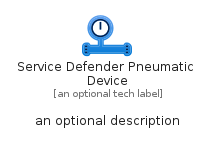
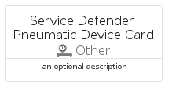

# ServiceDefenderPneumaticDevice


```text
azure-17/Item/Other/ServiceDefenderPneumaticDevice
```

```text
include('azure-17/Item/Other/ServiceDefenderPneumaticDevice')
```


| Illustration | ServiceDefenderPneumaticDevice | ServiceDefenderPneumaticDeviceCard | ServiceDefenderPneumaticDeviceGroup |
| :---: | :---: | :---: | :---: |
|  |  |  |  |


## Sprites
The item provides the following sriptes:

- `<$ServiceDefenderPneumaticDeviceXs>`
- `<$ServiceDefenderPneumaticDeviceSm>`
- `<$ServiceDefenderPneumaticDeviceMd>`
- `<$ServiceDefenderPneumaticDeviceLg>`


## ServiceDefenderPneumaticDevice

### Load remotely
```plantuml
@startuml
' configures the library
!global $LIB_BASE_LOCATION="https://raw.githubusercontent.com/tmorin/plantuml-libs/master/distribution"

' loads the library's bootstrap
!include $LIB_BASE_LOCATION/bootstrap.puml

' loads the package bootstrap
include('azure-17/bootstrap')

' loads the Item which embeds the element ServiceDefenderPneumaticDevice
include('azure-17/Item/Other/ServiceDefenderPneumaticDevice')

' renders the element
ServiceDefenderPneumaticDevice('ServiceDefenderPneumaticDevice', 'Service Defender Pneumatic Device', 'an optional tech label', 'an optional description')
@enduml
```

### Load locally
```plantuml
@startuml
' configures the library
!global $INCLUSION_MODE="local"
!global $LIB_BASE_LOCATION="../../.."

' loads the library's bootstrap
!include $LIB_BASE_LOCATION/bootstrap.puml

' loads the package bootstrap
include('azure-17/bootstrap')

' loads the Item which embeds the element ServiceDefenderPneumaticDevice
include('azure-17/Item/Other/ServiceDefenderPneumaticDevice')

' renders the element
ServiceDefenderPneumaticDevice('ServiceDefenderPneumaticDevice', 'Service Defender Pneumatic Device', 'an optional tech label', 'an optional description')
@enduml
```

## ServiceDefenderPneumaticDeviceCard

### Load remotely
```plantuml
@startuml
' configures the library
!global $LIB_BASE_LOCATION="https://raw.githubusercontent.com/tmorin/plantuml-libs/master/distribution"

' loads the library's bootstrap
!include $LIB_BASE_LOCATION/bootstrap.puml

' loads the package bootstrap
include('azure-17/bootstrap')

' loads the Item which embeds the element ServiceDefenderPneumaticDeviceCard
include('azure-17/Item/Other/ServiceDefenderPneumaticDevice')

' renders the element
ServiceDefenderPneumaticDeviceCard('ServiceDefenderPneumaticDeviceCard', 'Service Defender Pneumatic Device Card', 'an optional description')
@enduml
```

### Load locally
```plantuml
@startuml
' configures the library
!global $INCLUSION_MODE="local"
!global $LIB_BASE_LOCATION="../../.."

' loads the library's bootstrap
!include $LIB_BASE_LOCATION/bootstrap.puml

' loads the package bootstrap
include('azure-17/bootstrap')

' loads the Item which embeds the element ServiceDefenderPneumaticDeviceCard
include('azure-17/Item/Other/ServiceDefenderPneumaticDevice')

' renders the element
ServiceDefenderPneumaticDeviceCard('ServiceDefenderPneumaticDeviceCard', 'Service Defender Pneumatic Device Card', 'an optional description')
@enduml
```

## ServiceDefenderPneumaticDeviceGroup

### Load remotely
```plantuml
@startuml
' configures the library
!global $LIB_BASE_LOCATION="https://raw.githubusercontent.com/tmorin/plantuml-libs/master/distribution"

' loads the library's bootstrap
!include $LIB_BASE_LOCATION/bootstrap.puml

' loads the package bootstrap
include('azure-17/bootstrap')

' loads the Item which embeds the element ServiceDefenderPneumaticDeviceGroup
include('azure-17/Item/Other/ServiceDefenderPneumaticDevice')

' renders the element
ServiceDefenderPneumaticDeviceGroup('ServiceDefenderPneumaticDeviceGroup', 'Service Defender Pneumatic Device Group', 'an optional tech label') {
    note as note
        the content of the group
    end note
}
@enduml
```

### Load locally
```plantuml
@startuml
' configures the library
!global $INCLUSION_MODE="local"
!global $LIB_BASE_LOCATION="../../.."

' loads the library's bootstrap
!include $LIB_BASE_LOCATION/bootstrap.puml

' loads the package bootstrap
include('azure-17/bootstrap')

' loads the Item which embeds the element ServiceDefenderPneumaticDeviceGroup
include('azure-17/Item/Other/ServiceDefenderPneumaticDevice')

' renders the element
ServiceDefenderPneumaticDeviceGroup('ServiceDefenderPneumaticDeviceGroup', 'Service Defender Pneumatic Device Group', 'an optional tech label') {
    note as note
        the content of the group
    end note
}
@enduml
```

