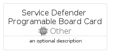

# ServiceDefenderProgramableBoard


```text
azure-17/Item/Other/ServiceDefenderProgramableBoard
```

```text
include('azure-17/Item/Other/ServiceDefenderProgramableBoard')
```


| Illustration | ServiceDefenderProgramableBoard | ServiceDefenderProgramableBoardCard | ServiceDefenderProgramableBoardGroup |
| :---: | :---: | :---: | :---: |
|  |  |  |  |


## Sprites
The item provides the following sriptes:

- `<$ServiceDefenderProgramableBoardXs>`
- `<$ServiceDefenderProgramableBoardSm>`
- `<$ServiceDefenderProgramableBoardMd>`
- `<$ServiceDefenderProgramableBoardLg>`


## ServiceDefenderProgramableBoard

### Load remotely
```plantuml
@startuml
' configures the library
!global $LIB_BASE_LOCATION="https://raw.githubusercontent.com/tmorin/plantuml-libs/master/distribution"

' loads the library's bootstrap
!include $LIB_BASE_LOCATION/bootstrap.puml

' loads the package bootstrap
include('azure-17/bootstrap')

' loads the Item which embeds the element ServiceDefenderProgramableBoard
include('azure-17/Item/Other/ServiceDefenderProgramableBoard')

' renders the element
ServiceDefenderProgramableBoard('ServiceDefenderProgramableBoard', 'Service Defender Programable Board', 'an optional tech label', 'an optional description')
@enduml
```

### Load locally
```plantuml
@startuml
' configures the library
!global $INCLUSION_MODE="local"
!global $LIB_BASE_LOCATION="../../.."

' loads the library's bootstrap
!include $LIB_BASE_LOCATION/bootstrap.puml

' loads the package bootstrap
include('azure-17/bootstrap')

' loads the Item which embeds the element ServiceDefenderProgramableBoard
include('azure-17/Item/Other/ServiceDefenderProgramableBoard')

' renders the element
ServiceDefenderProgramableBoard('ServiceDefenderProgramableBoard', 'Service Defender Programable Board', 'an optional tech label', 'an optional description')
@enduml
```

## ServiceDefenderProgramableBoardCard

### Load remotely
```plantuml
@startuml
' configures the library
!global $LIB_BASE_LOCATION="https://raw.githubusercontent.com/tmorin/plantuml-libs/master/distribution"

' loads the library's bootstrap
!include $LIB_BASE_LOCATION/bootstrap.puml

' loads the package bootstrap
include('azure-17/bootstrap')

' loads the Item which embeds the element ServiceDefenderProgramableBoardCard
include('azure-17/Item/Other/ServiceDefenderProgramableBoard')

' renders the element
ServiceDefenderProgramableBoardCard('ServiceDefenderProgramableBoardCard', 'Service Defender Programable Board Card', 'an optional description')
@enduml
```

### Load locally
```plantuml
@startuml
' configures the library
!global $INCLUSION_MODE="local"
!global $LIB_BASE_LOCATION="../../.."

' loads the library's bootstrap
!include $LIB_BASE_LOCATION/bootstrap.puml

' loads the package bootstrap
include('azure-17/bootstrap')

' loads the Item which embeds the element ServiceDefenderProgramableBoardCard
include('azure-17/Item/Other/ServiceDefenderProgramableBoard')

' renders the element
ServiceDefenderProgramableBoardCard('ServiceDefenderProgramableBoardCard', 'Service Defender Programable Board Card', 'an optional description')
@enduml
```

## ServiceDefenderProgramableBoardGroup

### Load remotely
```plantuml
@startuml
' configures the library
!global $LIB_BASE_LOCATION="https://raw.githubusercontent.com/tmorin/plantuml-libs/master/distribution"

' loads the library's bootstrap
!include $LIB_BASE_LOCATION/bootstrap.puml

' loads the package bootstrap
include('azure-17/bootstrap')

' loads the Item which embeds the element ServiceDefenderProgramableBoardGroup
include('azure-17/Item/Other/ServiceDefenderProgramableBoard')

' renders the element
ServiceDefenderProgramableBoardGroup('ServiceDefenderProgramableBoardGroup', 'Service Defender Programable Board Group', 'an optional tech label') {
    note as note
        the content of the group
    end note
}
@enduml
```

### Load locally
```plantuml
@startuml
' configures the library
!global $INCLUSION_MODE="local"
!global $LIB_BASE_LOCATION="../../.."

' loads the library's bootstrap
!include $LIB_BASE_LOCATION/bootstrap.puml

' loads the package bootstrap
include('azure-17/bootstrap')

' loads the Item which embeds the element ServiceDefenderProgramableBoardGroup
include('azure-17/Item/Other/ServiceDefenderProgramableBoard')

' renders the element
ServiceDefenderProgramableBoardGroup('ServiceDefenderProgramableBoardGroup', 'Service Defender Programable Board Group', 'an optional tech label') {
    note as note
        the content of the group
    end note
}
@enduml
```

