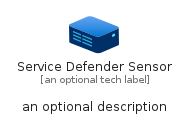
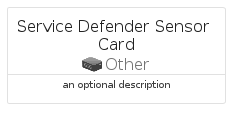
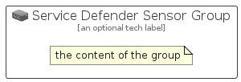

# ServiceDefenderSensor


```text
azure-17/Item/Other/ServiceDefenderSensor
```

```text
include('azure-17/Item/Other/ServiceDefenderSensor')
```


| Illustration | ServiceDefenderSensor | ServiceDefenderSensorCard | ServiceDefenderSensorGroup |
| :---: | :---: | :---: | :---: |
|  |  |  |  |


## Sprites
The item provides the following sriptes:

- `<$ServiceDefenderSensorXs>`
- `<$ServiceDefenderSensorSm>`
- `<$ServiceDefenderSensorMd>`
- `<$ServiceDefenderSensorLg>`


## ServiceDefenderSensor

### Load remotely
```plantuml
@startuml
' configures the library
!global $LIB_BASE_LOCATION="https://raw.githubusercontent.com/tmorin/plantuml-libs/master/distribution"

' loads the library's bootstrap
!include $LIB_BASE_LOCATION/bootstrap.puml

' loads the package bootstrap
include('azure-17/bootstrap')

' loads the Item which embeds the element ServiceDefenderSensor
include('azure-17/Item/Other/ServiceDefenderSensor')

' renders the element
ServiceDefenderSensor('ServiceDefenderSensor', 'Service Defender Sensor', 'an optional tech label', 'an optional description')
@enduml
```

### Load locally
```plantuml
@startuml
' configures the library
!global $INCLUSION_MODE="local"
!global $LIB_BASE_LOCATION="../../.."

' loads the library's bootstrap
!include $LIB_BASE_LOCATION/bootstrap.puml

' loads the package bootstrap
include('azure-17/bootstrap')

' loads the Item which embeds the element ServiceDefenderSensor
include('azure-17/Item/Other/ServiceDefenderSensor')

' renders the element
ServiceDefenderSensor('ServiceDefenderSensor', 'Service Defender Sensor', 'an optional tech label', 'an optional description')
@enduml
```

## ServiceDefenderSensorCard

### Load remotely
```plantuml
@startuml
' configures the library
!global $LIB_BASE_LOCATION="https://raw.githubusercontent.com/tmorin/plantuml-libs/master/distribution"

' loads the library's bootstrap
!include $LIB_BASE_LOCATION/bootstrap.puml

' loads the package bootstrap
include('azure-17/bootstrap')

' loads the Item which embeds the element ServiceDefenderSensorCard
include('azure-17/Item/Other/ServiceDefenderSensor')

' renders the element
ServiceDefenderSensorCard('ServiceDefenderSensorCard', 'Service Defender Sensor Card', 'an optional description')
@enduml
```

### Load locally
```plantuml
@startuml
' configures the library
!global $INCLUSION_MODE="local"
!global $LIB_BASE_LOCATION="../../.."

' loads the library's bootstrap
!include $LIB_BASE_LOCATION/bootstrap.puml

' loads the package bootstrap
include('azure-17/bootstrap')

' loads the Item which embeds the element ServiceDefenderSensorCard
include('azure-17/Item/Other/ServiceDefenderSensor')

' renders the element
ServiceDefenderSensorCard('ServiceDefenderSensorCard', 'Service Defender Sensor Card', 'an optional description')
@enduml
```

## ServiceDefenderSensorGroup

### Load remotely
```plantuml
@startuml
' configures the library
!global $LIB_BASE_LOCATION="https://raw.githubusercontent.com/tmorin/plantuml-libs/master/distribution"

' loads the library's bootstrap
!include $LIB_BASE_LOCATION/bootstrap.puml

' loads the package bootstrap
include('azure-17/bootstrap')

' loads the Item which embeds the element ServiceDefenderSensorGroup
include('azure-17/Item/Other/ServiceDefenderSensor')

' renders the element
ServiceDefenderSensorGroup('ServiceDefenderSensorGroup', 'Service Defender Sensor Group', 'an optional tech label') {
    note as note
        the content of the group
    end note
}
@enduml
```

### Load locally
```plantuml
@startuml
' configures the library
!global $INCLUSION_MODE="local"
!global $LIB_BASE_LOCATION="../../.."

' loads the library's bootstrap
!include $LIB_BASE_LOCATION/bootstrap.puml

' loads the package bootstrap
include('azure-17/bootstrap')

' loads the Item which embeds the element ServiceDefenderSensorGroup
include('azure-17/Item/Other/ServiceDefenderSensor')

' renders the element
ServiceDefenderSensorGroup('ServiceDefenderSensorGroup', 'Service Defender Sensor Group', 'an optional tech label') {
    note as note
        the content of the group
    end note
}
@enduml
```

